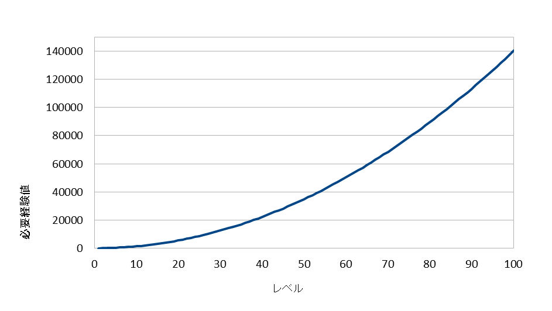

Ver.1.0.0 
https://raw.githubusercontent.com/nuun888/MZ/master/NUUN_EXPFormula.js 
計算表 
https://raw.githubusercontent.com/nuun888/MZ/master/expCalculationTable.xlsx 

コアスクリプトの経験値計算式はレベルが高くなるほど必要経験値の上がり方が緩くなるため、
中盤以降レベルが上がりやすくなってしまいます。
このプラグインでは経験値計算式の仕様を変え中盤以降でも必要経験値の上がり方を緩やかにならないように変更します。 

以下は基本値３０、補正値２０、増加度Ａ３０、増加度Ｂ３０での経験値曲線です。

