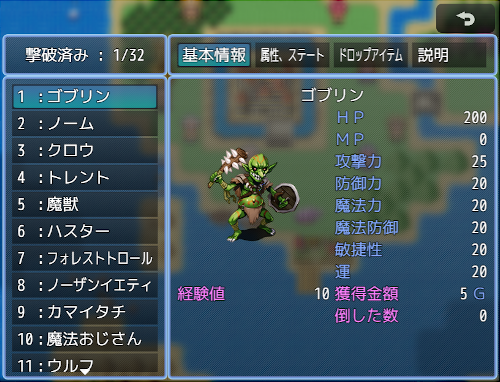
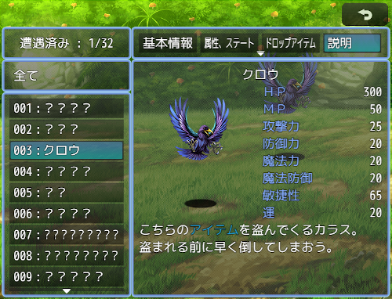
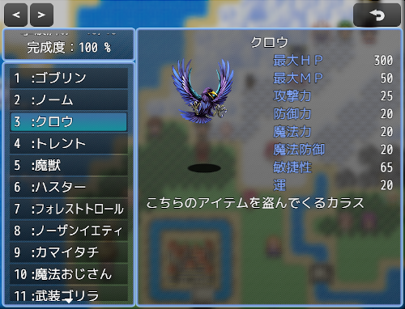
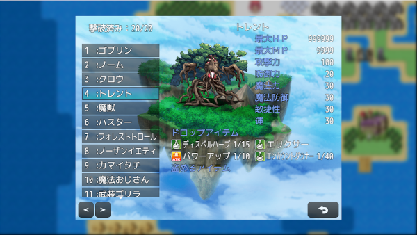
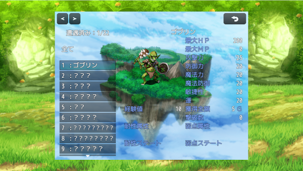
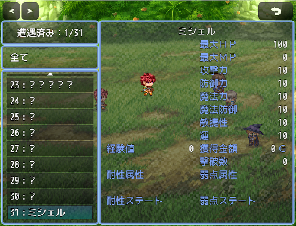
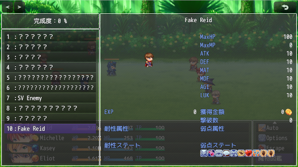
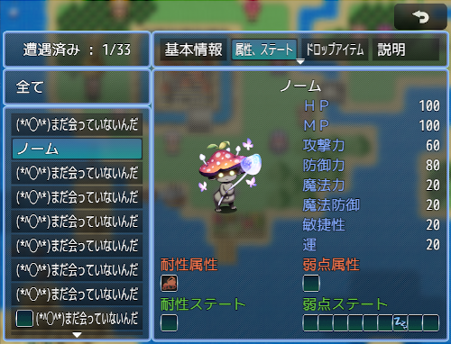
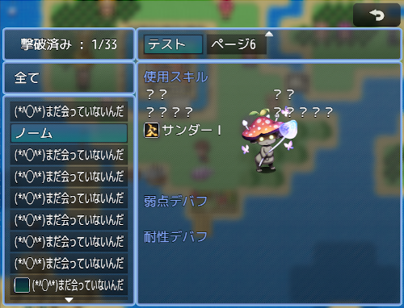

モンスター図鑑を実装します。 
図鑑は戦闘中にも表示が可能です。またアナライズ（敵の情報を確認するスキル、アイテム）機能もありアナライズで表示できる項目が図鑑とは別に設定可能です。 
モンスターの情報の自由に配置、追加することが出来ます。 
Ver.2.1.1 
https://raw.githubusercontent.com/nuun888/MZ/master/NUUN_EnemyBook.js 

<B>表示できる項目</B> 
HP（アナライズモードでは現在のステータスをONにしている時のみゲージが表示可能です） 
MP（アナライズモードでは現在のステータスをONにしている時のみゲージが表示可能です） 
TP（アナライズモードで現在のステータスをONにしている時のみ表示します） 
攻撃力 
防御力 
魔法力 
魔法防御 
敏捷性 
運 
命中率 
回避率 
会心率 
会心回避率 
魔法回避率 
魔法反射率 
反撃率 
HP再生率 
MP再生率 
TP再生率 
狙われ率 
防御効果率 
回復効果率 
薬の知識 
MP消費率 
TPチャージ率 
物理ダメージ率 
魔法ダメージ率 
経験値 
獲得金額 
倒した数 
モンスター名 
名称のみ 
耐性属性 
弱点属性 
無効属性 
耐性ステート 
弱点ステート 
無効ステート 
耐性デバフ 
弱点デバフ 
ドロップアイテム 
スティールアイテム（盗みスキル導入時） 
記述欄（フリーテキストスペース　制御文字が使用できます。改行が使用できますので何行でも可能です） 
オリジナルパラメータ（任意のステータス） 
使用スキル 
モンスター画像 

エネミーリストの表示位置を左側か右側か選択できます。 
エネミーリストのNoを表示なし、表示有り、表示有り（０埋め）から選択できます。 

図鑑の登録タイミングを遭遇時、撃破時、アナライズ時、撃破またはアナライズ時から選択できます。（ステータス情報は登録されません） 

<B>表示する項目リストの設定</B> 
Ver.2.0.0から設定方法が変更になっています。 
各ページの項目は「表示項目設定」から設定します。 
図鑑に表示するには「ページ設定」の「表示リスト指定」から表示させるリストを選択してください。 
この設定は「アナライズ設定」の「表示項目設定」でも同じです。 

<B>背景画像について</B> 
Ver.2.0.0以降 
背景画像のフォルダーを指定できるように変更しました。 
なお「共通処理」(NUUN_Base)プラグインVer.1.1.1以降が必要となります。 
https://raw.githubusercontent.com/nuun888/MZ/master/NUUN_Base.js

<B>アナライズの設定方法</B> 

Ver.1.1.0よりアナライズの設定方法が変更になります。 
アナライズスキルを設定するにはスキル、アイテムのメモ欄に<AnalyzeSkill:1>と記入します。この場合このスキル、アイテムはアナライズスキルとし、「アナライズスキル設定」の１番の設定で発動します。 

<B>操作方法</B> 
上下キー：エネミー選択 
左右 ：表示ページ切り替え 
PgUp PgDn：エネミーリストページ送り 
※表示ページ切り替えは上下キーは使用できません。 

モンスター図鑑はメニューコマンド、戦闘中のパーティコマンド及びプラグインコマンドの「図鑑を開く」から開くことが出来ます。 

 
 
 
 

任意の背景画像が設定できます。 

サイドビューアクターを表示させることが出来ます。サイドビュー画像はアニメーションします。 

ドロップアイテム、スティールアイテム、使用スキル、属性、ステート、デバフは確認できるまで非表示にすることが出来ます。 

 

 プラグインコマンド</B> 
| コマンド名 | 内容 |
| ------------- | ------------- |
| モンスター追加 | 図鑑を開きます。 |
| モンスター削除 | モンスターを図鑑に追加します。ステータス情報は登録されません。 |
| 図鑑完成 | 図鑑を完成させます。 |
| 図鑑初期化 | 図鑑をクリア（全削除）させます。 |
| モンスターステータス情報登録 | モンスターのステータス情報を登録します。 |
| モンスターステータス情報削除 | モンスターをステータス情報を削除します。 |
| モンスター撃破済み | モンスターを撃破済みにします。 |
| 撃破数初期化 | モンスターの撃破数をリセットします。 |
| モンスタードロップアイテム習得済み | モンスターのドロップアイテムを取得済みにさせます。 |
| モンスタードロップアイテム未収得 | モンスターのドロップアイテムを未収得にさせます。 |
| モンスタースティールアイテム取得済み | モンスターのスティールアイテムを取得済みにします。 |
| モンスタースティールアイテム未取得 | モンスターのスティールアイテムを未収得にさせます。 |
| 総撃破数モンスター数 | 撃破したモンスター数を変数に格納します。 |
| 遭遇数 | 遭遇済みのモンスター数を変数に格納します。 |
| 図鑑完成度 | 現在の完成度を変数に格納します。 |
| 総撃破数 | 指定のモンスターの撃破数を変数に格納します。 |
| アイテムドロップ済み判定 | 指定のアイテムがドロップ済みか判定します。 |
| アイテム盗み済み判定 | 指定のアイテムが盗み済みか判定します。 |
| 敵の使用スキル確認済み | 敵の使用スキルを確認済みにします。0で全て確認済みにします。 |
| 敵の使用スキル未確認 | 敵の使用スキルを未確認にします。0で全て未確認にします。 |
| 敵の属性耐性弱点確認済み | 敵の属性耐性弱点を確認済みにします。0で全て確認済みにします。 |
| 敵の属性耐性弱点未確認 | 敵の属性耐性弱点を未確認にします。0で全て未確認にします。 |
| 敵のステート耐性弱点確認済み | 敵のステート耐性弱点を確認済みにします。0で全て確認済みにします。 |
| 敵のステート耐性弱点未確認 | 敵のステート耐性弱点を未確認にします。0で全て未確認にします。 |
| 敵のデバフ耐性弱点確認済み | 敵のデバフ耐性弱点を確認済みにします。0で全て確認済みにします。 |
| 敵のデバフ耐性弱点未確認 | 敵のデバフ耐性弱点を未確認にします。0で全て未確認にします。 |

