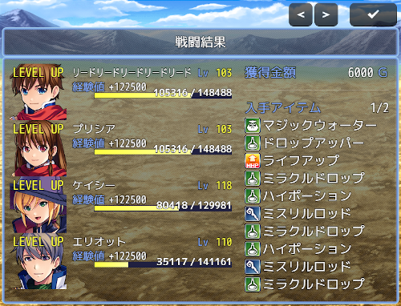
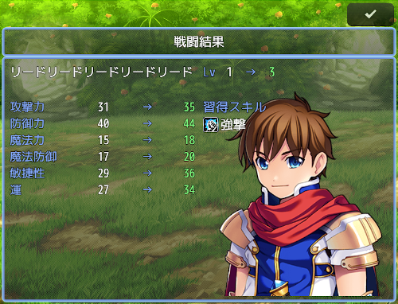

# [リザルト](https://raw.githubusercontent.com/nuun888/MZ/master/NUUN_Result.js)
# Ver.1.14.3

[詳細](https://forum.tkool.jp/index.php?threads/%E3%80%90%E3%83%97%E3%83%A9%E3%82%B0%E3%82%A4%E3%83%B3%E3%80%91%E3%83%AA%E3%82%B6%E3%83%AB%E3%83%88%E3%80%80ver-1-4-3.4852/) 

戦闘終了時にリザルト画面を表示します。 
デフォルトのリザルトはメッセージウィンドウで表示されるシンプルなものになっていますが、このプラグインでは専用のウィンドウでリザルト画面を表示させます。  
このプラグインではテンポ重視にしているためできるだけワンクリックでリザルトを終了できるようになっています。レベルアップしたアクターがいない場合はワンクリックでリザルト画面が終了します。  
アクターの獲得経験値のゲージ、数値はアニメーションします。  
各キャラクターがレベルアップし決定キーをおしたらレベルアップ画面に移行します。レベルアップ画面ではアクターの立ち絵が表示できプラグインコマンドで立ち絵を変更することが出来ます。  

 
 
 

画像指定のフォルダーについて 
Ver.1.6.4からフォルダーの参照先を変更しました。 
背景画像はnuun_background、アクター画像はnuun_actorpicturesに変更となっています。 

このプラグインは以下のプラグインVer.1.1.4以降が必要です。
[NUUN_Base](https://raw.githubusercontent.com/nuun888/MZ/master/NUUN_Base.js)　共通処理 

<B>更新履歴</B> 
2021/3/9 Ver.1.5.0 
獲得金額、独自パラメータの設定方法を変更。 
戦闘結果の文字の表示位置を左、中央、右から選択し表示できる機能を追加。 
2021/3/8 Ver.1.4.7 
リザルトウィンドウのY座標を変更したとき、ウィンドウがサイズ変更してしまう問題を修正。 
アクター名・レベル・経験値のフォントサイズで負の数値を入力できなかった問題を修正。 
ゲージ現在値のフォントサイズの計算が間違っていたので修正。 
2021/3/7 Ver.1.4.6 
ドロップアイテム、習得スキルに色を付ける機能を追加。 
入手画面のアクター名、レベル、獲得経験値のフォントサイスを変更できるように変更。 
入手画面の獲得経験値、EXPゲージのY位置を指定できる機能を追加。 
プラグインパラメータ「勝利BGM」に勝利MEを再生させない機能を追加。 
入手画面の経験値バーの現在値にフォントサイズを指定できるように変更。 
タッチUIがOFFの時にウィンドウの表示範囲を上に詰める機能を追加。 
リザルトウィンドウY座標を調整できる機能を追加。 
線の色を変えられる機能を追加。 
2021/3/6 Ver.1.4.5 
獲得経験率に変化があった時、EXPゲージ、数値の更新フレームが正常に動作していない問題を修正。 
拡大率を顔グラモード以外適用しないように修正。 
レベルアップ画面のステータス差分で差がなかった数値の色がシステムカラーになっていた問題を修正。 
2021/3/5 Ver.1.4.4 
レベルアップ、レベルアップした時のレベル、レベルアップ後のレベル、ステータスの色を指定できる機能を追加。 
獲得経験率により通常の獲得経験値よりも多い又は少ない時に、数値に色付け出来る機能を追加。 
戦闘不能アクターの名前を赤く表示するように変更。 
リザルト画面を開いた後、次のページを切り替えるまでの待機フレームを設定する機能を追加。 
背景画像がボタンの前面に表示されてしまう問題を修正。 
2021/3/4 Ver.1.4.3 
獲得経験値が0の時にレベルが表示されない問題を修正。 
獲得金額が0の時に金額が表示されない問題を修正。 
2021/3/4 Ver.1.4.2 
獲得経験値が0の時に獲得経験値が表示されない問題を修正。 
獲得経験値が0の時に現在経験値の数値にNaNが表示される問題を修正。 
次のレベルまでの必要経験値のY座標計算に問題が生じたためユーザー側がY座標を調整できるように変更。 
2021/3/3 Ver.1.4.1 
決定キーを押しっぱなしで戦闘を終了するとリザルトウィンドウがすぐに閉じてしまう問題を修正。 
ドロップアイテム、習得スキルのページ切り替えを押しっぱなしで切り替えられるように修正。 
2021/3/2 Ver.1.4.0 
背景画像を表示できる機能を追加。 
ウィンドウ幅を0以外にしたときにドロップアイテム、習得スキルの表示位置がずれる問題を修正。 
ウィンドウ幅を0以外にしたときにボタンが右端に来るよう修正。 
2021/3/1 Ver.1.3.1 
戦闘勝利後のBGMを設定できるプラグインコマンドを追加。 
2021/3/1 Ver.1.3.0 
勝利ME後に任意のBGMを再生する機能を追加。 
プラグインコマンドでレベルアップ画面を表示を許可する機能を追加。(注：このプラグインコマンドを実行後レベルアップ画面表示の設定が無効化されます） 
2021/3/1 Ver.1.2.1 
EXPゲージの数値を百分率表記にする機能を追加。 
最大レベルの時にゲージがMAXになるよう修正。 
2021/3/1 Ver.1.2.0 
EXPゲージに数値を表示する機能を追加。 
2021/2/28 Ver.1.1.1 
フォントサイズを変更したとき、経験値名称と獲得経験値の文字が被る問題を修正。 
入手画面のアクター名、レベル、経験値のフォントサイズが２２未満の時反映されるように変更。 
2021/2/28 Ver.1.1.0 
獲得金額の下に独自パラメータを表示する機能を追加。 
レベルアップ画面に独自パラメータを表示する機能を追加。 
レベルアップした時に表示するレベルアップ画面をカットする機能を追加。 
レベルアップ画面のレベルのレベルアップ後の数値を色付け。 
ドロップアイテムリストの表示が若干早く表示されていた問題を修正。 
レベルアップ表示で表示横幅のアクター表示拡大率を考慮されていなかった問題を修正。 
2021/2/28 Ver.1.0.2 
アクター画像の設置方法を変更。 
レベルアップ画面のアクター名がシステムカラーになっていたので修正。 
ゲージの更新フレーム時間を設定できる機能を追加。 
2021/2/27 Ver.1.0.1 
レベルの表示幅を修正。 
レベルアップステータスのレベルアップ後のステータスに色付け。 
右クリックでページ送りを出来るように変更。 
2021/2/27 Ver.1.0.0 
初版。 
