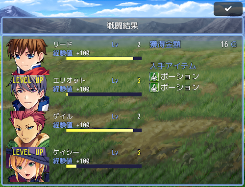
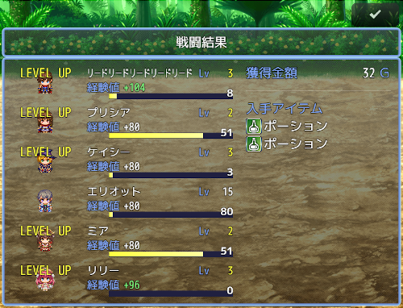

Ver.1.0.0 
https://raw.githubusercontent.com/nuun888/MZ/master/NUUN_Result.js 

戦闘終了時にリザルト画面を表示します。 
最初に各キャラクターのEXPとドロップアイテムが表示されます。 
アクターのレベルが上がったら別画面でステータスの差分と習得スキルが表示されます。 

<B>仕様</B> 
獲得金額の名称のみ未記入にすると金額のみ表示することが出来ます。 
所持金拡張プラグインで所持金のアイコンを表示させたい場合はアイコンの表示クラスに"Window_Result"を記入してください。（必ず'及び"で囲む） 

<B>操作</B>
エンター　切り替え、画面を閉じる
←→　ドロップアイテム、習得スキルページ切り替え

