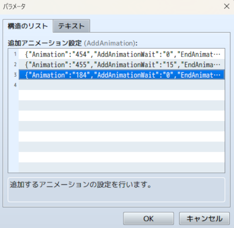

# [追加アニメーション表示](https://raw.githubusercontent.com/nuun888/MZ/master/NUUN_AddAnimation.js)
# Ver.1.3.0
[ダウンロード](https://raw.githubusercontent.com/nuun888/MZ/master/NUUN_AddAnimation.js)  
#### 無償ライセンス
クレジット表記：任意  
商業利用：可能  
成人向け：可能  
改変：可能  
再配布：可能  
当リポジトリ内、公式フォーラム、正規販売サイト以外からのダウンロード、改変済みの場合はサポートは対象外となります。  

アイテム、スキルのアニメーションを複数または追加で再生させます。  

  

## 設定
スキル、アイテムのメモ欄  
`<AddAnimation:[id]>` 設定したアニメーションを連続再生します。  
`[id]`:プラグインパラメータの追加アニメーション設定のID  

例：  
アニメーション設定 ID: 1  
  追加アニメーション1  
    アニメーション: 10  
    ウェイト: 0  
  追加アニメーション2  
    アニメーション: 11  
    ウェイト: 30  
  追加アニメーション3  
    アニメーション: 12  
    ウェイト: 0  
    アニメーション終了後再生: ON  
上記の場合、アニメーションID 10、11番のアニメーションが30フレーム後、12番のアニメーションが10、11番のアニメーションが終了後に順番に再生されます。  
  

#### アニメーション終了後再生  
再生している全てのアニメーションが終了後に再生します。  
それ以降のアニメーションはアニメーション終了後再生を設定しているアニメーション基準にウェイトが発生します。  

## 旧設定について
旧設定は廃止となりました。Ver.1.2.0以前のバージョンをご使用ください。  

## 旧バージョン Ver.1.2.0
[ダウンロード](https://raw.githubusercontent.com/nuun888/MZ/master/oldVer/NUUN_AddAnimation.js)  

#### 旧設定(非推奨)
スキル、アイテムのメモ欄  
`<AddAnimation:[id],[id]...>` 複数のアニメーションを同時に再生します。  
`[id]`:アニメーションID  

`<WaitAddAnimation:[id],[id]...>`  一つのアニメーションが終わった後に次のアニメーションを再生します。  
`[id]`:アニメーションID  
`[Number]`:識別ID(整数) 最初のタグは数字を省略します。２番目以降は2と記入します。  
`<AddAnimationWaitFrame[Number]:[WaitFrame]>`　上記のアニメーションの再生を指定のフレーム数遅延再生します。  
`[WaitFrame]`;遅延フレーム数 -1と記入した場合は、アニメーションが再生し終わるまで待ちます。  
`[Number]`:識別ID(整数) 最初のタグは数字を省略します。２番目以降は2と記入します。  

例  
`<AddAnimation:13>`  
`<AddAnimation2:14>`  
`<AddAnimationWaitFrame:30>`  
`<AddAnimationWaitFrame2:45>`  
最初のアニメーションが再生されて３０フレーム後にアニメーションID13が再生され、４５フレーム後にアニメーションID14番が再生されます。  

### 更新履歴
2026/9/24 Ver 1.3.0  
NUUN_Baseなしで実行できるように仕様を変更。  
2025/2/4 Ver 1.2.0   
設定方法をプラグインパラメータで設定する方式に変更。  
2023/6/4 Ver 1.1.0  
指定のフレーム数遅延して再生できる機能を追加。  
2023/6/3 Ver 1.0.0  
初版  
