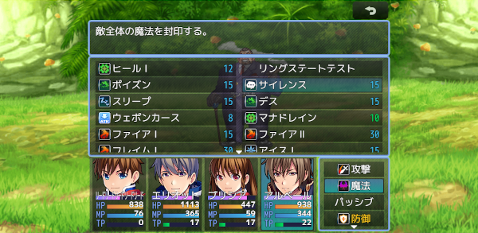

# [戦闘中アイテム、スキル選択画面MV風表示](https://raw.githubusercontent.com/nuun888/MZ/master/NUUN_BattleItemSkillWindowMV.js)
# Ver.1.3.2
[ダウンロード](https://raw.githubusercontent.com/nuun888/MZ/master/NUUN_BattleItemSkillWindowMV.js)

戦闘中のアイテム、スキル選択画面をMV風形式に変更させます。
  

## 更新履歴
2024/6/8 Ver.1.3.2  
バトルスタイル拡張プラグイン併用時にアイテム画面の表示が正常に表示されない問題を修正。  
2022/8/27 Ver.1.3.1  
処理の修正。  
2022/6/5 Ver.1.3.0  
アイテム、スキル選択中にアクターコマンドを非表示にする機能を追加いたしました。  
2022/3/17 Ver.1.2.0  
表示する列を指定できる機能を追加。  
2021/11/15 Ver.1.2.0  
キャンセルボタンの表示がおかしくなる問題を修正。  
対象選択時にアイテム画面、スキル画面が表示されたままだったのを修正。  
2021/11/14 Ver.1.1.2  
スキル、アイテムを選択し敵の選択画面を表示した後にキャンセルするとアクターウィンドウが表示されない問題を修正。  
2021/11/5 Ver.1.1.1  
キャンセルボタンの表示がスキル、アイテムウィンドウが開いていなくても一番上に表示されてしまう問題を修正。  
2021/11/5 Ver.1.1.0  
画面下まで表示できる機能を追加。  
可変モードでスキル及びアイテムが１つもない場合、１行分表示されるように修正。  
キャンセルボタンの位置を変更。  
2021/2/3 Ver.1.0.2  
マップ上でアイテム、スキル画面を表示した時、戦闘時の画面が表示されてしまう問題を修正。  
2021/2/1 Ver.1.0.1  
キャンセルボタンの処理を修正。  
2021/1/31 Ver.1.0.0  
初版  
