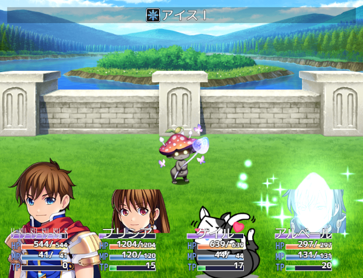
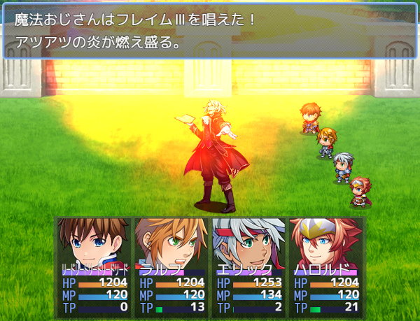
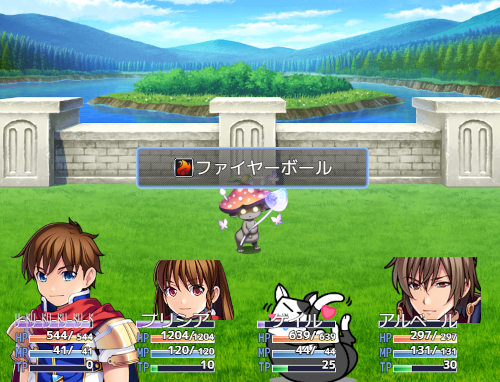

# [バトルログ簡易表示及び一括ポップアップ](https://raw.githubusercontent.com/nuun888/MZ/master/NUUN_BattleLogSimpleDisplayPopupBatch.js)
# Ver.1.2.1
[ダウンロード](https://raw.githubusercontent.com/nuun888/MZ/master/NUUN_BattleLogSimpleDisplayPopupBatch.js)  
#### 必須、前提プラグイン
[共通処理](https://github.com/nuun888/MZ/blob/master/README/Base.md)  

バトルログをアイテム名、スキル名のみ表示させるようにします。  
また、このプラグインではポップアップを一括で表示させます。  
※このプラグインのみでフロントビューでアクター側にポップアップを表示させることはできません。  
  

ログウィンドウ指定時のバトルログウィンドウのクラスは`Window_NUUN_BattleLog`です。  

## 設定
### ログ設定
#### ログメッセージ  
  

#### ログウィンドウ  
  

#### ログ表示形式
使用時のメッセージを選択した場合、スキル、アイテム発動時のメッセージが表示されます。  
  

### ログ表示位置
#### 通常
左側基準で表示されます。座標設定はこの表示位置からの相対座標になります。  
#### 横位置中央
ウィンドウをUIウィンドウ中心を基準に表示されます。座標設定はこの表示位置からの相対座標になります。  
#### バトラー
バトラー(アクターはサイドビューバトラー、敵キャラはモンスター画像)の位置基準に表示されます。座標設定はこの表示位置からの相対座標になり、
ログ表示位置バトラー設定で設定した座標が加算されます。尚子のモードはログ設定でログウィンドウを選択したときに有効になります。    
  
  

ログ表示位置をバトラー(ログウィンドウのみ)に設定したときに、敵キャラのモンスター毎にログを表示する位置を指定できます。  
敵キャラのメモ欄  
`<BattleLogPosition:[x],[y]>`  
`[x]`:X座標  
`[y]`:Y座標  
上記のタグがある場合、敵キャラウィンドウ表示位置での設定は無視されます。  

### 更新履歴
2023/7/22 Ver 1.2.1  
背景画像の基本位置を指定する機能を追加。  
2023/7/8 Ver 1.2.0  
スキル、アイテム名とメッセージを表示する機能を追加。  
2023/6/3 Ver 1.1.1  
処理の修正。  
2023/5/9 Ver 1.1.0  
使用時のメッセージを表示させる機能を追加。  
2023/5/5 Ver 1.0.0  
初版  
