# [バトルスタイル拡張EX](https://raw.githubusercontent.com/nuun888/MZ/master/NewBattleStyleSeries/NUUN_BattleStyleEX.js)
# Ver.1.0.15  
[ダウンロード](https://raw.githubusercontent.com/nuun888/MZ/master/NewBattleStyleSeries/NUUN_BattleStyleEX.js)  
#### 必須プラグイン
[共通処理](https://github.com/nuun888/MZ/blob/master/README/Base.md)  
[ステータス項目ベース](https://github.com/nuun888/MZ/blob/master/README/NUUN_MenuParamListBase.md)  
#### 対応プラグイン
[立ち絵、顔グラ表示](https://github.com/nuun888/MZ/blob/master/README/ActorPicture.md)Ver.1.7.2以降   
#### オプションプラグイン
[敵の条件画像変更](https://raw.githubusercontent.com/nuun888/MZ/master/NewBattleStyleSeries/NUUN_EnemyCondPicture.js)   
[戦闘中天候適用](https://raw.githubusercontent.com/nuun888/MZ/master/NewBattleStyleSeries/NUUN_BattleWeather.js)   
[バトルエネミーウィンドウカスタマイズ](https://raw.githubusercontent.com/nuun888/MZ/master/NewBattleStyleSeries/NUUN_EnemySelectWindow.js)   
[バトルアイテム、スキルウィンドウカスタマイズ](https://raw.githubusercontent.com/nuun888/MZ/master/NewBattleStyleSeries/NUUN_BattleItemSkillWindowEX.js)   
[戦闘中メッセージウィンドウ背景画像](https://raw.githubusercontent.com/nuun888/MZ/master/NewBattleStyleSeries/NUUN_BattleMessagesBackgroundImg.js)   
[バトルスタイル拡張サポートアクターVer2.0対応](https://github.com/nuun888/MZ/blob/master/README/BattleStyleEXWithSupportActor.md)  
[バトラーのバトルフィールド表示](https://raw.githubusercontent.com/nuun888/MZ/master/NewBattleStyleSeries/NUUN_BS_BattleFieldActors.js)   
[戦闘バイブレーション]   

## 設定方法
### 敵キャラの通常攻撃のアニメーション
敵キャラのメモ欄  
`<AttackAnimation:11>`
敵キャラの通常攻撃時、11番のアニメーションが再生されます。指定がない場合はプラグインパラメータのデフォルト値が適用されます。  

### スタイルの設定
バトルスタイルから表示させたいレイアウトをリストから指定します。リストにないスタイル(独自定義のスタイル)は直接該当のスタイル名を記入します。  
#### 用意されている設定のスタイル
Default:MZのバトルレイアウトと同じです。フロントビューでアニメーションが再生されます。    
List及びList_NoTP:MVまでのバトルレイアウトになります。フロントビューではアニメーションが再生されません。  
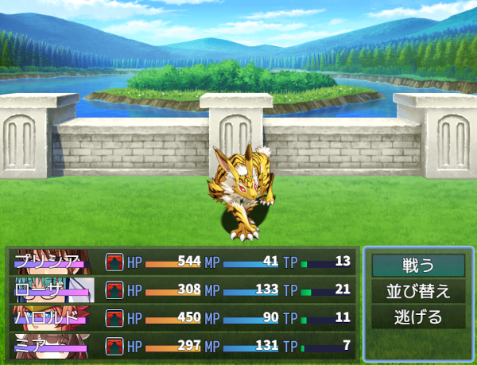  
XP:XPのバトルレイアウトになります。フロントビューでアニメーションが再生されます。  
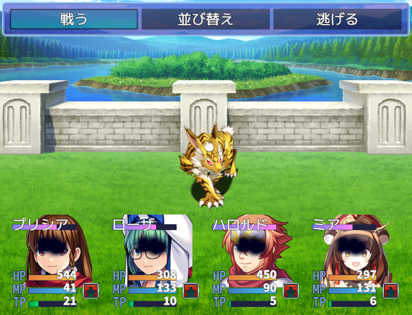  

### バトルレイアウト設定
#### アクターステータスウィンドウの横方向表示方法
左寄り  
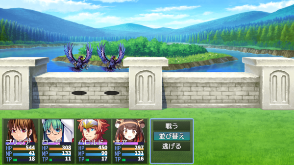  
右寄り  
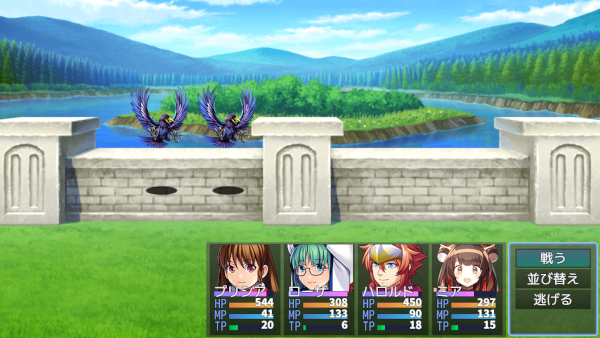  
中央  
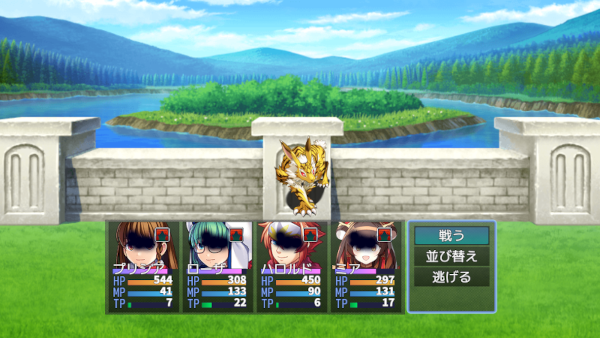  
#### アクターステータスウィンドウの縦方向表示方法
上基準  
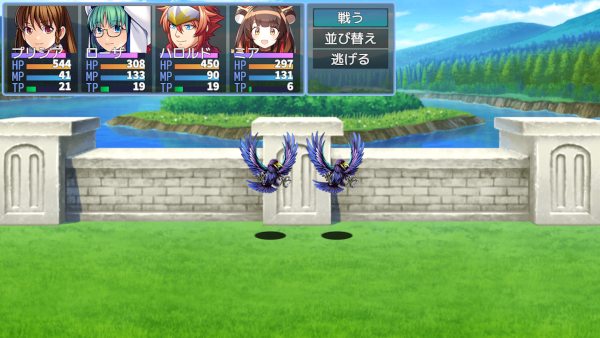  
下基準  
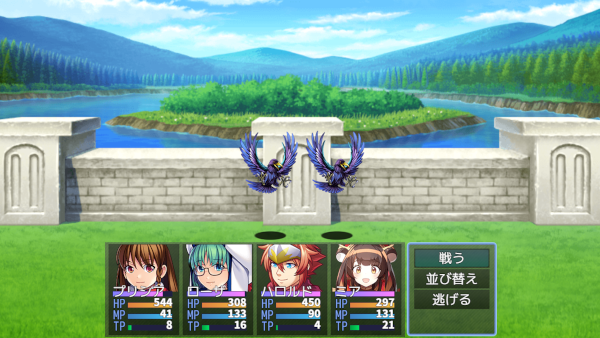  
#### アクターステータスウィンドウのコンテンツの横方向表示方法
左寄り  
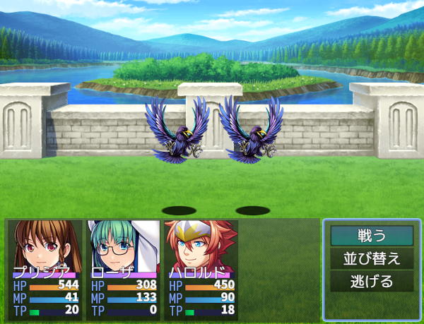  
右寄り  
  
中央  
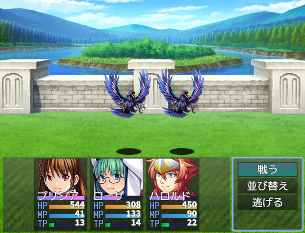  

#### パーティコマンドの表示方法
上部  
  
中部  
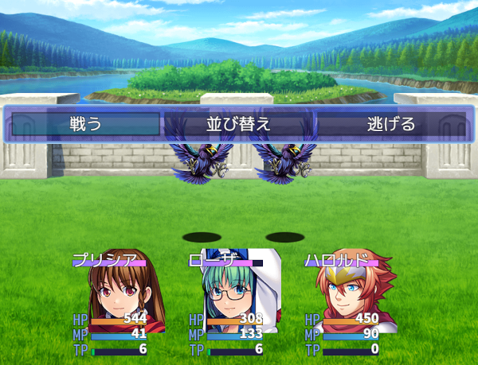  
下部  
  
アクターステータスウィンドウの上  
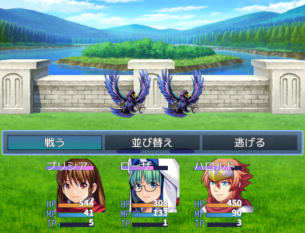  

#### アクターコマンドの表示方法
各アクターの上  
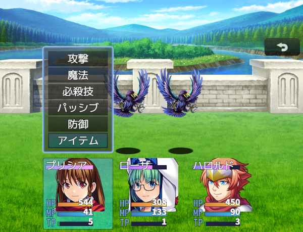  
上部、中部、下部、アクターステータスウィンドウの上はパーティコマンドと同じです。  

#### コマンド可変表示
アクターコマンドの表示を各アクターのコマンドの表示最大数分表示させます。  
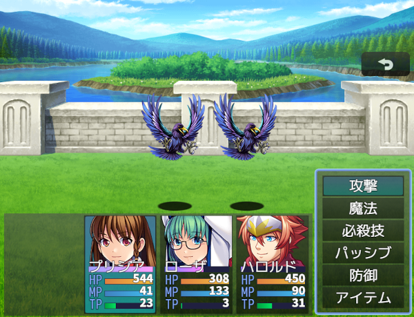  

#### 表示項目設定
X表示列位置:指定の項目列に表示します。  
Y表示列位置:指定の行に表示します。  
X座標:X表示列位置からの相対座標。  
Y座標:Y表示列位置からの相対座標。  
項目、ゲージ横幅:表示項目全体の幅。ゲージの場合はゲージの長さ。  
項目名称横幅:項目名称の横幅。  
名称:項目の名称。  
項目名称文字色:項目の文字色。  
文字揃え:パラメータの表示位置。  
評価式or文字列(上):評価式または文字列を記入します。ステートはステートID、ゲージは現在値  
評価式or文字列(下):評価式または文字列を記入します。ステートはバフ、ゲージは最大値  

#### バトラー画像切り替え
以下の設定した条件が全て一致したときに有効になります。  
特定の装備(複数の装備を指定できます)  
特定の職業(複数の職業を指定できます)  
特定のステート(複数のステートを指定できます)  
スイッチがON  
残りHP(HP条件有効をONに設定)  
変化シーン(下の一覧から選択)  

##### 変化シーン一覧
戦闘不能  
コマンド選択時  
攻撃時  
特定のステートにかかっている(複数のステートを指定できます)  
瀕死  
ダメージ
クリティカルダメージ
回復時  
防御時  
詠唱時  
勝利時  
反撃時  
反撃時CounterExtend(トリアコンタン氏)要NUUN_BattleStyleEX_CounterExtend  
魔法反射時  
攻撃スキル使用時(特定のスキル発動時に変化可能で複数指定できます※1)  
回復スキル使用時(特定のスキル発動時に変化可能で複数指定できます※1)  
アイテム使用時(特定のアイテム発動時に変化可能で複数指定できます※1)  
ファイナルアタック(1) 要NUUN_FinalAttack  
※1 スキル、アイテムが指定されていない場合は全てのスキル又はアイテム使用時に適用されます。  

残りHP、スイッチ、装備している武器、防具、職業、ステートと変化シーンを同時指定することで特定の装備時、ステート時、スイッチがONの時毎の立ち絵を設定できます。  
設定した画像の優先度はリストの上から順に条件一致したときに適用されます。通常時の画像は一番下に配置してください。  
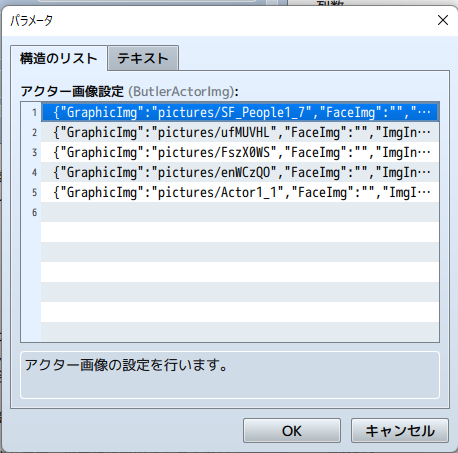  

反撃時CounterExtend(トリアコンタン氏)を適用するには別途要CounterExtend(トリアコンタン氏)及びNUUN_BattleStyleEX_CounterExtendが必要です。  

##### アクター画像設定の残りHPの設定方法
上限値：指定の数値が上限値以下　上限値が0の場合は下限値以上のみの判定になります。  
下限値：指定の数値が下限値以上  
例  
`上限値50 下限値25`  
残りHPが25%以上50%以下の時に適用します。  
`上限値0 下限値70`  
残りHPが70%以上の時に適用します。  
`上限値25 下限値0`  
残りHPが25%以下の時に適用します。  

##### APNGで表示
別途トリアコンタン様のAPNGピクチャプラグインが必要です。  
設定用プラグインまたは立ち絵、顔グラ表示EXのimg/pictures/にある画像ファイルを指定します。  
APNGピクチャプラグインでのAPNGピクチャリストに先ほど設定した画像ファイルと同じ画像を指定します。  

#### ウィンドウ表示モード
フロントビューアニメーションでアクターへの一部のアニメーションの表示がおかしくなる場合は'Sprite'を指定してください。  
問題ない場合、サイドビュー戦闘の場合は'Scene_Battle'に指定しても問題ありません。  

## オプションプラグイン
### 敵の条件画像変更  
条件により敵の画像を変更します。当プラグインVer.1.0.13以降  
[ダウンロード](https://raw.githubusercontent.com/nuun888/MZ/master/NewBattleStyleSeries/NUUN_EnemyCondPicture.js)  
### 戦闘中天候適用  
天候の変化を戦闘中でも適用します。  
[ダウンロード](https://raw.githubusercontent.com/nuun888/MZ/master/NewBattleStyleSeries/NUUN_BattleWeather.js)  
### バトルエネミーウィンドウカスタマイズ  
敵対象選択画面をカスタマイズします。  
[ダウンロード](https://raw.githubusercontent.com/nuun888/MZ/master/NewBattleStyleSeries/NUUN_EnemySelectWindow.js)   
### バトルアイテム、スキルウィンドウカスタマイズ
戦闘中のアイテム、スキルウィンドウをカスタマイズできます。  
[ダウンロード](https://raw.githubusercontent.com/nuun888/MZ/master/NewBattleStyleSeries/NUUN_BattleItemSkillWindowEX.js)   
### 戦闘中メッセージウィンドウ背景画像
[ダウンロード](https://raw.githubusercontent.com/nuun888/MZ/master/NewBattleStyleSeries/NUUN_BattleMessagesBackgroundImg.js)   
### バトラーのバトルフィールド表示
[ダウンロード](https://raw.githubusercontent.com/nuun888/MZ/master/NewBattleStyleSeries/NUUN_BS_BattleFieldActors.js)   
### バトルスタイル拡張サポートアクターVer2.0対応
[ダウンロード](https://github.com/nuun888/MZ/blob/master/README/BattleStyleEXWithSupportActor.md)  

## 更新履歴
2024/12/21 Ver.1.0.15  
アクター画像条件にレベルを追加。  
アクター別設定の表示ステータスが適用されていなかった問題を修正。  
2024/12/1 Ver.1.0.14  
一部プラグインにてフロントビューでアニメーションを再生させたときに、アニメーションが正常に再生されない問題を修正いたしました。  
2024/11/12 Ver.1.0.13  
一部の処理を修正。  
2024/11/9 Ver.1.0.12  
表示バフの設定を行ったステートアイコンでデバフが表示されない問題を修正。  
2024/11/4 Ver.1.0.11  
アクターコマンドの位置をアクターステータスウインドウの上に指定したときに、アクターステータスウインドウの上に表示されない問題を修正。  
2024/10/13 Ver.1.0.10  
敵対象キャンセル後、パーティコマンドが表示されずにフリーズする問題を修正。  
2024/10/8 Ver.1.0.9  
ステート2の設定でエラーが出る問題を修正。  
2024/10/8 Ver.1.0.8  
ステートのフィルター機能が機能していなかった問題を修正。  
2024/9/23 Ver.1.0.7  
アクター選択のカーソルがずれて表示される問題を修正。  
2024/8/19 Ver.1.0.6  
ステート(メニュータイプ)の表示が切り替わらなっかた問題を修正。  
2024/8/14 Ver.1.0.5  
2回目以降の行動選択時からパーティコマンドに戻る際にフリーズする問題を修正。  
2024/8/11 Ver.1.0.4  
アクターコマンドのカスタムのY座標が0の位置に表示されない問題を修正。  
2024/8/9 Ver.1.0.3  
出現、逃走、勝利、敗北ウィンドウの表示位置を指定できる機能を追加。  
戦闘開始時にアクターステータスウィンドウが表示されなかったのを修正。  
2024/8/2 Ver.1.0.2  
マップ上でアニメーションを再生するとエラーが出る問題を修正。  
2024/7/21 Ver.1.0.1  
アクターステータスウィンドウがちらつく問題を修正。  
2024/7/20 Ver.1.0.0  
初版  
