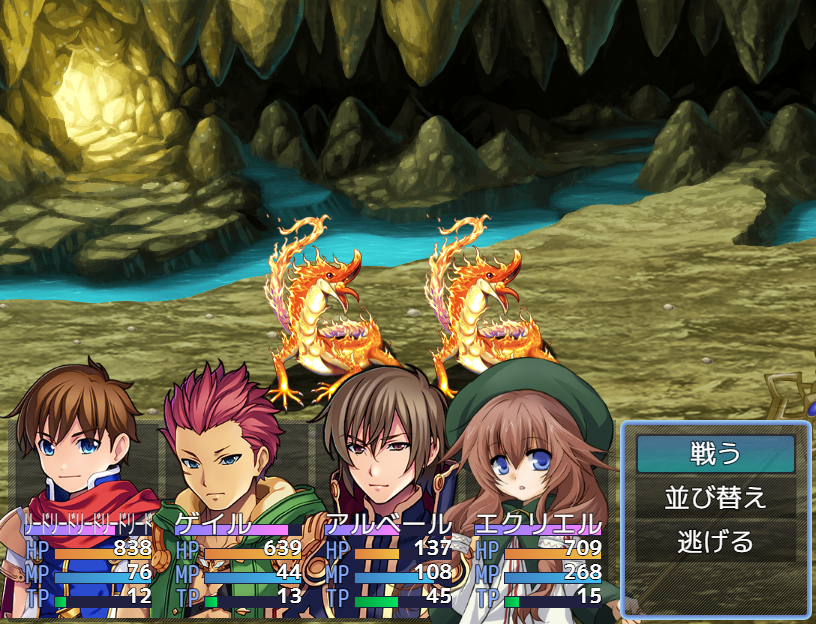
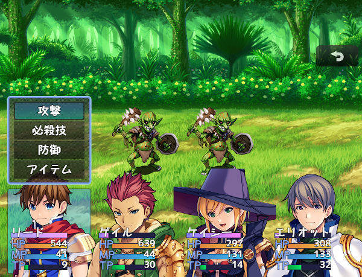
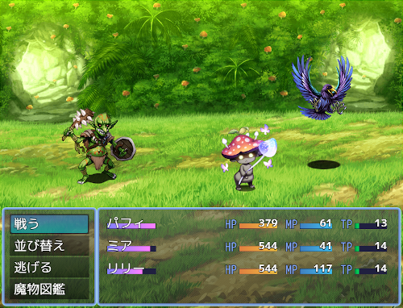
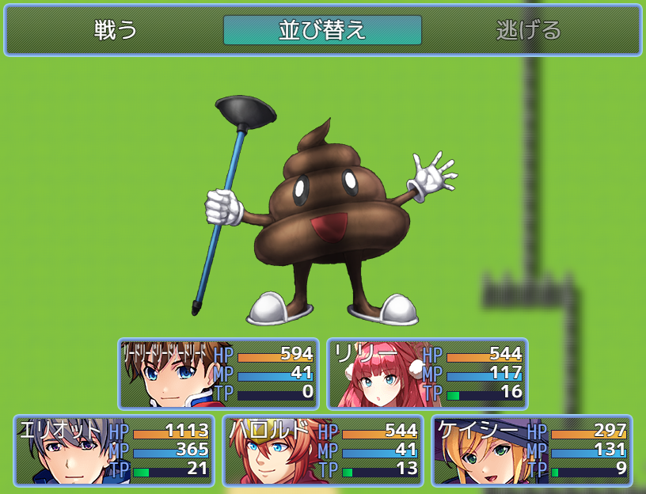
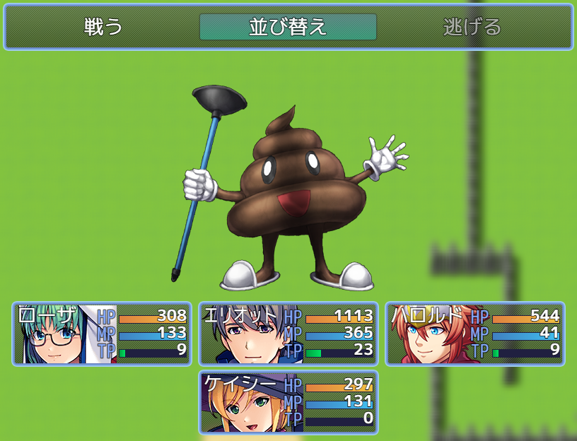
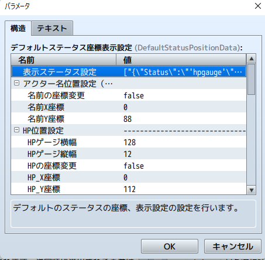
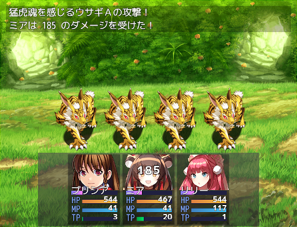
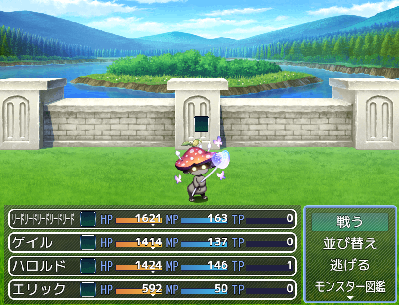
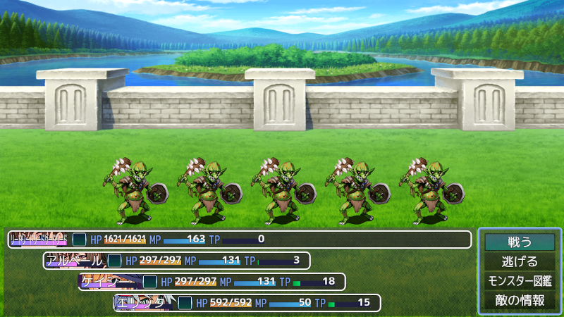

# バトルスタイル拡張

## バトルスタイル拡張ベース
### Ver.3.12.20
[ダウンロード](https://raw.githubusercontent.com/nuun888/MZ/master/NUUN_BattleStyleEX.js)
## 設定用プラグイン
[バトルスタイル拡張デフォルト設定用](https://raw.githubusercontent.com/nuun888/MZ/master/NUUN_BattleStyleEX_Default.js)Ver.1.11.2  
[バトルスタイル拡張スタンダード設定用](https://raw.githubusercontent.com/nuun888/MZ/master/NUUN_BattleStyleEX_Standard.js)Ver.1.11.2  
[バトルスタイル拡張XPスタイル設定用](https://raw.githubusercontent.com/nuun888/MZ/master/NUUN_BattleStyleEX_XP.js)Ver.1.11.2  
[バトルスタイル拡張タイプ4設定用](https://raw.githubusercontent.com/nuun888/MZ/master/NUUN_BattleStyleEX_Type4.js)Ver.1.4.2  

バトルスタイル拡張デフォルト設定用 Ver.1.11.3  
   

バトルスタイル拡張スタンダード設定用 Ver.1.11.3 
  

バトルスタイル拡張XPスタイル設定用 Ver.1.11.3  
  

バトルスタイル拡張タイプ4設定用 Ver.1.4.3  
  
  

## 必須、前提プラグイン
[共通処理](https://github.com/nuun888/MZ/blob/master/README/Base.md)Ver.1.5.1以降  

## 拡張プラグイン
「戦闘アニメーションの表示」をアクターにも表示できるようにするプラグインコマンドを追加。  
[戦闘中のアクターへのアニメーション実行](https://raw.githubusercontent.com/nuun888/MZ/master/NUUN_BattleAnimationEX.js)Ver.1.0.0  
反撃拡張プラグイン(トリアコンタン氏)での立ち絵切り替えを適用。  
[条件バトラー反撃拡張プラグイン適用](https://github.com/nuun888/MZ/blob/master/README/BattleStyleEX_CounterExtend.md)  
敵の条件画像変更    
[敵の条件画像変更](https://github.com/nuun888/MZ/blob/master/README/EnemyCondPicture.md)  

## オプション
味方の被ダメージ時にゲームパッドを振動。  
[ゲームパッド振動](https://github.com/nuun888/MZ/blob/master/README/GamePadVibration.md)  
[立ち絵、顔グラ表示共通](https://github.com/nuun888/MZ/blob/master/README/ActorPicture.md)Ver.1.7.0以降  

## 機能
テーマの変更（デフォルト、MV、XP）  
使用時のアニメーション  
フロントビューでもアクター側にステートアニメーション表示  
フロントビューアクター側にアニメーション  
敵の通常攻撃時のアニメーション表示  
アクター画像の条件による変更  
コマンドの表示変更  
アクターステータスウィンドウ内の各アクターのステータスパラメータのカスタマイズ  

アクターの顔グラを立ち絵にする場合は、プラグインパラメータのデフォルトアクター画像設定またはアクター画像座標拡大率設定でアクターの画像モードを画像に設定してください。  
アクター画像座標拡大率設定を設定してない場合はのデフォルトアクター画像設定の設定が適用されます。  

アクターの画像設定で条件で顔グラまたは立ち絵を切り替える事ができます。また立ち絵、顔グラ表示EXに対応していますが、プラグインパラメータの立ち絵表示EX適用をONにしてください。  
条件の優先度は上から順に一致した条件が適用されます。通常時に適用される画像は一番下に設定してください。  

各ステータスの座標位置を変更したい場合は、各項目の「〇〇の座標変更」をtureにしてください。  

## 設定方法
### アクターステータスウィンドウの独自表示設定
ステータス座標表示設定の表示ステータス設定で表示させる項目を設定できます。  
ひとつでも設定している場合は、リストに設定している項目のみステータスウィンドウに表示されます。(デフォルトでは未設定です)  
  

#### 独自パラメータ、独自パラメータ(動的) 
評価式or文字列Aには表示する式をjavascriptで記入します。  
`this._battler`:アクターゲームデータ  
`this._battler.actor()`:アクターシステムデータ  

#### 独自ゲージ
評価式or文字列Aに現在の値をjavascriptで記入します。  
評価式or文字列Bに最大値をjavascriptで記入します。  
`this._battler`:アクターゲームデータ  
`this._battler.actor()`:アクターシステムデータ  

#### ステート,ステート2
評価式or文字列Aに表示するステートIDを記入します。  
評価式or文字列Bに表示するバフIDを記入します。  

#### 画像
評価式or文字列Aには表示条件をjavascriptで記入します。条件が一致しているときに表示されます。  
無記入の場合は常に表示されます。  
`actor`:アクターゲームデータ  
`actor.actor()`:アクターシステムデータ  
`this._battler`:アクターゲームデータ  
`this._battler.actor()`:アクターシステムデータ  

### パ－ティコマンド
オプションの「コマンド表示中央寄り」をONにした場合コマンド名の表示が中央寄りになります。  
  

### アクターコマンド
各SVアクターの上、左、右を指定した場合、アクターのサイドビュー画像の該当するポジション付近に表示します。  
フロントビューで指定した場合は、アクターステータスウィンドウの上に表示されてしまいます。  

### アクターステータスウィンドウ
#### アクター名に任意のフォントを設定　　
fontsフォルダ内の指定のフォントファイル名を拡張子なしで記入して下さい。  
なおフォントを変更するには別途フォントをロードするプラグインが必要です。  
トリアコンタン様　フォントロードプラグイン推奨  
https://triacontane.blogspot.com/  

### 敵キャラの通常攻撃のアニメーション
敵キャラのメモ欄  
`<AttackAnimation:11>`
敵キャラの通常攻撃時、11番のアニメーションが再生されます。指定がない場合はプラグインパラメータのデフォルト値が適用されます。  

### アクター画像設定
#### 画像横基準表示位置
画像左基準：画像の左を起点に表示します。  
画像中央基準：画像の中央を起点で、アクターステータスの中央に表示されます。  

#### 画像縦基準表示位置
画像上基準：画像の上を起点とし、アクターステータスの上から表示されます。  
画像下基準：画像の下を起点とし、アクターステータスの下から上方向に表示します。  

### 立ち絵切り替え機能
以下の設定した条件が全て一致したときに有効になります。  
特定の装備(複数の装備を指定できます)  
特定の職業(複数の職業を指定できます)  
特定のステート(複数のステートを指定できます)  
スイッチがON  
残りHP(HP条件有効をONに設定)  
変化シーン(下の一覧から選択)  

#### 変化シーン一覧
戦闘不能  
コマンド選択時  
攻撃時  
特定のステートにかかっている(複数のステートを指定できます)  
瀕死  
ダメージ  
回復時  
防御時  
詠唱時  
勝利時  
反撃時  
反撃時CounterExtend(トリアコンタン氏)要NUUN_BattleStyleEX_CounterExtend  
魔法反射時  
攻撃スキル使用時(特定のスキル発動時に変化可能で複数指定できます※1)  
回復スキル使用時(特定のスキル発動時に変化可能で複数指定できます※1)  
アイテム使用時(特定のアイテム発動時に変化可能で複数指定できます※1)  
※1 スキル、アイテムが指定されていない場合は全てのスキル又はアイテム使用時に適用されます。  

残りHP、スイッチ、装備している武器、防具、職業、ステートと変化シーンを同時指定することで特定の装備時、ステート時、スイッチがONの時毎の立ち絵を設定できます。  
設定した画像の優先度はリストの上から順に条件一致したときに適用されます。通常時の画像は一番下に配置してください。  
  

反撃時CounterExtend(トリアコンタン氏)を適用するには別途要CounterExtend(トリアコンタン氏)及びNUUN_BattleStyleEX_CounterExtendが必要です。  

#### アクター画像設定の残りHPの設定方法
上限値：指定の数値が上限値以下　上限値が0の場合は下限値以上のみの判定になります。  
下限値：指定の数値が下限値以上  
例  
`上限値50 下限値25`  
残りHPが25%以上50%以下の時に適用します。  
`上限値0 下限値70`  
残りHPが70%以上の時に適用します。  
`上限値25 下限値0`  
残りHPが25%以下の時に適用します。  

### APNGで表示
別途トリアコンタン様のAPNGピクチャプラグインが必要です。  
設定用プラグインまたは立ち絵、顔グラ表示EXのimg/pictures/にある画像ファイルを指定します。  
APNGピクチャプラグインでのAPNGピクチャリストに先ほど設定した画像ファイルと同じ画像を指定します。  

### アクター毎にウィンドウを表示
プラグインパラメータのアクター別ウィンドウ表示をONします。  
ステータス座標表示設定のアクター別個別ウィンドウ設定内にあるウィンドウスキン画像でスキンを設定することでアクター別にスキンを変更できます。  
未指定の場合はデフォルトのスキンが表示されます。  
  

### アクターステータスのコンテンツ毎の座標を設定
リストの設定順はアクターステータスウィンドウに表示されるアクター順(戦闘キャラが1)になります。  
戦闘メンバーの表示設定はリストID1番に設定します。2番目は2番に設定します。(アクター別には設定できません)  
  

### ゲームパッドの振動
味方のHPダメージ時、ボスの消滅時にゲームパッドを振動させることができます。(X Inputのみ対応)  
上記の機能を使用するには別途[ゲームパッド振動](https://github.com/nuun888/MZ/blob/master/README/GamePadVibration.md)が必要です。  

### 天候適用
他の天候プラグインで戦闘中に天候を反映できる場合で、競合が起きる場合は当プラグインの戦闘時天候表示設定を表示なしに設定してください。  

## 競合対策パッチ  
木星ペンギン氏作疑似３Dバトルプラグインと併用して、フロントビューで味方にアニメーションを表示させる場合は別途バトルスタイル拡張疑似３Dバトル併用パッチを導入してください。  
木星ペンギン様の疑似３Dバトルと併用するときのパッチです。  
[バトルスタイル拡張疑似３Dバトル併用パッチ](https://raw.githubusercontent.com/nuun888/MZ/master/NUUN_BattleStyleEXInMPP_Pseudo3DBattle.js)  

## 旧バージョン
[バトルスタイル拡張ベース](https://raw.githubusercontent.com/nuun888/MZ/master/oldBS/NUUN_BattleStyleEX_Base.js) Ver.2.6.15  
[バトルスタイル拡張設定用](https://raw.githubusercontent.com/nuun888/MZ/master/oldBS/NUUN_BattleStyleEX.js) Ver.1.6.4  

### 設定用Ver.1.0.5以前からVer.1.1.0以降にアップデートする際の注意
アクター画像設定のスイッチ、武器、防具、ステート、使用アイテム、使用スキルの条件の複数指定対応により仕様が変更しております。  
再度再設定をお願いいたします。

### 設定用Ver.1.6.0にアップデートする際の注意
Ver.1.6.0でバトルステータスのデフォルトの設定を表示ステータス設定での設定に変更しております。  
旧設定で設定している場合でアクター座標、画像設定で追加する場合は、表示ステータス設定を空欄にしてください。  

### ウィンドウ表示モード
フロントビューアニメーションでアクターへの一部のアニメーションの表示がおかしくなる場合は'Sprite'を指定してください。  
問題ない場合、サイドビュー戦闘の場合は'Scene_Battle'に指定しても問題ありません。  
LL_StandingPictureBattle等と併用する場合は、'Scene_Battle'に設定することでアクターが背後に表示されますが、フロントビューアニメーションでアクターへの一部のアニメーションの表示が正常に表示されません。  

## 仕様
メニュー型のステート表示、画像、アクター名の表示幅は表示ステータス設定でのみ設定できます。  
表示するステート、バフのアイコンを指定する場合、複数のステートに同じIDのアイコンを設定している場合、表示されなくなります。  

## 更新履歴
2024/7/27 Ver.3.12.20  
アクター画像が切り替わらない問題を修正。  
2024/7/14 Ver.3.12.19  
顔グラが切り替わらない問題を修正。  
2024/7/13 Ver.3.12.18  
コマンド選択を終了してもアクター画像が切り替わらなかった問題を修正。  
立ち絵、顔グラ表示EXの更新による修正。  
2024/7/7 Ver.3.12.17  
戦闘リトライプラグインでのリトライ時の不具合を修正。  
2024/6/16 Ver.3.12.16  
戦闘中に最大メンバーが増加したときにフロントビューでのエフェクトが表示されない問題を修正。  
2024/3/2 Ver.3.12.15  
ステート表示の処理を修正。  
2024/2/18 Ver.3.12.14  
表示させるステートアイコン指定時に戦闘開始するとエラーが出る問題を修正。  
2024/2/5 Ver.3.12.13  
対象選択時のアイテム、スキルヘルプを非表示にする機能を復活。  
2024/1/7 Ver.3.12.12  
エフェクトの位置がずれて表示される問題を修正。  
2023/12/29 Ver.3.12.11  
戦闘開始時の画像が正常に取得できない問題を修正。　　
2023/12/28 Ver.3.12.10  
一定時間変化の画像が戻らなくなる問題を修正。  
2023/12/28 Ver.3.12.9  
戦闘不能時の画像非表示をOFFに設定していても、画像が消えてしまう問題を修正。  
戦闘不能をアイテム、スキルから付加させたときに、アクターの不透明度が正常に適用されない問題を修正。  
反撃の立ち絵切り替えが機能していない問題を修正。  
2023/12/23 Ver.3.12.8  
戦闘不能ステートの判定が正常に行われていなかった問題を修正。  
ステート条件設定に0を指定していると他の条件も一致しなくなる問題を修正。  
2023/12/21 Ver.3.12.7  
不透明度が適用されない問題を修正。  
2023/12/18 Ver.3.12.6  
立ち絵、顔グラ表示EXでの画像設定で、画像が切り替わらない問題を修正。(立ち絵、顔グラ表示EX Ver.1.6.3以降)  
2023/12/17 Ver.3.12.5  
コマンド選択時にアクターステータスウィンドウの位置が正常にシフトしない問題を修正。  
アクター画像を表示していない時にアクターを選択するとエラーが出る問題を修正。  
コマンドの位置をデフォルトに指定している場合のコマンドの表示位置を、アクターステータスウィンドウの横に表示されるように修正。  
2023/9/2 Ver.3.12.4  
メンバー入れ替え時のアクター画像を一旦消去するように修正。  
2023/8/8 Ver.3.12.3  
メンバー入れ替え時にカーソルの位置がずれて表示される問題を修正。  
2023/7/30 Ver.3.12.2  
味方の画像切り替えでランダムに表示できる機能を追加。  
2023/7/21 Ver.3.12.1  
敵の攻撃時の画像切り替えが機能していなかった問題を修正。  
2023/7/17 Ver.3.12.0  
敵の画像切り替えに関する処理の変更。  
2023/7/8 Ver.3.11.3  
アクターのアニメーション、ポップアップの位置を修正。  
2023/7/3 Ver.3.11.2  
マンガ的表現のバトルビューとの競合対応。  
画像切り替え機能で反撃(反射)から元に戻らない問題を修正。  
2023/7/2 Ver.3.11.1  
天候を戦闘中でも切り替えられるように修正。  
戦闘中の天候をスイッチで切り替えられる機能を追加。  
戦闘開始時及び戦闘終了時に指定のコモンイベントを指定できる機能を追加。  
2023/7/2 Ver.3.11.0  
戦闘中に天候を適用できる機能を追加。  
2023/6/26 Ver.3.10.16   
カウンターの画像切り替え処理を修正。  
2023/6/22 Ver.3.10.15  
Dynamic Motionプラグインとの競合対策。  
2023/6/14 Ver.3.10.14  
スキル発動待機時間ゲージ表示プラグインとの競合対応。  
2023/6/3 Ver.3.10.13  
バトルウィンドウの表示形式をVer.3.10.6以前の方式とVer.3.10.7以降の方式を選択できる機能を追加。  
2023/5/27 Ver.3.10.12  
ヘルプウィンドウスキンが非表示にならない問題を修正。  
2023/5/24 Ver.3.10.11  
メッセージウィンドウのウィンドウスキン表示をOFFにすると、戦闘時以外で通常のウィンドウスキンが表示されなくなる問題を修正。  
2023/5/22 Ver.3.10.10  
マップ中でメッセージウィンドウスキンが表示されなくなる問題を修正。  
条件付きアクター画像にクリティカルダメージ時を追加。  
ステートアニメーションが行動エフェクト時にずれる問題を修正。  
2023/5/14 Ver.3.10.9  
アクター画像がない場合にエラーが出る問題を修正。  
2023/5/7 Ver.3.10.8  
戦闘中のアクターへのアニメーション実行プラグイン対応による処理追加。  
2023/5/2 Ver.3.10.7  
一部のアニメーションで正常に表示されない問題を修正。  
2023/4/30 Ver.3.10.6  
画像の表示に条件を指定できる機能を追加。  
行動エフェクト時に顔グラが消える問題を修正。  
2023/4/16 Ver.3.10.5  
行動エフェクトと攻撃時の画像切り替えで画像の座標がずれる問題を修正。  
2023/4/13 Ver.3.10.4  
カウンター時のスキル発動時のアクター画像切り替えを行うように修正。  
カウンター時は行動時エフェクトを行わないように修正。  
2023/4/11 Ver.3.10.3  
CounterExtend(トリアコンタン氏)に対応。  
2023/3/27 Ver.3.10.2   
複数メッセージウィンドウと競合を起こす問題を修正。  
2023/3/12 Ver.1.10.1  
味方へのクリティカル時と通常ダメージ時の振動設定を別々に変更。  
2023/2/27 Ver.3.10.0  
ゲームパッドを振動させる機能を正式に追加。(要NUUN_GamePadVibration)  
ボス消滅時にゲームパッドを振動させる機能を追加。  
2023/2/26 Ver.3.9.1  
通常攻撃の画像が変化しなかった問題を修正。  
試験的に味方のダメージ時にゲームパッドを振動させる機能を追加。  
2023/2/24 Ver.3.9.0  
アクターステータスの各アクター表示の位置、幅を指定できる機能を追加。  
戦闘アニメーションがないスキルを使用後、ステートを付加させると攻撃時の画像が瞬間表示される問題を修正。  
2023/2/23 Ver.3.8.11  
戦闘中セリフ表示プラグインとの競合対策。  
2023/2/11 Ver.3.8.10  
アクターコンテンツを下側から表示する機能を追加。  
2023/1/23 Ver.3.8.9  
味方対象選択時キャンセルを押すと、スキル、アイテム画面とアクターコマンドが同時に表示される問題を修正。  
2023/1/22 Ver.3.8.8  
アクターのフラッシュを他のアクターと同期するように修正。  
2023/1/21 Ver.3.8.7  
MVアニメーションの時にフラッシュを行うと、アクターの色が戻らない問題を修正。  
2023/1/8 Ver.3.8.6  
アクター名、オリジナルパラメータ、レベルの表示文字揃えを行う処理を追加。  
味方対象選択時キャンセルをすると、対象者の行動時背景が表示されない問題を修正。  
2022/12/24 Ver.3.8.5  
アクター名に任意のフォントを指定できる機能を追加。  
2022/12/10 Ver.3.8.4  
敵のダメージポップアップの位置を指定できる機能を追加。  
2022/11/26 Ver.3.8.3  
行動時ズーム時にAPNGの画像の座標がずれてしまう問題を修正。  
2022/11/12 Ver.3.8.2  
立ち絵が切り替わると表示が消えてしまう問題を修正。  
2022/11/7 Ver.3.8.1  
アクター画像をAPNGに対応。  
2022/10/18 Ver.3.8.0  
スキル、アイテム選択画面の座標、横幅、行数、列数を設定できる機能を追加。  
2022/10/16 Ver.3.7.10  
微修正。  
2022/10/16 Ver.3.7.9  
アクター別ウィンドウ表示時に矢印が表示されてしまう問題を修正。  
2022/10/15 Ver.3.7.8  
ステート無付加時のステートアイコンが敵にも適用されてしまう問題を修正。  
2022/10/15 Ver.3.7.7  
ステートが一つも付加されていないときに表示するアイコンを指定できる機能を追加。  
2022/10/9 Ver.3.7.6  
ウィンドウスキンが適用されない問題を修正。  
2022/10/9 Ver.3.7.5  
タイプ4追加による処理追加。  
戦闘開始時にウィンドウが移動しないように修正。  
2022/9/17 Ver.3.7.4  
敵対象選択画面のモンスター名の表示をアクター名と同じ仕様にする機能を追加。  
2022/9/10 Ver.3.7.3  
TPBバトルでサポートアクターが最初にコマンド選択するときにパーティコマンドが２回表示されてしまう問題を修正。  
2022/9/10 Ver.3.7.2  
画面サイズとUIサイズが異なるときにアクターコマンドの表示位置をactorに設定したときに、コマンドの表示がずれる問題を修正。  
2022/9/3 Ver.3.7.1  
外部プラグインでサイドビューアクターを表示すると正常に表示されない問題を修正。  
2022/8/25 Ver.3.7.0  
アクター画像変化条件に防御時、反撃時、魔法反射時を追加。  
アクターコマンド可変表示時にアクターコマンドの表示がおかしくなる問題を修正。  
2022/8/24 Ver.1.6.3  
敵出現、アイテムウィンドウのXY座標が適用されていなかった問題を修正。 
アクターウィンドウのX座標を変更したときに、アクターコマンドがアクターの上指定時にコマンドウィンドウがずれて表示されてしまう問題を修正。  
アクターウィンドウの横幅指定時にアクターウィンドウが表示されない問題を修正。  
サイドビューアクターが表示されない問題を修正。  
2022/8/7 Ver.3.6.8  
ステート2の表示ステートアイコンが適用されなかった問題を修正。  
2022/8/7 Ver.3.6.7  
アニメーションの座標が適用されない問題を修正。  
戦闘終了時にチラつく問題を修正。  
戦闘終了時にアクターウィンドウを閉じる機能(コアスクリプトと同じ仕様)を追加。  
2022/8/6 Ver.3.6.6  
旧方式で戦闘を開始するとエラーが出る問題を修正。  
サイドビューでアクターが表示されなくなる問題を修正。  
2022/8/6 Ver.3.6.5  
戦闘以外でステートアイコンを表示する処理を行うとエラーが出る問題を修正。  
可変表示をOFFにするとゲージの長さが適用されない問題を修正。  
2022/8/6 Ver.3.6.4  
バフアイコン表示指定時のバフアイコンの２段階目のアイコンが表示されてしまう問題を修正。(現状２段階まで)  
旧モードで設定した状態で戦闘を行うとエラーが出る問題を修正。  
2022/8/6 Ver.3.6.3  
表示するステートアイコン指定時にアイコンが正常に表示されない問題を修正。  
2022/8/6 Ver.3.6.2  
ステート2が正常に表示されない問題を修正。  
スピードスターバトルと併用するとアニメーションの座標が正しく表示されない問題を修正。  
ステート、ステート2に表示できるステート、バフのアイコンを指定および非表示にできる機能を追加。  
Ver.1.6.0での仕様変更によりステートの枠外表示を廃止。(設定用)  
2022/7/31 Ver.3.6.1  
アクター表示範囲可変表示の時にゲージ、名前が表示範囲内に収まるように修正。  
2022/7/30 Ver.3.6.0  
ステータスが表示されるウィンドウに表示するステータスをウィンドウ外にも表示できるように変更。  
表示ステータスに画像を表示できる機能を追加。  
表示ステータスにメニューで表示されるタイプのステートを表示する機能を追加。  
敵選択ウィンドウの表示がずれる問題を修正。  
バトルステータスウィンドウの表示がおかしくなる問題を修正。  
2022/7/23 Ver.3.5.4  
キャンセルボタンのX座標を調整できる処理の追加。  
2022/7/18 Ver.1.5.2  
キャンセルボタンの表示位置を左か右か指定できる機能を追加。  
2022/7/2 Ver.3.5.2  
TPBバトルでパーティコマンドが表示されず進行不能になる問題を修正。  
顔グラの行動時エフェクト時に座標がずれる問題を修正。  
メンバー交代時にステートエフェクトが残ってしまう問題を修正。  
2022/6/24 Ver.3.5.1  
立ち絵切り替えの画像設定でデフォルトの画像を設定しなかったときにリスト0番の画像が切り替わらない問題を修正。  
アクターのアニメーションをOFFにして敵から攻撃を受けるとエラーが出る問題を修正。  
スタンダードでアクターの画像位置がおかしくなる問題を修正。  
新規、更新後にアクターの画像がおかしくなる問題を修正。  
2022/6/19 Ver.3.5.0  
画像切り替え時に座標がリセットされてしまう問題を修正。  
アクター画像条件にコマンド選択時を追加。  
アクター画像条件に不透明度を指定できる機能を追加。  
2022/6/18 Ver.3.4.1  
アニメーションの表示をステータスの背後、ダメージポップアップをステータスの前面に表示するように変更。  
2022/6/15 Ver.3.4.0  
パーティコマンド、アクターコマンド、アクターステータスウィンドウに任意のウィンドウスキンを設定できる機能を追加。  
2022/6/11 Ver.3.3.7  
ステートエフェクトが画像の拡大率に依存してしまう問題を修正。  
2022/6/7 Ver.3.3.6  
アクター画像の表示幅を指定すると行動時に画像が消える問題を修正。  
アクター行動時にステートの表示がおかしくなる問題を修正。  
アクター毎にステートエフェクトの座標を調整できる機能を追加。  
2022/6/5 Ver.3.3.5  
アクター行動時のエフェクトがおかしくなる問題を修正。  
2022/6/4 Ver.3.3.4  
アクター画像設定をなしに設定して戦闘を行うとアニメーション時にエラーが出る問題を修正。  
2022/6/2 Ver.3.3.3  
立ち絵の起点を下に設定したときに、画像の下部分がウィンドウの下側から表示されない問題を修正。  
2022/6/1 Ver.3.3.2  
２行目のアクターステータスの表示で表示揃えを適用できるように修正。  
アクター画像（顔グラ）の設定方法に画像起点を追加。  
2022/5/31 Ver.3.3.1  
敵またはアクター対象選択をキャンセルしパーティコマンドまで戻った時に、操作を受け付けなくなる問題を修正。  
2022/5/26 Ver.3.3.0  
アクターステータスの表示する方法に独自表示設定する機能を追加。  
上記の機能に独自パラメータ、独自ゲージを表示する機能を追加。  
2022/5/12 Ver.3.2.2  
ステートアニメーションを表示させない機能を追加。  
2022/5/11 Ver.3.2.1  
フロントビュー時のアクターのアニメーションをOFF、サイドビューバトル時でもステートアニメーションが適用してしまう問題を修正。  
2022/5/11 Ver.3.2.0  
アクター画像にステート画像を表示する機能を追加。  
パーティ、アクターコマンドの表示位置を指定できる機能を追加。  
2022/5/10 Ver.3.1.6  
MVアニメーションを再生したときにエラーが起きる問題を修正。  
2022/5/10 Ver.3.1.5  
アクター画像にエフェクト（アニメーション）を適用するように修正。  
2022/5/4 Ver.3.1.4  
攻撃時のスキルをなしに設定したときに画像が切り替わらない問題を修正。  
2022/5/3 Ver.3.1.3  
戦闘不能時の画像を設定しても戦闘不能時に画像が消えてしまう問題を修正。  
2022/5/2 Ver.3.1.2  
エフェクトのプロパティを中間（アクター画像とステータスの間）か最前面に表示する機能を追加。  
2022/5/1 Ver.3.1.1  
MP、TPゲージの座標変更許可時に座標が正常に適用されてなかった問題を修正。  
2022/4/10 Ver.3.1.0  
アクター画像設定のスイッチ、武器、防具、ステートの条件に複数指定できるように変更。(設定)  
アクター画像設定に残りHPの条件を追加。  
アクター画像設定の職業でリストが表示されなかった問題を修正。(設定)  
アクター画像設定のスキル、アイテム条件が適用されていなかった問題を修正。  
2022/4/4 Ver.3.0.7  
アイコンスステート枠内表示をOFFにした場合、ステートアイコンがアクター画像の背後に表示されてしまう問題を修正。  
2022/4/1 Ver.3.0.6  
アクターコマンドの項目表示位置を中央にする機能の処理を追加。  
2022/3/29 Ver.3.0.5  
アクターコマンドを各アクターの上指定時のサポートアクターのコマンド座標の処理を追加。  
2022/3/27 Ver.3.0.4  
アニメーション、ダメージポップアップの表示がずれるため一時的にもとに戻す修正。  
2022/3/26 Ver.3.0.3  
アクターウィンドウステータスのアクター配置を表示範囲可変表示にする機能を追加。  
2022/3/26 Ver.3.0.2
敵選択ウィンドウのスキン非表示を設定する項目がなかった問題を修正。  
逃走失敗時にエラーが出る問題を修正。  
敵出現、勝利、敗北、逃走時に背景画像を指定したときに、背景のY座標が正常に適用していなかった問題を修正。  
2022/3/25 Ver.3.0.1
立ち絵切り替え条件にスイッチ、武器、防具装備時、特定の職業を追加。  
プラグインコマンド「アクターステータスウィンドウ透明化表示」の表記が逆だった問題を修正。  
2022/3/24 Ver.3.0.0  
リニューアル版初版  
