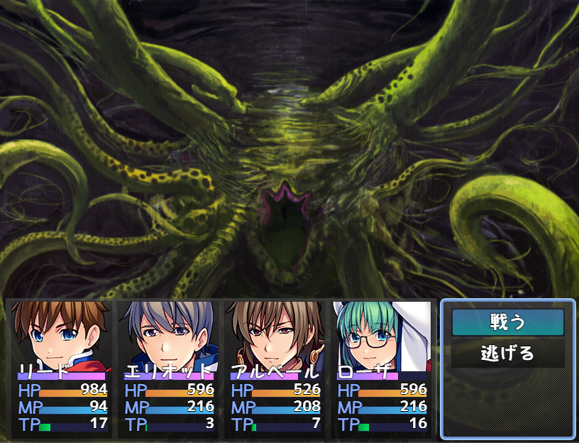

# [巨大モンスター](https://raw.githubusercontent.com/nuun888/MZ/master/NUUN_BigEnemy.js)
# Ver.1.2.1

エネミー画像を画面一杯またはゲーム画面下に合わせて表示します。

  

## 設定方法
敵キャラのメモ欄  
以下のタグは画面の横サイズに合わせて拡大されます。  
`<BigEnemy>` 画像を画面サイズに合わせます。  
`<BigEnemy:OriginalRatio>` 比率を変更せず横幅の倍率基準で拡大します。  
以下のタグはオリジナル画像サイズのまま、ゲーム画面の下側に画像の下を合わせて表示されます。    
`<BigEnemy:UnderPosition>` 画像を原寸倍率で画面下に合わせ表示させます。画像のサイズ調整やX座標調整はいたしません。  

`<BigEnemyFront>` 画像を一番手前側に表示させます。  
`<BigEnemyBack>` 画像を一番後ろ側に表示させます。  

`<BigEnemyY:[y]>` Y座標をシフトして表示します。  
`<BigEnemyY:50>` Y座標を50下にシフトして表示します。  

`<BigEnemyDamageX:[x]>` ダメージエフェクトのX座標を調整します。  
`<BigEnemyDamageX:[y]>` ダメージエフェクトのY座標を調整します。  
`[x]`：X座標(相対)  
`[y]`：Y座標(相対)  

`<CorrectionScale:[scale]>` 拡大率の補正を行います。  
`[scale]`：倍率  
`<CorrectionScale:1.1>`  

#### 仕様
BigEnemy及びBigEnemy:OriginalRatioは画面の横サイズに合わせて拡大されます。  
BigEnemy:UnderPositionはオリジナルサイズのまま表示されX座標の調整は行われませんが、Yは画像の一番下が画面の下に表示されるように調整されます。  
BigEnemyYは表示した画像からの相対座標となります。なお巨大エネミーのみ有効です。  

## 更新履歴
2024/10/23 Ver.1.2.1  
外部プラグインでエネミーの倍率補正をかけている場合に、敵消滅時にサイズが元のサイズに戻ってしまう問題を修正。  
2021/11/7 Ver.1.2.0  
ダメージエフェクトを調整できる機能を追加。  
一部の計算が間違っていたため修正。  
2021/6/31 Ver.1.1.6  
Ver.1.3.0以降で敵の画像が想定よりも大きく拡大されてしまう問題を修正。  
2021/5/31 Ver.1.1.5  
モンスターが出現していないときは、拡大率のアップデートをしないように修正。  
2021/5/30 Ver.1.1.4  
UnderPositionモードの時に画像が表示されない問題を修正。  
2021/5/29 Ver.1.1.3  
MNKR_TMBattlerExMZの息づかい、MOG_BattlerMotionのBreath Motionに対応。  
2021/3/20 Ver.1.1.2  
標準の表示順をデフォルト仕様に変更。<BigEnemyNormal>はデフォルト設定に変更されました。<BigEnemyBack>が追加されVer.1.1.1までのデフォルト設定は<BigEnemyBack>を記入しなくてはならなくなりました。  
2021/3/20 Ver.1.1.1  
巨大エネミーの表示順を元の仕様にする機能を追加。  
2021/3/18 Ver.1.1.0  
モンスター画像の下に合わせて表示する機能を追加。  
２回目の戦闘以降にモンスターが手前に表示される問題を修正。  
2021/3/17 Ver.1.0.3  
Y座標を調整できる機能を追加。  
2021/1/17 Ver.1.0.2  
常に後ろに表示されるように変更。  
2020/12/15 Ver.1.0.1  
OriginalRatioモードの時にポップアップの位置がずれる問題を修正。  
2020/11/22 Ver.1.0.0  
初版  
