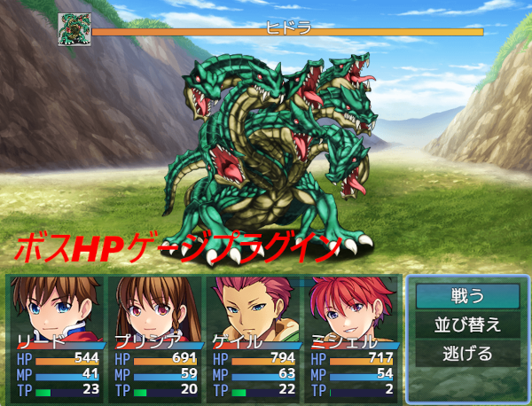

# [ボスHPゲージ](https://raw.githubusercontent.com/nuun888/MZ/master/NUUN_BossHPGauge.js)
# Ver.1.0.3
[ダウンロード](https://raw.githubusercontent.com/nuun888/MZ/master/NUUN_BossHPGauge.js)
#### 無償ライセンス
クレジット表記：任意  
商業利用：可能  
成人向け：可能  
改変：可能  
再配布：可能  
当リポジトリ内、公式フォーラム、正規販売サイト以外からのダウンロード、改変済みの場合はサポートは対象外となります。  

ボス用のゲージを表示します。  
[マニュアル](https://raw.githubusercontent.com/nuun888/MZ/master/BossHPGauge.pdf)  
[Manual (English)](https://raw.githubusercontent.com/nuun888/MZ/master/BossHPGauge_en.pdf)  

   

## 更新履歴
2026/6/17 Ver.1.0.3  
敵キャラ画像表示をOFFにした場合に、ゲージ余白をモンスター表示横幅未満の値でも設定できるように修正。  
2026/6/16 Ver.1.0.2  
ゲージの縦の表示間隔を指定できる機能を追加。  
2026/6/15 Ver.1.0.1  
消滅エフェクトがボスでもボスエネミーとして認識するように修正。  
2026/6/15 Ver.1.0.0  
初版  
