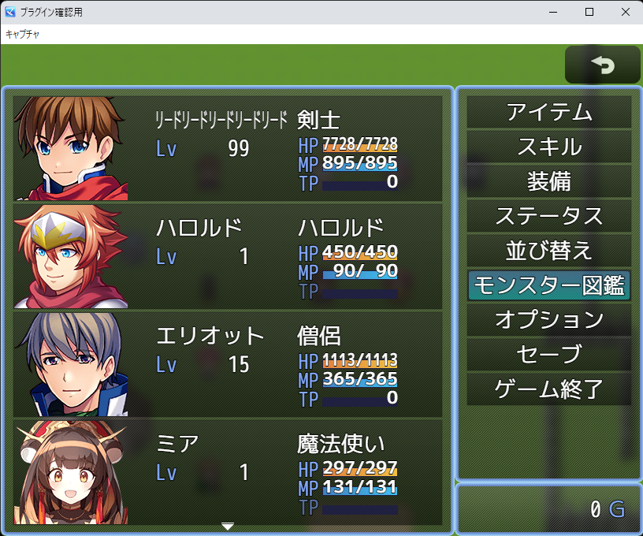

# [ウィンドウの余白なし](https://raw.githubusercontent.com/nuun888/MZ/master/NUUN_BoxMargin.js)
# Ver.1.0.0  
 [ダウンロード](https://raw.githubusercontent.com/nuun888/MZ/master/NUUN_BoxMargin.js)  

画面とUIの4ピクセルの余白を無くし、データベースで設定したUIサイズのまま表示します。  

  

## 更新履歴
2023/8/3 Ver.1.0.0  
初版  
