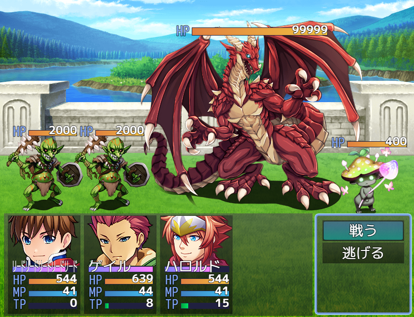

# [バトラーHPゲージ](https://raw.githubusercontent.com/nuun888/MZ/master/NUUN_ButlerHPGauge.js)
# Ver.1.7.6
[ダウンロード](https://raw.githubusercontent.com/nuun888/MZ/master/NUUN_ButlerHPGauge.js)
#### 必須、前提プラグイン
[バトラーオーバーレイベース](https://github.com/nuun888/MZ/blob/master/README/BattlerOverlayBase.md)Ver.1.0.2以降  

敵またはSVアクターのバトラー上にHPゲージを表示します。  

  

### 設定方法

#### HPゲージの座標指定
敵キャラまたはアクターのメモ欄  
`<HPGaugeX:[position]>`HPゲージのX座標を調整します。（相対座標）  
`<HPGaugeY:[position]>` HPゲージのY座標を調整します。（相対座標）  
[position]:座標

バトルイベント1ページ目のの注釈  
`<HPGaugePosition:[Id],[x],[y]>` 敵グループの[Id]番目のモンスターのゲージの位置を調整します。（相対座標）  
[Id]：表示順番号  敵グループ設定で配置した順番のIDで指定します。モンスター画像の左上に番号が表示されますのでその番号を記入します。  
[x]：X座標  
[y]：Y座標  

#### HPゲージの表示
敵キャラのメモ欄  
`<NoHPGauge>` HPゲージを表示しません。  
`<HPGaugeMask:[eval]>` 条件に一致しなければHP値の表示を？？？にします。  
[eval]:評価式  
this 敵データ  
this.enemy() 敵のデータベースデータ  
例`<HPGaugeMask:this.hp < this.mhp * 0.3>`敵のHPが３０％未満の時のみHP値を表示します。  

特徴を有するメモ欄  
`<HPGaugeVisible>`この特徴を持つアクターが存在すれば、敵のHPゲージが表示されます。  
`<EnemyHPGaugeVisible>` この特徴を持つ敵はHPゲージが表示されます。  

### 表示のタイミング設定
#### HPゲージ表示タイミング
`常に表示`  
常に表示されます。  
`選択時`  
対象選択時に表示します。  
`ダメージ時`   
ダメージ時に表示されます。  
`選択時、ダメージ時`  
選択時、ダメージ時に表示されます。  

#### 初期HPゲージ表示
`<HPGaugeVisible>`の特徴を持つアクターが戦闘メンバーにいるとき、または図鑑登録と連動している際に登録済みなら表示されます。  
上記の特徴を使用する場合は初期HPゲージ表示を非表示に設定してください。 

### モンスター図鑑の情報登録を反映
この機能を使用するには[モンスター図鑑](https://raw.githubusercontent.com/nuun888/MZ/master/NUUN_EnemyBook.js)が必要です。
#### HPゲージ表示タイミング（モンスター図鑑）
初期HPゲージ表示をOFFにする必要があります。HPゲージ表示タイミングによって表示タイミングを指定できます。  
`図鑑登録後に表示`  
図鑑登録後にHPゲージを表示します。  
`図鑑情報登録後に表示`  
図鑑にモンスター情報が登録後にHPゲージを表示します。  

## 更新履歴
2024/9/11 Ver.1.7.6  
特定のスクリプトを記入した場合、スタックエラーが起きる問題を修正。  
2023/11/4 Ver.1.7.5  
`<HPGaugeVisible>`が機能していなかった問題を修正。  
2023/8/3 Ver.1.7.4  
一部のプラグインにてNoHPGaugeが機能していなかった問題を修正。  
2023/6/23 Ver.1.7.3  
NoHPGaugeが機能していなかった問題を修正。  
2023/6/2 Ver.1.7.2  
処理の修正。  
2023/5/28 Ver.1.7.1  
処理の修正。  
2023/5/28 Ver.1.7.0  
SVアクターにゲージを表示する機能を追加。  
2023/5/6 Ver.1.6.1  
HPゲージの表示をフェードアウト、フェードインさせるように修正。  
2022/9/17 Ver.1.6.0  
敵キャラ毎にHPゲージの横幅、縦幅を指定できる機能を追加。  
2022/5/14 Ver.1.5.0  
バトラーの表示処理の定義大幅変更に関する定義変更。  
2022/1/10 Ver.1.4.1  
ゲージがラベル表示でも座標0から表示されてしまう問題を修正。  
2021/12/19 Ver.1.4.0  
ゲージ画像化対応。  
2021/11/8 Ver.1.3.3  
敵グループの座標変更の設定方法を変更。  
2021/11/6 Ver.1.3.2  
不要な処理を削除。  
2021/11/5 Ver.1.3.1  
敵グループからゲージ座標するタグの名前が不自然だったのを変更。  
2021/11/5 Ver.1.3.0  
敵グループのモンスター毎にゲージの座標を調整できる機能を追加。  
2021/9/2 Ver.1.2.7  
中心に表示する機能を追加。  
2021/8/31 Ver.1.2.6  
HPラベルが非表示の時にラベル分の余白が空いてしまう問題を修正。  
2021/8/29 Ver.1.2.5  
一部プラグインとの競合対策。  
2021/7/15 Ver.1.2.4  
処理の最適化により一部処理をNUUN_Baseに移行。   
2021/7/13 Ver.1.2.3  
エネミー画像を消去する及び新たにエネミー画像を追加表示するプラグインとの競合対策。  
2021/6/28 Ver.1.2.2  
一部が機能しなくなっていたので処理修正  
2021/6/28 Ver.1.2.1  
条件によりHPを隠す機能を追加。  
2021/6/26 Ver.1.2.0  
状況によってHPゲージを表示する機能を追加。  
2021/6/20 Ver.1.1.1  
モンスター図鑑（NUUN_EnemyBook）の登録により表示する機能を追加。  
2021/6/19 Ver.1.1.0  
HPゲージの表示タイミングを設定できる機能を追加。  
2021/6/19 Ver.1.0.3  
疑似3DバトルVer.1.1対応のため一部の処理を変更。  
2021/5/24 Ver.1.0.2  
HPラベル、数値を表示させない機能を追加。  
2021/5/24 Ver.1.0.1  
HPゲージを表示させない機能を追加。  
2021/5/24 Ver.1.0.0  
初版  
