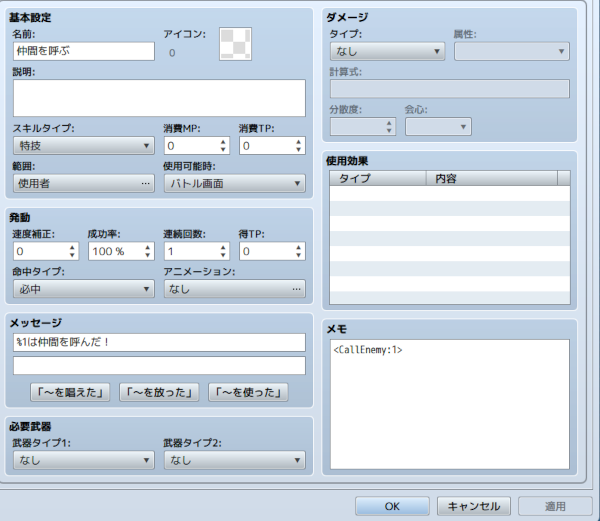

# [敵が仲間を呼ぶスキル](https://raw.githubusercontent.com/nuun888/MZ/master/NUUN_CallingEnemy.js)
# Ver.1.1.0
[ダウンロード](https://raw.githubusercontent.com/nuun888/MZ/master/NUUN_CallingEnemy.js)
#### 必須、前提プラグイン
[共通処理](https://github.com/nuun888/MZ/blob/master/README/Base.md)  

敵が仲間を呼ぶスキルを設定できます。  

## 設定方法
### 仲間を呼ぶスキルの設定
仲間呼び出しスキルの設定はプラグインパラメータから設定を行い、設定ID(指定IDの識別名)で指定します。  
スキルのメモ欄  
`<CallEnemy:[id]>` 仲間を呼び出します。  
`[id]`:プラグインパラメータの設定リストのIDまたは識別名  
  

### 仲間を呼ぶスキルの内部設定
プラグインパラメータの設定リストで呼び出しスキルの設定を行います。  
指定の設定が見つからない場合、呼び出しは行われません。  
また、モンスターリストにモンスターが設定されていなくても呼び出しは行われません。  

### 出現する座標を設定
プラグインパラメータの設定リストで出現モンスター座標設定で出現する場所を設定します。  
出現モンスター座標設定で設定を行い、設定座標が有効の場合出現座標X、出現座標Y、出現横範囲、出現縦範囲は無効になります。  
設定がない場合は「出現する座標、範囲を設定」のパラメータが適用されます。  

### 出現する座標、範囲を設定
プラグインパラメータの設定リストで出現座標X及び出現座標Yで中心となる座標を指定します。  
呼び出されるモンスターは出現横範囲及び出現縦範囲からランダムに算出されます。  
出現横範囲及び出現縦範囲は出現座標X及び出現座標Yを基準にした設定値で±出現横範囲及び出現縦範囲/2の範囲になります。  

### モンスターとの重なりをなくしたい
プラグインパラメータの設定リストで出現重複無効横範囲及び出現重複無効縦範囲に任意の数字を記入して下さい。  
対象のモンスターを中心に指定された範囲内にはモンスターが出現されません。
例:出現重複無効横範囲が20ならモンスターの座標から±20の範囲内には出現されません。  
試行回数を終えた場合、スペースがないと見なされ呼び出しに失敗扱いとなります。  
戦闘不能のモンスターの座標重座標を有効にする場合、死亡時座標重複有効をtureに設定してください。  

## 更新履歴
2025/12/13 Ver.1.1.0  
呼び出せるモンスターの最大数を設定できる機能を追加。  
呼び出しスキルが使用できない場合はアクションを実行しない機能を追加。  
呼び出し成功時のメッセージのデフォルト設定を修正。  
2024/12/1 Ver.1.0.0  
初版  

