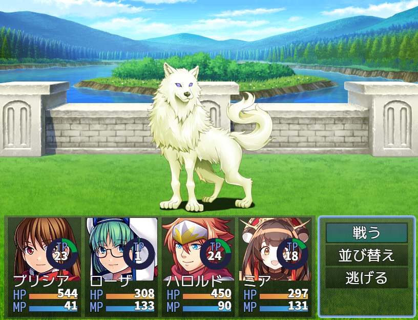

# [サークルゲージ](https://raw.githubusercontent.com/nuun888/MZ/master/NUUN_CircularGauge.js)
# Ver.1.0.2
[ダウンロード](https://raw.githubusercontent.com/nuun888/MZ/master/NUUN_CircularGauge.js)  
### 必須、前提プラグイン
[共通処理](https://github.com/nuun888/MZ/blob/master/README/Base.md)    

指定のゲージをサークル型にします。  
バトルスタイル拡張プラグインと併用する場合はこのプラグインを「NUUN_BattleStyleEX_Base」より下に配置してください。  

### パラメータ
`menuexp`:メニュー画面経験値ゲージ  
`result_exp`:リザルト獲得経験値ゲージ  

  

## 画像の仕様
画像の中心を基準に弧を描くようにアニメーションします。  
ゲージ半径、ゲージ縦幅は画像のサイズで計算されます。  
画像はゲージ背景画像、ゲージ画像両方設定してください。  

## NUUN_DamageGaugeで差分ゲージ表示
当プラグインとNUUN_DamageGaugeで該当のゲージを設定してください。   
ダメージ、リカバリーゲージの色はNUUN_DamageGaugeで設定します。  
サークルゲージで画像指定の場合は、画像指定しているファイルの名前を以下にします。    
ダメージ:[通常サークルゲージ]_damage  
リカバリー:[通常サークルゲージ]_recovery  
例  
通常ゲージ:Gauge_hp  
ダメージ:Gauge_hp_damage  
リカバリー:Gauge_hp_recovery  

## 更新履歴
2024/9/29 Ver.1.0.2 
処理の修正。  
画像が表示されない問題を修正。  
2024/9/17 Ver.1.0.1  
NUUN_DamageGaugeの適用。  
2024/5/26 Ver.1.0.0  
初版  
