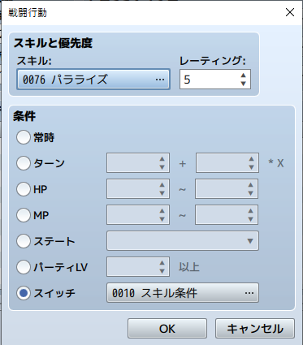

# [敵の行動パターン条件拡張](https://raw.githubusercontent.com/nuun888/MZ/master/NUUN_CondEnemyAction.js)
# Ver.1.0.0
[ダウンロード](https://raw.githubusercontent.com/nuun888/MZ/master/NUUN_CondEnemyAction.js)

### 必須プラグイン
[条件付きベース](https://github.com/nuun888/MZ/blob/master/README/ConditionsBase.md)

敵の行動パターンの条件を細かく設定できます。  
【属性】【攻撃】【ダメージ】【使用アイテム、スキル】【反撃、魔法反射】は設定できません。

## 設定方法
### 条件行動パターンを適用するための設定
プラグインパラメータの条件判定適用スイッチIDリストに条件を適用するためのスイッチを設定します。

### 条件の設定
敵のメモ欄
`<ActionCond[id]>` 使用者の指定したIDの条件が一致したときのみ条件を満たします。  
`<PartyActionCond[id]>` パーティメンバーの指定したIDの条件が一致したときのみ条件を満たします。  
`<TroopActionCond[id]>` 敵グループの指定したIDの条件が一致したときのみ条件を満たします。  
`[id]`:行動パターンのスイッチで設定したスイッチID  

`<ActionMatch:[modeId]>`   
`[modeId]`:0 いずれかが一致　1：全て一致  
未記入の場合はいずれかが一致の場合条件を満たしたときになります。  

行動パターンの条件で設定したスイッチを指定すると、上記の設定した条件が適用されます。  

### 行動パターンの設定
敵の行動パターンの条件をスイッチに設定します。  
  
条件判定適用スイッチIDリストに設定しているスイッチなら条件付きでの条件で判定されます。    
画像の設定だと  
`<ActionCond10><PartyActionCond10><TroopActionCond10>`  
で指定してください。  
元のスイッチの条件は判定されません。別途スイッチの条件を指定してください。  

## 更新履歴
2021/12/18 Ver.1.0.0  
初版
