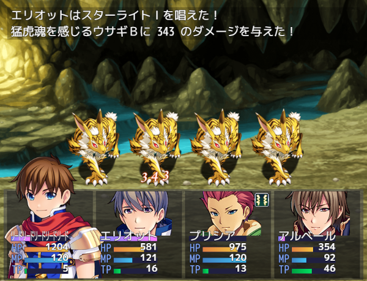

# [ダメージポップアップ画像化](https://raw.githubusercontent.com/nuun888/MZ/master/NUUN_DamagePopUpImg.js)
# Ver.1.1.2
[ダウンロード](https://raw.githubusercontent.com/nuun888/MZ/master/NUUN_DamagePopUpImg.js)
#### 必須、前提プラグイン
[共通処理](https://github.com/nuun888/MZ/blob/master/README/Base.md)  

ダメージポップアップをツクールMVと同じ仕様に変更します。（文字ではなく画像で表示）  
なおツクールMVのダメージポップアップ画像「Damage.png」を使用するにはのツクールMVのユーザ登録が必要です。  

  

## 設定方法
素材規格は縦分割数で設定した数値で割り切れる高さにしてください。横幅は指定はありません。    
TP用のポップアップ（ダメージ用、回復用）を追加する場合は縦分割数を7にしてください。  
画像のインデックス番号は一番上から0で始まります。  

## 更新履歴
2025/5/24 Ver 1.1.2  
英語対応。  
2022/3/27 Ver 1.1.1  
ダメージポップアップのイメージインデックスがずれる問題を修正。  
2022/1/8 Ver 1.1.0  
割り当てられる画像の種類を増やせるように修正。  
各ポップアップ画像のインデックス番号を指定できるように修正。  
2021/7/22 Ver 1.0.0   
初版  
