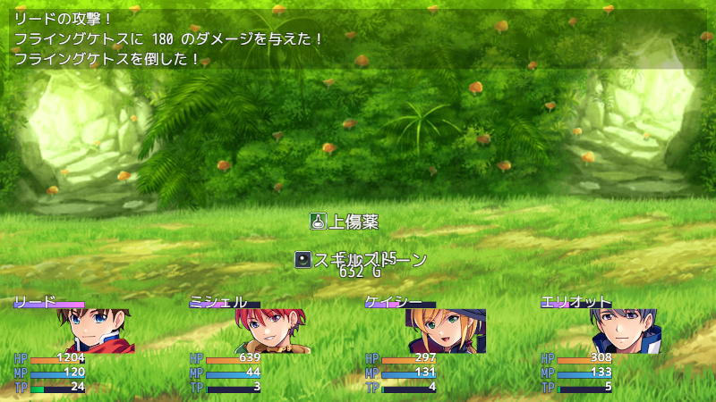

# [撃破時ドロップポップアップ](https://raw.githubusercontent.com/nuun888/MZ/master/NUUN_DefeatDropPopup.js)
# Ver.1.0.1
[ダウンロード](https://raw.githubusercontent.com/nuun888/MZ/master/NUUN_DefeatDropPopup.js)
#### 無償ライセンス
クレジット表記：任意  
商業利用：可能  
成人向け：可能  
改変：可能  
再配布：可能  
当リポジトリ内、公式フォーラム、正規販売サイト以外からのダウンロード、改変済みの場合はサポートは対象外となります。  
#### 必須、前提プラグイン
[共通処理](https://github.com/nuun888/MZ/blob/master/README/Base.md)  
[ポップアップ拡張](https://github.com/nuun888/MZ/blob/master/README/PopupEx.md)Ver.1.1.0以降  

敵を倒した際に得る報酬を撃破時にポップアップ表示します。報酬は戦闘終了時に取得されます。  
なおこのプラグインはNUUN_PopupExの拡張プラグインです。  

※他ポップアッププラグインとの競合対応は行いません。  
以下のプラグインでのみ対応を行います。(VisuMZ_1_BattleCoreを除く)  

  

以下のプラグインと併用することにより個性的なポップアップを表示できます。  
[アップフェードアウトポップアップ](https://github.com/nuun888/MZ/blob/master/README/UpFadeoutPopup.md)  
[スライドフェードアウトポップアップ](https://github.com/nuun888/MZ/blob/master/README/SlideFadeoutPopup.md)  
[バウンドポップアップ](https://github.com/nuun888/MZ/blob/master/README/LateralBoundPopUp.md)  

## 更新履歴
2025/10/4 Ver.1.0.1  
アクター死亡時にエラーが出る問題を修正。  
2025/9/30 Ver.1.0.0  
初版  
