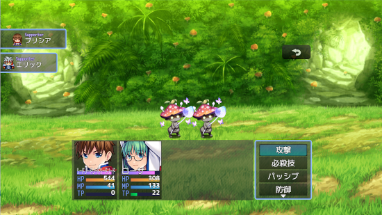

# [サポートアクターインジケータ](https://raw.githubusercontent.com/nuun888/MZ/master/NUUN_DisplaySupportActor.js)
# Ver.1.6.0
[ダウンロード](https://raw.githubusercontent.com/nuun888/MZ/master/NUUN_DisplaySupportActor.js)
#### 必須、前提プラグイン
[サポートアクター](https://github.com/nuun888/MZ/blob/master/README/SupportActor.md)  

参加しているサポートアクターを表示させます。  
このプラグインはサポートアクター（NUUN_SupportActor）Ver.2.0.0以降の拡張機能です。  

  

## 更新履歴
2024/12/14 Ver.1.6.0  
サポートアクターVer.2.0.0用の更新。  
控えサポートメンバーまで表示されてしまう問題を修正。  
2022/9/14 Ver.1.5.1  
プラグインコマンドが正常に機能していなかった問題を修正。  
2022/9/10 Ver.1.5.0  
ウィンドウの代わりに背景画像を指定できる機能を追加。  
プラグインコマンドからインジケータ表示非表示にする機能を追加。  
2022/5/15 Ver.1.4.0  
処理の改修。  
ターン制でコマンド選択後サポートアクターの位置が戻らない問題を修正。  
2022/3/28 Ver.1.3.3  
サポートアクター更新により定義変更。  
2022/1/4 Ver.1.3.2  
サポートアクターがメンバーから離脱した後にエラーが出る問題を修正。  
2021/8/13 Ver.1.3.1  
サポートアクターが追加されたときにサポートアクターウィンドウの動作がおかしくなる問題を修正。  
サポートアクターが参加していない場合はコマンドに表示しないように修正。  
2021/8/13 Ver.1.3.0  
サポートアクターウィンドウの初期表示を指定できる機能を追加。  
2021/8/12 Ver.1.2.0  
サポートアクターウィンドウを非表示にする機能を追加。  
2021/8/12 Ver.1.1.0  
ウィンドウの表示の仕様を変更。  
右側表示に対応。  
2021/8/11 Ver.1.0.0  
初版  
