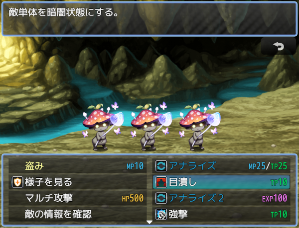

# [サポートアクターインジケータ](https://raw.githubusercontent.com/nuun888/MZ/master/NUUN_DisplaySupportActor.js)
# Ver.1.3.2
[ダウンロード](https://raw.githubusercontent.com/nuun888/MZ/master/NUUN_DisplaySupportActor.js)
#### 必須、前提プラグイン
[サポートアクター](https://github.com/nuun888/MZ/blob/master/README/SupportActor.md)  

参加しているサポートアクターを表示させます。  
このプラグインはサポートアクター（NUUN_SupportActor）の拡張機能です。  

  

## 更新履歴
2022/1/4 Ver.1.3.2  
サポートアクターがメンバーから離脱した後にエラーが出る問題を修正。  
2021/8/13 Ver.1.3.1  
サポートアクターが追加されたときにサポートアクターウィンドウの動作がおかしくなる問題を修正。  
サポートアクターが参加していない場合はコマンドに表示しないように修正。  
2021/8/13 Ver.1.3.0  
サポートアクターウィンドウの初期表示を指定できる機能を追加。  
2021/8/12 Ver.1.2.0  
サポートアクターウィンドウを非表示にする機能を追加。  
2021/8/12 Ver.1.1.0  
ウィンドウの表示の仕様を変更。  
右側表示に対応。  
2021/8/11 Ver.1.0.0  
初版  
