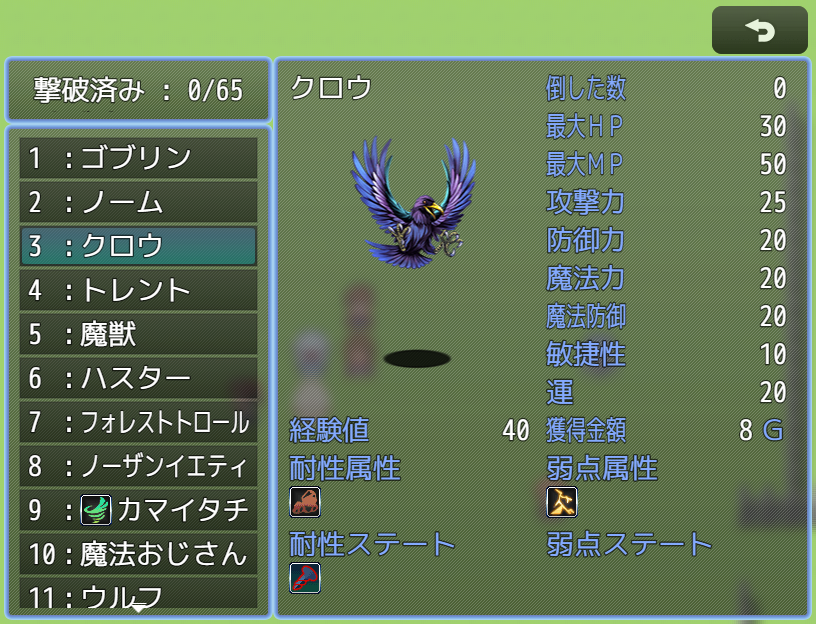
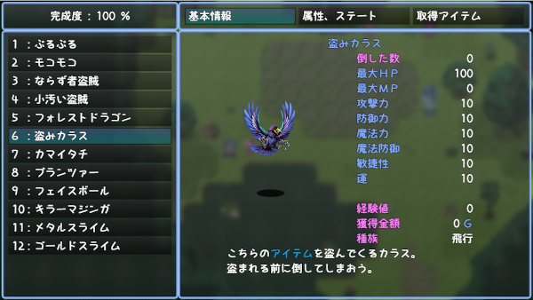
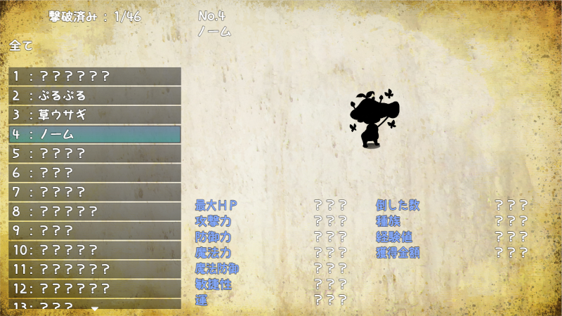

# [モンスター図鑑](https://raw.githubusercontent.com/nuun888/MZ/master/NUUN_EnemyBook.js)
# Ver.2.22.5
[ダウンロード](https://raw.githubusercontent.com/nuun888/MZ/master/NUUN_EnemyBook.js)
#### 必須、前提プラグイン
[共通処理](https://github.com/nuun888/MZ/blob/master/README/Base.md)Ver.1.6.1以降  
#### 対応プラグイン
[盗みスキル](https://github.com/nuun888/MZ/blob/master/README/StealableItems.md)  
[レーダーチャートベース](https://github.com/nuun888/MZ/blob/master/README/RadarChartBase.md)  
#### 拡張プラグイン
[耐性表示マスク](https://github.com/nuun888/MZ/blob/master/README/NUUN_EnemyBookEX_1.md) Ver.1.1.0  
[条件付きドロップアイテム図鑑適用](https://raw.githubusercontent.com/nuun888/MZ/master/NUUN_EnemyBookEX_2.js) Ver.1.0.0
[（要条件付きドロップアイテムVer.1.0.6以降）](https://github.com/nuun888/MZ/blob/master/README/ConditionalDrops.md)  
[モンスター図鑑全セーブ共通](https://github.com/nuun888/MZ/blob/master/README/EnemyBook_Global.md)  
[モンスター図鑑マップ遭遇チェック](https://github.com/nuun888/MZ/blob/master/README/EnemyBookEncounterCheck.md)Ver.1.0.2  
[モンスター図鑑表示順変更](https://github.com/nuun888/MZ/blob/master/README/EnemyBookOrder.md)Ver.1.0.0  
[モンスター図鑑表示順拡張](https://github.com/nuun888/MZ/blob/master/README/EnemyBookOrderEx.md)Ver.1.0.0  
[モンスター図鑑レイアウトカスタマイズ](https://github.com/nuun888/MZ/blob/master/README/EnemyBookCustomLayout.md)Ver.1.0.0  
#### オプション
[キーボタン割り当て](https://github.com/nuun888/MZ/blob/master/README/UserKey.md)  

モンスター図鑑を実装します。  
このプラグインではモンスター情報の表示内容を自由にカスタマイズする事が出来ます。  
  
  

Ver.2.14.0での要再設定  
敵の図鑑登録  
背景画像  
アナライズ設定  
図鑑に適用しないタグ  
旧  
`<NoBook>`:モンスター図鑑に登録(表示)されませんが、敵の情報、アナライズのみ表示されます。  
`<NoBookData>`:モンスター図鑑に登録(表示)されません。  
新  
`<NoBook>`:モンスター図鑑に登録(表示)されません。  
`<NoBookData>`:モンスター図鑑に登録(表示)されませんが、敵の情報、アナライズのみ表示されます。  

### 機能
図鑑：モンスターの情報を確認できます。戦闘中でも表示できます。  
敵の情報：現在戦っているモンスターの情報を確認できます。  
アナライズ：指定のモンスターの情報を確認します。  
図鑑の表示項目をカスタマイズできます。  
モンスターをカテゴリーごとに表示できます.  
登録タイミングを出現時、撃破時、アナライズ時、任意のタイミグで登録可能。  

#### 表示できる項目
モンスター名  
共通画像  
モンスター毎に表示される任意画像  
倒した数  
通常能力値  
追加能力値  
特殊能力値  
獲得金額  
獲得経験値  
ドロップアイテム  
スティールアイテム  
条件付きドロップアイテム  
使用スキル  
任意のパラメータ  
テキスト  
属性耐性(アイコン表示または割合表示)  
ステート耐性(アイコン表示または割合表示)  
デバフ耐性  

## 設定
### モンスター情報の登録
戦闘開始時：戦闘開始時に出現モンスターを図鑑に登録します。  
撃破時：倒したときにそのモンスターを図鑑に登録します。  
アナライズ時：アナライズ成功時に図鑑に登録します。  
戦闘終了時：戦闘終了時に出現モンスターを図鑑に登録します。  
ステータス情報登録をOFFにしている場合は、項目設定で情報未登録ステータス表示をONにしている該当の項目でステータス情報登録をONにしている場面で図鑑に登録しない限り表示が？等で表示されます。  
例  
戦闘開始時に図鑑に登録し、撃破時にステータス情報を登録  
リストで戦闘終了時(ステータス情報登録OFF)と撃破時(ステータス情報登録ON)を設定します。  
アナライズ成功時に全て登録  
リストでアナライズ時(ステータス情報登録ON)を設定します。  
　
### 変身前撃破
モンスターが別の形態に変化したときに変化前のモンスターを撃破扱い済みにします。ステータス情報登録が撃破になっている場合、図鑑に登録されます。  

### ページ設定
設定できるページ数は２０ページまで設定できますので、図鑑、アナライズ、敵の情報それぞれのページを設定できます。  
図鑑に表示させる項目は表示項目設定から設定します。  
表示ページ設定、アナライズの表示ページ設定、敵の情報の表示ページ設定で表示させるページを選択してください。  
ゲージ、ターンは戦闘中のみ表示されます。

#### X表示列位置
表示する列番号を指定します。列設定はモンスター情報項目列数から設定します。  

#### Y表示行位置
表示する行番号を指定します。

#### X座標（相対）
X表示列位置からのX方向の座標を指定します。  

#### Y座標（相対）
Y表示列位置からのY方向の座標を指定します。  

#### 項目横幅
表示項目全体の横幅を指定します。  

#### 項目表示モード
列をまたいで表示します。  

#### 項目名称項目横幅
項目名称の横幅を指定します。  
 
#### 項目名称文字色
項目名称の文字色をシステムカラーまたはカラーコードで記入します。  

#### フォントサイズ
フォントサイズをメインフォントからの差で変更します。  

#### 名称
項目の名称を設定します。  

#### パラメータ評価式or文字列
パラメータ評価式または文字列を設定します。enemy:モンスターのゲームデータ　de:モンスターのデータベースデータ  

#### コンテンツ背景表示
各項目に背景画像を表示します。  

#### フォントサイズ
フォントサイズをメインフォント+デフォルトフォントからの差で指定します。  

#### 情報未登録ステータス表示
ステータス情報登録を行っていなステータスの表示を隠します。なお敵の情報、アナライズでしか見れないモンスターに関しては全ての情報が表示されます。  
モンスター画像(200)の場合は、シルエットで表示されます。（デフォルトではモンスター画像の情報未登録ステータス表示はOFFに設定されています。各ページ設定のモンスター画像(200)の情報未登録ステータス表示をONに設定することで適用されます。） 
  
 
#### 小数点桁数
割合表示の小数点数を指定します。  

#### 単位
単位を設定します。  

#### 文字の表示位置
文字揃えを指定します。  

#### 記述欄タグ名
記述欄を識別するためのタグを記入します。  

##### 記述欄
敵キャラのメモ欄及びモンスターカテゴリー設定のメモ欄　※後者はカテゴリー表示時のみ
`<[tag]:[text]>` 記述欄のテキスト    
`[tag]`:記述欄タグ名　デフォルト設定だとモンスターの説明を記述するタグはdescに設定されています。  
`[text]`:表示するテキスト。  
改行すれば何行でも表示可能ですので、独自の項目を追加することも可能です。  
`<desc1:ああああ>` descとタグ付けされた項目に「ああああ」が表示されます。  
デフォルト設定では４ページ目に表示される項目にdescが設定されていますので、文章を表示させる場合は`<desc:[text]>`と記入してください。  

##### 個別表示画像タグ
敵キャラのメモ欄及びモンスターカテゴリー設定のメモ欄　※後者はカテゴリー表示時のみ
`<[tag]:[img],[x],[y]>` モンスター個別画像の表示  
`[tag]`:モンスター個別画像タグ名（記述欄、個別指定画像タグで設定します）  
`[img]`:画像パス(拡張子なし)　  
個別指定画像フォルダが'pictures'ならimg/pictures直下のファイルを拡張子なしで記入してください。  
サブフォルダーから取得する場合はサブフォルダー名も記入してください。例 items/tankobu  
`[x]`:x座標(相対)  
`[y]`:y座標(相対)  
複数画像を指定したい場合は項目リストで表示する分だけ設定し、記述欄、個別指定画像タグ名で別々の名前で設定してください。  
デフォルトの設定ではpicturesフォルダーが指定されています。  
モンスター個別画像はモンスター毎に異なる任意の画像を表示させるための機能です。モンスター画像を表示させる場合はモンスター画像で表示させてください。  

#### 共通画像
図鑑に表示する画像を指定します。  

#### 画像の最大縦幅
画像の最大縦幅を指定します。横幅は項目横幅で指定します。  

### サイドビュー
`<EB_SVBattler:[fileName]>` モンスター画像をサイドビュー画像で表示させます。(モンスターにサイドビューアクターを表示する系のプラグイン導入が前提としています)  
`[fileName]`:ファイル名　サイドビューバトラー画像を指定します。sv_actorsフォルダ内のファイル名を拡張子なしで指定してください。  
`<EB_SVBattlerMotion:[motionId]>` 指定したモーションで表示させます。記入なしの場合は0のモーションで表示されます。  
`[motionId]`:0～17モーションID(数値で入力)  

### キャラチップ
`<EnemyBookCharacter:[failName],[id],[direction]>` キャラチップを表示します。指定していないモンスターには表示されません。  
`[failName]`:ファイル名　charactersフォルダ内のファイル名を拡張子なしで指定してください。  
`[id]`:キャラチップのインデックス番号。3×4のキャラチップは0になります。  
`[direction]`:方向を指定します。2正面（一番上） 4左（２番目） 6右（３番目） 8後向き（一番下）　※省略可能  

### カテゴリー
モンスターを種類ごとにカテゴリー別に表示させることができます。  
また、カテゴリーはその種類のモンスターと遭遇してない場合は表示を隠すことができます。  
プラグインパラメータのカテゴリーを表示をONにすることでカテゴリーウィンドウが表示されます。  

モンスターの種類カテゴリーの設定  
モンスターを種類別に表示させることが出来ます。  
カテゴリーkeyはallを除いて任意の文字列で設定可能です。  
allを記入の場合は図鑑に登録される全てのモンスターが表示されます。  
mapEnemyを記入の場合は現在のマップのモンスターが表示されます。  
敵キャラのメモ欄  
`<CategoryKey:[Key]>` 表示するカテゴリーを設定します。  
`<CategoryKey:[Key],[Key]....>` 表示出来るカテゴリーは複数設定可能です。  
`[Key]`:カテゴリーKey([]は付けずにプラグインパラメータで設定した文字列を記入してください)  

### マップに出現する敵のリスト設定
以下の設定を行うことにより、現在のマップに出現するモンスターを表示することができます。  
カテゴリーkeyを'mapEnemy'を記入することで現在のマップのモンスター一覧が表示されます。  

マップのイベントにエンカウントする敵キャラのIDを記入。  
プラグインパラメータのマップ敵エンカウントリストで指定。  
マップ敵エンカウントリストから設定できます。  
マップIDは複数制定できます。(複数記入の場合は,で区切り)   
敵キャラリストに指定のマップに出現する敵キャラを指定してください。  
なお、プラグインパラメータで設定する場合は記入する必要はありませんが、以下のタグを記入した場合は、以下のタグの設定が優先されます。  

マップのメモ欄  
`<EncountEnemiesList:[id],[id]...>`  
敵キャラIDを指定します。複数入力できます。  

モンスター図鑑マップ遭遇チェックを使用している場合は、上記の設定がある場合はその設定が適用されますが、設定されていない場合は  
現在のマップの敵グループから自動で判定されます。  

### アナライズ
スキル、アイテムのメモ欄  
`<AnalyzeSkill:1>` このスキル、アイテムはアナライズスキルとし、「アナライズスキル設定」の１番の設定で発動します。  
`<CertainAnalyze>` アナライズ耐性を無視します。  
`<AnalyzeResist:50>` アナライズの抵抗値を設定します。この場合５０％の確率でアナライズが成功します。  
アナライズスキル設定の失敗時のメッセージ  
%1:ターゲット名  
%2:使用者名  
「%2はアナライズに失敗した。」の時、スキル使用者がリードの場合は「リードはアナライズに失敗した。」と表示されます。  

`<SeeThrough>` アナライズ画面を開かずに図鑑登録します。スキルの攻撃、図鑑登録、情報登録はアナライズ扱いとなります。  
アナライズ耐性無視、抵抗の影響も受けます。  

### 背景画像
図鑑、敵の情報、アナライズそれぞれ設定できます。  
またページごとに背景画像が設定されます。  
カテゴリーが表示される場合はカテゴリー表示の画像が表示されます。  
ページごと、カテゴリーに背景画像が指定されていない場合はデフォルトお背景画像が表示されます。(アナライズはデフォルトの図鑑背景画像)  
戦闘中に図鑑の背景を表示させる場合は、戦闘時背景画像モードをONにしてください。  

### 図鑑の登録
敵キャラのメモ欄  
`<NoBook>`(図鑑登録なしタグデフォルト)  
モンスター図鑑に登録(表示)されません。アナライズのみデータを見ることが出来ます。  
プラグインパラメータの図鑑登録なしタグで任意のタグ名を設定できます。旧バージョンのタグ名のまま使用したい場合は図鑑登録なしタグ2とタグ名を入れ替えてください。  
`<NoBookData>`(図鑑登録なしタグ2デフォルト)  
モンスター図鑑に登録(表示)されず、アナライズを使用しても表示されません。  
アナライズ機能を使用する場合で、完全に図鑑登録しない場合はこちらをご使用ください。  
プラグインパラメータの図鑑登録なしタグ2で任意のタグ名を設定できます。  
`<ShowDataBook>`  
未撃破でも撃破済みと判定されます。また情報がすべて表示されます。  
`<EnemyIcon:[iconid]>`  
モンスター名の左にアイコンを表示させることが出来ます。  
`<EnemyIcon:120>` アイコンID120番のアイコンが表示されます。  
`<NoTransformInData>` 変身時に撃破扱いに図鑑に登録しません。（変身前撃破をONにしている時のみ）  
`<TransformEnemy:[enemyid]>` 撃破時に指定のIDのモンスターを撃破済みにします。また撃破数、取得アイテム等も指定のIDのモンスターに集計されます。  
`[enemyid]`:敵キャラID  

スキル、アイテムのメモ欄  
`<EnemyInfo>` 敵の情報を表示します。(後日修正します)  
アイテムのメモ欄  
`<NoDropProbability>`  
このタグを記入したアイテムはドロップアイテムの確率表示を表示しません。  

### 完成度ウィンドウ設定
図鑑の完成度などを表示します。複数設定の場合はスクロールして表示させます。  
表示させる完成度の項目設定は表示項目設定から設定します。  

### ページウィンドウ
ページウィンドウ表示をOFFにすることでウィンドウの表示を画面外に隠し、モンスターステータス情報の表示範囲を増やすことができます。
ページの切り替えには表示非表示にかかわらず列設定が必要になりますのでページ数分の値を設定してください。

### APNGでの動的表示
別途トリアコンタン様のApngPicture.js及び以下のライブラリが必要です。  
https://github.com/sbfkcel/pixi-apngAndGif  
ダウンロード先はApngPicture.js(APNGピクチャプラグイン)をご確認ください。  

## 操作
操作方法  
上下（↑ ↓）キー：モンスター選択  
左右（← →）キー ：ページ切り替え(デフォルト)  
PgUp PgDnキー：モンスターページ送り  
決定：モンスター画像原寸大表示  

タッチ操作  
上下スワイプ：スクロール（弾くように勢いよくスワイプすることでページ送りと同等になります）  

## 図鑑表示中非表示ウィンドウ
`_ctbWindow`: NRP_VisualTurn  

## 更新履歴
2025/5/28 Ver.2.22.5  
アナライズ時にページ表示を非表示にした際に、画面上部にページ画面が表示されてしまう問題を修正。  
2025/5/27 Ver.2.22.4  
NUUN_EnemyBookEX_1更新による処理の追加。  
2025/2/11 Ver.2.22.3  
キャンセル時のアクターコマンド、パーティコマンドのアクティブ化の処理を修正。  
2025/1/19 Ver.2.22.2  
アナライズ時に決定キーを押すと、キーが反応しなくなる問題を修正。  
戦闘時のモンスター情報のページが表示されない問題を修正。  
2024/12/7 Ver.2.22.1  
戦闘中の図鑑のモードを判定する処理を追加。  
2024/10/14 Ver.2.22.0  
戦闘中の図鑑ウィンドウの仕様を変更。  
戦闘中の敵名色を残りHPに応じて変化する機能を追加。現在のステータスでモンスター名の項目文字色を-1に指定時  
2024/8/31 Ver.2.21.4  
図鑑表示中に非表示にするウィンドウを設定できる機能を追加。  
2024/8/3 Ver.2.21.3  
撃破したモンスターの撃破カウントを再カウントしないように修正。  
2024/7/15 Ver.2.21.2  
図鑑項目の基準Y座標を修正。  
2024/6/22 Ver.2.21.1  
項目の横幅が1項目の横幅より広く適用されない問題を修正。  
2024/6/16 Ver.2.21.0  
ソート機能対応に関する修正。  
2024/5/14 Ver.2.20.13  
単位にシステムカラーを適用できるように修正。  
属性耐性数値表示、ステート耐性数値表示がシステム文字と重なって表示される問題を修正。  
能力値に単位を設定できるように修正。  
2024/4/6 Ver.2.20.12  
小数点の桁数が正常に機能していない問題を修正。  
2024/3/9 Ver.2.20.11  
盗めるアイテムを設定している場合、図鑑表示時にエラーが出る問題を修正。  
2024/2/10 Ver.2.20.10  
コマンドの選択できる条件を設定できる機能を追加。  
2024/1/3 Ver.2.20.9  
攻撃時属性のアイコンが正常に表示されなかった問題を修正。  
2023/12/29 Ver.2.20.8  
完成度の表示設定に不正なデータが設定されているときのエラーログを設定。  
2023/12/29 Ver.2.20.7  
戦闘中にカテゴリーを表示したときにエラーが出る問題を修正。  
戦闘中の一部のウィンドウの挙動を修正。  
モンスター原寸大未登録シルエットの設定が適用されていなかった問題を修正。  
2023/12/10 Ver.2.20.6  
攻撃持続性の未登録時のマスク処理が行われていなかった問題を修正。  
2023/12/9 Ver.2.20.5  
攻撃持続性を追加。(要自己設定)  
2023/11/4 Ver.2.20.4  
微修正。  
2023/7/22 Ver.2.20.3  
属性、ステート耐性(数値)で耐性、弱点の数値を色分けするように修正。  
2023/7/16 Ver.2.20.2  
アナライズ画面を開かずにアナライズの登録処理のみを実行する機能を追加。  
2023/7/8 Ver.2.20.1  
カテゴリー表示をtrueに設定してモンスター図鑑を開くとエラーが出る問題を修正。  
属性アイコンの耐性、弱体、無効、吸収表示が正常に表示されない問題を修正。  
2023/7/1 Ver.2.20.0  
吸収属性(アイコン表示)の項目を追加。  
無効属性から吸収属性を表示しない機能を追加。  
未確認属性を隠す(要NUUN_EnemyBookEX_1)が適用されていなかった問題を修正。  
2023/6/30 Ver.2.19.5  
原寸大表示のシルエットが機能していなかった問題を修正。  
2023/6/21 Ver.2.19.4  
アナライズのページが切り替えられない問題を修正。  
2023/6/18 Ver.2.19.3  
アナライズの表示項目設定が正常に適用されていなかった問題を修正。  
2023/6/17 Ver.2.19.2  
現在のマップを表示させる際に、モンスター図鑑マップ遭遇チェックプラグインを入れていないとエラーが出る問題を修正。  
レーダーチャートが表示されなくなる問題を修正。  
2023/6/9 Ver.2.19.1  
耐性デバフを表示させるとエラーが出る問題を修正。  
ステート(アイコン)耐性、無効、弱点にデバフを表示させる機能を追加。  
表示項目に無効デバフを追加。  
2023/6/2 Ver.2.19.0  
図鑑カテゴリーに現在のマップを追加。  
2023/4/8 Ver.2.18.6  
モンスター画像をフロントビュー画像かサイドビュー画像で表示する機能を追加。  
条件付きドロップアイテムを表示するとエラーが出る問題を修正。  
2023/3/20 Ver.2.18.5  
敵のゲームデータをキャッシュするように修正。(一部のモンスター以外)  
未登録モンスターの原寸画像を表示しないように修正。  
2023/3/12 Ver.2.18.4  
VisuMZ_1_BattleCoreでの敵のサイドビューアクターに対応。  
2023/3/11 Ver.2.18.3  
戦闘中にカーソル以外のページ切り替えができなかった問題を修正。  
VisuMZ_0_CoreEngineと併用するとモンスター選択時にモンスターのページも切り替わってしまう問題を修正。  
2023/3/10 Ver.2.18.2  
システムカラー0番が指定できない問題を修正。  
2023/3/6 Ver.2.18.1  
Apngのモンスターを表示するときに、重くなる問題を修正。  
2023/3/5 Ver.2.18.0  
原寸大のモンスターを表示する機能を追加。  
2023/3/4 Ver.2.17.14  
競合の解消。  
2023/3/4 Ver.2.17.13  
モンスターページのページ切り替えのキー設定を指定できる機能を追加。(別途キー割り当てが出来るプラグインが必要です)  
2023/2/26 Ver.2.17.12  
敵の出現ではなくプラグイン等で敵を追加したときに、図鑑に登録されない問題を修正。  
2023/2/25 Ver.2.17.11  
ナンバー表示の処理を修正。  
2023/2/23 Ver.2.17.10  
情報登録していないモンスター画像をシルエットで表示する機能を追加。  
2023/1/22 Ver.2.17.9  
敵ナンバーの表示で数値の前にNo.が付くように修正。  
ページ列を自動設定に変更。  
ウィンドウスキンで色を指定できるように修正。(要再設定)  
ウィンドウ画像の表示を各ウィンドウ毎に指定できるように修正。  
2023/1/5 Ver.2.17.8  
変身前のモンスターが撃破カウントされずに変身後のモンスターが2重に撃破カウントされてしまう問題を修正。  
2022/12/25 Ver.2.17.7  
外部プラグインで敵の行動を追加したときの処理を修正。  
2022/12/17 Ver.2.17.6  
敵の行動でスキルラーニングで習得したスキルを表示できるように対応。  
2022/12/14 Ver.2.17.5  
ドロップアイテム、盗めるアイテムで一部の変数を呼び出すとエラーが出る問題を修正。  
2022/12/12 Ver.2.17.4  
属性耐性（耐性数値表示）でエラーが出る問題を修正。  
2022/12/9 Ver.2.17.3  
カラー指定のプラグインパラメータのTypeをcolorに変更。(Ver.1.6.0以降)  
アイコン指定のプラグインパラメータのTypeをiconに変更。(Ver.1.6.0以降)  
日本語以外での表示を英語表示に変更。  
2022/11/20 Ver.2.17.2  
敵の情報で同じモンスターの情報の切り替えが行われない問題を修正。  
2022/11/19 Ver.2.17.1  
撃破時に図鑑に登録及び、ステータス登録が行われない問題を修正。  
アナライズ時に図鑑に登録及び、ステータス登録が行われない問題を修正。  
2022/11/19 Ver.2.17.0  
項目名称の横にアイコンを表示できる機能を追加。  
2022/11/12 Ver.2.16.5  
敵のレベルを表示する機能を追加。  
APNG関連の修正。  
2022/11/6 Ver.2.16.4  
APNG関連の修正。  
2022/11/5 Ver.2.16.3  
ApngPictureが導入されていないとエラーが出る問題を修正。  
2022/11/5 Ver.2.16.2  
APNGで表示したモンスターが２重に表示されてしまう問題を修正。  
2022/11/5 Ver.2.16.1  
Apng対応。(トリアコンタン様のApngPicture.jsが必要となります)  
2022/10/18 Ver.2.16.0  
モンスターステータスウィンドウにカテゴリー選択時の項目を表示できる機能を追加。  
カテゴリーにモンスターが表示されなかった問題を修正。  
2022/10/9 Ver.2.15.0  
未登録のモンスターに対して表示できる項目を設定できる機能を追加。  
敵の情報のモンスター一覧に同一モンスターがいるときに表示されるアルファベットが表示されない問題を修正。  
機能していなかったタグの問題を修正。  
2022/10/8 Ver.2.14.3
撃破、図鑑データの登録を指定のモンスターに変更する機能を追加。  
敵の情報、アナライズでのみしか表示されないモンスターのNoを表示しないように修正。  
モンスター選択ウィンドウの登録済みの文字色が適用されない問題を修正。  
敵の情報でステータス情報未登録のステータスを隠す機能が適用されなかった問題を修正。  
2022/10/4 Ver.2.14.2  
図鑑に表示するタグを任意の名前に設定できる機能を追加。  
2022/10/2 Ver.2.14.1  
項目横幅指定時に図鑑を開くとエラーが出る問題を修正。  
文字揃えのrightが間違っていたので修正。  
プリセット再修正  
2022/10/2 Ver.2.14.0  
図鑑登録時の設定の仕様を変更。  
ドロップアイテム、スティールアイテム、条件付きアイテム、敵のスキル、属性耐性、ステート耐性の列指定の仕様変更。  
プラグインパラメータの整理。  
スティールアイテムが正常に表示されなかった問題を修正。  
アナライズの設定の仕様を変更。  
<NoBook>と<NoBookData>の仕様変更。  
カテゴリー選択時の背景画像を指定できるように変更。  
2022/7/30 Ver.2.13.4  
図鑑に表示しない名前を指定できる機能を追加。  
コンテンツ背景の表示なしの時に、項目の表示がわずかにずれて表示される問題を修正。  
2022/6/15 Ver.2.13.3  
評価式に文字列を記入したときにNaNと表示されてしまう問題を修正。  
2022/6/13 Ver.2.13.2  
属性耐性一覧に物理ダメージ率と魔法ダメージ率を表示できる機能を追加。  
2022/6/5 Ver.2.13.1  
一部の処理を修正。  
2022/5/5 Ver.2.13.0  
盗みスキル率の表示を評価式形式に変更。  
ドロップアイテム、盗みアイテムで確立を表示しない場合、アイテムの表示が不自然になる問題を修正。  
ドロップアイテム、各項目の評価式記入の仕様を変更。  
図鑑のプリセットを変更。  
2022/4/2 Ver.2.12.1  
図鑑データセーブ共有化による処理追加。  
2022/3/4 Ver.2.12.0  
属性、ステート耐性を百分率で表示する機能を追加。  
図鑑登録のパターンによっては戦闘開始時にエラーが起きる問題を修正。  
2022/1/29 Ver.2.11.2  
ドロップアイテム率の表示の仕様を変更。  
2022/1/24 Ver.2.11.1  
敵の詳細ページウィンドウを表示させない機能を追加。  
2022/1/24 Ver.2.11.0  
プラグインパラメータを整理。  
オリジナルパラメータの仕様変更。  
モンスター詳細ページのプリセットの変更。  
項目フォントサイズを指定できる機能を追加。  
戦闘終了時に登録する機能を追加。  
登録時の処理を修正。  
2022/1/1 Ver.2.10.4  
戦闘中に情報ページの横幅指定時に敵の情報を開くと表示がずれる問題を修正。  
カテゴリーのナンバー表記がおかしくなる問題を修正。  
カテゴリー名が別のカテゴリー名で表示される問題を修正。  
2021/12/31 Ver.2.10.3  
表示していないカテゴリーを選択できてしまう問題を修正。  
モンスターカテゴリーを強制的に左揃えにするように修正。  
2021/12/25Ver.2.10.2  
単位を空白で設定したときにnullが表示されてしまう問題を修正。  
2021/12/25Ver.2.10.1  
ページカテゴリー、敵のカテゴリーをコマンド化。  
条件付きドロップアイテム図鑑表示併用時エラーが出る問題を修正。  
2021/12/22er.2.10.0  
未確認ドロップアイテム、スティールアイテム名、使用スキル名を隠すをOFFにした時、フラグ処理を行わないように変更。  
条件付きドロップアイテムを表示する機能を追加。  
2021/12/12 Ver.2.9.6  
メインウィンドウ（モンスターの情報を表示）の横幅を設定できる機能を追加。  
2021/12/11 Ver.2.9.5  
追加、特殊能力値に小数点数を指定できる機能を追加。  
2021/11/10 Ver.2.9.4  
使用していないプラグインパラメータを削除。  
2021/11/9 Ver.2.9.3  
カラーコードに対応。  
評価式でのモンスターデータの参照方法を変更。  
 敵の情報で背景を設定したときにモンスターリストの位置がズレる問題を修正。  
背景の表示方法を変更。  
2021/11/3 Ver.2.9.2  
アナライズに成功して、別のスキルを実行しミスしたときにアナライズの失敗時のメッセージが表示される問題を修正。  
2021/9/27 Ver.2.9.1  
敵の情報に情報登録しているエネミー名に色を付けれる機能を追加。  
敵の情報の登録済みエネミー名の色の反映を登録タイミングに関係なく反映するように変更。  
ナンバー表示をカテゴリー順に表示させる機能を追加。  
2021/9/26 Ver.2.9.0  
背景画像はページ、アナライズ、敵の情報毎に設定できるように変更。  
敵の情報に登録タイミングを反映させるように変更。  
敵の情報に登録しているエネミー名に色を付けれる機能を追加。  
背景画像を指定して敵の情報を開いた後に閉じるとモンスターの画像が残ってしまう問題を修正。  
2021/9/2 Ver.2.8.1  
モンスター毎の個別画像の座標設定が反映されていなかった問題を修正。  
2021/8/28 Ver.2.8.0  
画像を表示できる機能を追加。  
2021/8/13 Ver.2.7.3  
アイテム百分率化プラグインに対応。  
受けた属性、ステート、デバフ表示機能を別プラグイン化。  
2021/7/25 Ver.2.7.2  
登録タイミングに登録なしを追加。  
2021/7/19 Ver.2.7.1  
レーダーチャートの座標調整でマイナス側に設定できなかった問題を修正。  
2021/7/18 Ver.2.7.0  
属性耐性、ステート耐性をレーダーチャートで表示できる機能を追加。(要NUUN_RadarChartBase)  
2021/6/26 Ver.2.6.1  
変身時撃破をONにしても変身時の図鑑登録をしない機能を追加。  
2021/6/16 Ver.2.6.0  
モンスターブックナンバーを表示する機能を追加。  
図鑑に登録されていないモンスターをリストから表示しない機能を追加。  
完成度ウィンドウに幾つかの項目を追加。  
2021/6/13 Ver.2.5.2  
プラグインコマンドで敵の情報を表示できる機能を追加。  
2021/6/12 Ver.2.5.1  
ウィンドウの端に謎の黒い縦線が出る問題を修正。  
2021/6/9 Ver.2.5.0  
遭遇していないカテゴリーをシークレット表示、非表示にする機能を追加。  
アナライズ耐性を無視するスキルを設定できる機能を追加。  
2021/6/6 Ver.2.4.3  
プラグインコマンドに図鑑登録済み判定とステータス情報登録済み判定を追加。  
モンスターにアナライズ耐性を設定できる機能を追加。  
TPBアクティブで敵を全滅させた直後に敵の情報を開くとエラーが出る問題を修正。  
2021/5/29 Ver.2.4.2  
キャラチップを表示する機能を追加。  
色相が変化しているモンスターの次にサイドビューアクターが表示されると、色相が前のモンスターの色相で表示される問題を修正。  
2021/5/24 Ver.2.4.1  
モンスター図鑑を開いた後に敵の情報を開くと特定の条件でエラーが起きる問題を修正。  
登録タイミングを遭遇時にして途中から出現するモンスターが出現せずに戦闘を終了すると図鑑に登録してしまう問題を修正。  
敵の情報でステータス情報登録をしていないモンスターの情報を隠す機能を追加。  
2021/5/22 Ver.2.4.0  
戦闘中の敵の情報を確認する機能を追加。  
2021/5/20 Ver.2.3.1  
各項目の背景（黒い背景）を表示する機能を追加。  
システム文字の幅を指定できる機能を追加。  
単位を付けられる機能を追加。  
2021/5/15 Ver.2.3.0  
各ウィンドウのウィンドウスキンを個別に設定できる機能を追加。（要NUUN_Base Ver.1.1.4以降）  
2021/5/7 Ver.2.2.1  
変身前のモンスターを撃破済みにしてもステータス情報が反映されなかった問題を修正。  
2021/5/4 Ver.2.2.0  
モンスター情報の各項目の座標、横幅を詳細に設定できるように変更。  
ターン数を表示する機能を追加。  
2021/5/2 Ver.2.1.3  
図鑑、アナライズに表示されないモンスターを攻撃したときダメージが表示されない問題を修正。  
2021/5/1 Ver.2.1.2  
プラグインコマンド「モンスター図鑑オープン」を戦闘中にも対応。  
図鑑登録、アナライズを使用しても表示しない機能を追加。  
2021/4/30 Ver.2.1.1  
登録タイミングを撃破済みにしてモンスターを撃破しても登録されない問題を修正。  
2021/4/30 Ver.2.1.0  
敵の使用スキルに未確認の使用スキルを隠す機能を追加。  
敵の属性、ステート、デバフに未確認のアイコンを隠す機能を追加。  
不要なプラグインパラメータを削除。  
アイテム、スティール情報を確認済み及び未確認にする時に、１番目のアイテムを指定したときに全てのアイテムが対象になってしまう問題を修正。  
情報登録タイミングを遭遇時に設定するとエラーが出る問題を修正。  
2021/4/28 Ver.2.0.3  
敵の現在のTPを表示する機能を追加。  
モンスター名にアイコンを表示する機能を追加。  
ゲージの表示が現在のステータスを表示のみ表示以外に表示されていた問題を修正。  
NRP_LoopCursorと併用するとエラーが出る問題を修正。  
2021/4/27 Ver.2.0.2  
未情報のアイテム、スキルの表示を未確認の索引名から別々に変更。  
リスト型のプラグインパラメータで空白のまま図鑑を実行するとエラーが起きる問題を修正。  
2021/4/26 Ver.2.0.1  
表示できる項目に行動、耐性デバフ、弱点デバフを追加。  
弱点ステートに無効化ステートが表示してしまう問題を修正。  
2021/4/25 Ver.2.0.0  
敵のステータスを表示する項目を大幅にリニューアル。  
ステータス情報の登録タイミングを指定できる機能を追加。  
ステータス情報未登録時に耐性属性、弱点属性、無効属性、耐性ステート、弱点ステート、無敵ステートに未登録時の表示アイコンを指定できる機能を追加。  
背景画像の参照先を指定できるように変更。  
完成度を撃破数からステータス登録した数に変更。  
プラグインコマンド「図鑑完成」を実行すると撃破数がリセットされる問題を修正。  
2021/4/19 Ver.1.4.5  
戦闘中でモンスターのカテゴリーをONにして図鑑を開いたときにスクロールしてしまう問題を修正。  
一部の不具合が再発していたので修正。  
2021/4/15 Ver.1.4.4  
サイズによってはモンスターのサイズ調整がうまくいっていなかった問題を修正。  
ボタン画像が表示されていない時に図鑑を開くとエラーが出る問題を修正。  
2021/4/13 Ver.1.4.3  
完成度ウィンドウを非表示にする機能が機能していなかった問題を修正。  
2021/4/12 Ver.1.4.2  
戦闘中で背景画像を表示できる機能を追加。  
モンスターを登録した後、項目が未登録のままになる問題を修正。  
2021/4/11 Ver.1.4.1  
未登録のモンスターを選択した状態で図鑑を閉じた時にエラーが出る問題を修正。  
2021/4/11 Ver.1.4.0  
サイドビューアクターを表示する機能を追加。  
2021/4/10 Ver.1.3.0  
モンスターを種類毎に表示する機能を追加。  
2021/4/8 Ver.1.2.2  
耐性ステートで無効を反映した時にステート無効化が反映されない問題を修正。  
2021/4/1 Ver.1.2.1  
色相の異なるモンスターを連続で表示すると一瞬別の色相が反映されてしまう問題を修正。  
2021/3/31 Ver.1.2.0  
ドロップアイテム、スティールアイテムのWideModeをtrueにしたときにアイテムの表示を２列にする機能を追加。  
特定のドロップアイテムの確率表示を表示しない機能を追加。  
2021/3/27 Ver.1.1.5  
オリジナルパラメータが反映されていなかった問題を修正。  
2021/3/17 Ver.1.1.4  
背景画像の参照先が変更されていなかった問題を修正。  
2021/3/16 Ver.1.1.3  
アナライズを使用し、ウィンドウを閉じるとき一瞬別のモンスターが表示される問題を修正。  
アナライズを使用すると別のターゲットの情報が表示される問題を修正。  
2021/3/14 Ver.1.1.2  
アナライズモードの時にバフ、デバフ以外の色指定がカラーコードになっていたので修正。  
2021/3/14 Ver.1.1.1  
アナライズ設定で一部の設定が空欄の時エラーが出る問題を修正。  
2021/3/14 Ver.1.1.0  
一部プラグイン導入時、戦闘開始時にエラーが出る問題を修正。  
アナライズでHP,MPの現在のステータス以外が取得できていなかった問題を修正。  
アナライズでモンスターの現在のステータス表示が機能していなかった問題を修正。  
登録タイミングに「撃破時及びアナライズ時」を追加。  
アナライズモードでコモンイベント経由で使用すると行動失敗時でも画面が開いてしまう問題があったため、メモ欄での指定に変更。  
アナライズでバフ、デバフ時ステータスの文字色を指定できる機能を追加。  
背景画像の指定先フォルダーを変更。  
2021/3/10 Ver.1.0.11  
新規に登録されたモンスター名の文字色を付ける機能を追加。  
2021/3/6 Ver.1.0.10  
タッチUIがOFFの時にウィンドウの表示範囲を上に詰める機能を追加。  
2021/2/28 Ver.1.0.9  
背景画像が反映されていなかった問題を修正。  
2021/2/24 Ver.1.0.8  
バトルリザルト中にモンスター図鑑を閉じるように修正。  
2021/2/22 Ver.1.0.7  
ロード後に図鑑を開いてドロップアイテムのあるページを表示するとエラーが出る問題を修正。  
2021/2/18 Ver.1.0.6  
戦闘中のモンスター図鑑の表示スイッチをメニューコマンドと別に変更。  
プラグインコマンドに「モンスターを撃破済みにする」を追加。  
2021/2/16 Ver.1.0.5  
Scene_Base.prototype.isBottomHelpMode、Scene_Base.prototype.isBottomButtonModeで設定の反映するように修正。  
2021/2/15 Ver.1.0.4  
PageUp・PageDownキーでモンスターリストをページ送り出来る仕様に変更。なおモンスター情報ページの切り替えは左右（← →）キーのみになります。  
ターン制の時に図鑑を開いたとき、裏でアクションが進行してしまう問題を修正。  
アナライズモード以外で開くとHP,MPゲージが表示される問題を修正。  
2021/2/14 Ver.1.0.3  
戦闘中でアナライズを使用中PageUp・PageDownキーを押した後操作ができなくなる問題を修正。  
図鑑の登録タイミングが「撃破時」に設定している時にアナライズを使用した際、画面が空白になる問題を修正。  
プラグインコマンドで「モンスター削除」「撃破数」「図鑑完成度」を実行するとエラーが出る問題を修正。  
プラグインコマンドで「モンスター撃破数リセット」「遭遇数」「総撃破数」を実行しても変数が変わらない問題を修正。  
「モンスター撃破数リセット」が「図鑑完成度」と表示されていた問題を修正。  
2021/2/14 Ver.1.0.2  
特定の条件下で図鑑を開きドロップアイテム、スティールアイテムのあるページを開くとエラーが出る問題を修正。  
2021/2/14 Ver.1.0.1  
アナライズモードをオープンした際の他のウィンドウの処理を変更。  
2021/2/7 Ver.1.0.0  
初版  
