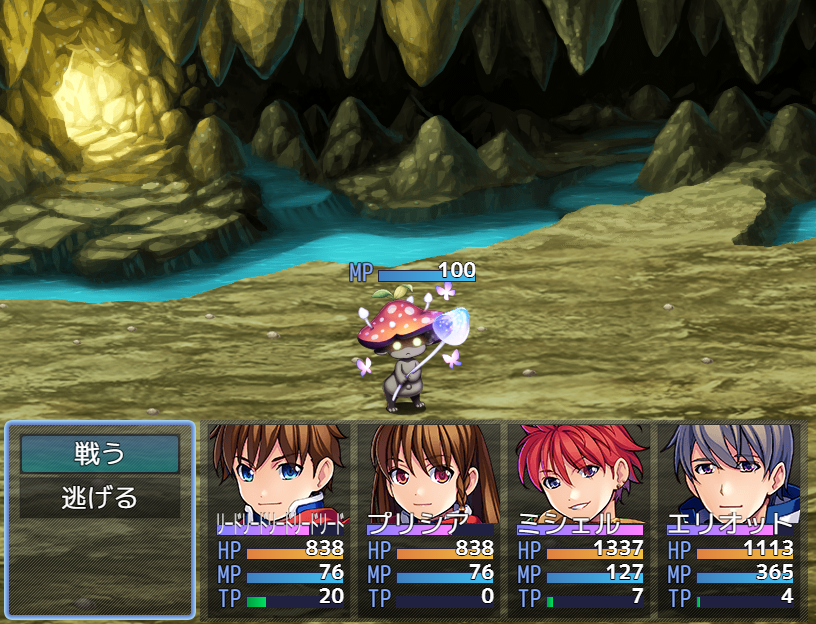

# [バトラーMPゲージ](https://raw.githubusercontent.com/nuun888/MZ/master/NUUN_BattlerMPGauge.js)
# Ver.1.2.5
[ダウンロード](https://raw.githubusercontent.com/nuun888/MZ/master/NUUN_BattlerMPGauge.js)  
#### 必須、前提プラグイン
[バトラーオーバーレイベース](https://github.com/nuun888/MZ/blob/master/README/BattlerOverlayBase.md)  

敵またはSVアクターのバトラー上にMPゲージを表示します。  

※Ver.1.2.0よりプラグイン名が変更になりましたので、再設定が必要になります。  

  

### 設定方法

#### MPゲージの座標指定
敵キャラまたはアクターのメモ欄
`<MPGaugeX:[position]>`MPゲージのX座標を調整します。（相対座標）  
`<MPGaugeY:[position]>` MPゲージのY座標を調整します。（相対座標）  
[position]:座標  

敵キャラのメモ欄  
`<MPGaugeLength:[width], [height]>` MPゲージの幅を指定します。
`[position]`:座標
`[width]`:ゲージ横幅
`[height]`:ゲージ縦幅

バトルイベント1ページ目のの注釈  
`<MPGaugePosition:[Id],[x],[y]>` 敵グループの[Id]番目のモンスターのゲージの位置を調整します。（相対座標）  
[Id]：表示順番号  敵グループ設定で配置した順番のIDで指定します。モンスター画像の左上に番号が表示されますのでその番号を記入します。  
[x]：X座標  
[y]：Y座標  

#### MPゲージの表示
敵キャラのメモ欄  
`<NoMPGauge>` HPゲージを表示しません。  
`<MPGaugeMask:[eval]>` 条件に一致しなければMP値の表示を？？？にします。  
[eval]:評価式  
this 敵データ  
this.enemy() 敵のデータベースデータ  
例`<MPGaugeMask:this.hp < this.mmp * 0.3>`敵のMPが３０％未満の時にMP値を表示します。  

特徴を有するメモ欄  
`<MPGaugeVisible>`この特徴を持つアクターが存在すれば、敵のMPゲージが表示されます。  
`<EnemyMPGaugeVisible>` この特徴を持つ敵はMPゲージが表示されます。  

### 表示のタイミング設定
#### MPゲージ表示タイミング
`常に表示`  
常に表示されます。  
`選択時`  
対象選択時に表示します。  
`MP変動時`   
ダメージ時に表示されます。  
`選択時、MP変動時`  
選択時、ダメージ時に表示されます。  

#### 初期MPゲージ表示  
`<MPGaugeVisible>`の特徴を持つアクターが戦闘メンバーにいるとき、または図鑑登録と連動している際に登録済みなら表示されます。  
上記の特徴を使用する場合は初期MPゲージ表示を非表示に設定してください。  

### モンスター図鑑の情報登録を反映
この機能を使用するには[モンスター図鑑](https://raw.githubusercontent.com/nuun888/MZ/master/NUUN_EnemyBook.js)が必要です。
#### MPゲージ表示タイミング（モンスター図鑑）
初期MPゲージ表示をOFFにする必要があります。MPゲージ表示タイミングによって表示タイミングを指定できます。  
`図鑑登録後に表示`  
図鑑登録後にMPゲージを表示します。  
`図鑑情報登録後に表示`  
図鑑にモンスター情報が登録後にMPゲージを表示します。  

## 更新履歴
2025/1/3 Ver.1.2.5  
変身後のモンスターのゲージが非表示に設定されている場合、ゲージが表示がされたままになる問題を修正。  
2023/8/3 Ver.1.2.4  
一部のプラグインにてNoMPGaugeが機能していなかった問題を修正。  
2023/7/7 Ver.1.2.3  
一部プラグインで表示した敵キャラにゲージを表示されるとエラーが出る問題を修正。  
2023/6/23 Ver.1.2.2  
NoMPGaugeが機能していなかった問題を修正。  
2023/6/2 Ver.1.2.1  
不具合の修正。  
2023/6/2 Ver.1.2.0  
SVアクターにゲージを表示する機能を追加。  
敵キャラ毎にHPゲージの横幅、縦幅を指定できる機能を追加。  
2023/5/7 Ver.1.1.1  
MPゲージの表示をフェードアウト、フェードインさせるように修正。  
2022/5/14 Ver.1.1.0  
バトラーの表示処理の定義大幅変更に関する定義変更。  
2022/1/10 Ver.1.0.1  
ゲージがラベル表示でも座標0から表示されてしまう問題を修正。  
2022/1/12 Ver.1.0.0  
初版  
