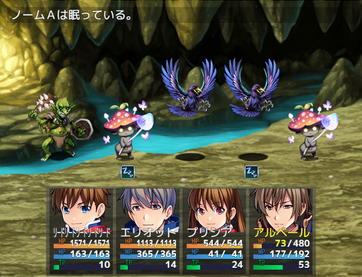

# [敵ステート表示拡張](https://raw.githubusercontent.com/nuun888/MZ/master/NUUN_EnemyStateIconEX.js)
# Ver.1.1.4
 [ダウンロード](https://raw.githubusercontent.com/nuun888/MZ/master/NUUN_EnemyStateIconEX.js)  
 
 ## 必須、前提プラグイン
[バトラーオーバーレイベース](https://github.com/nuun888/MZ/blob/master/README/BattlerOverlayBase.md)  

敵のステートの表示を拡張、変更します。  
一部のプラグイン上で敵グラフィックの色調を変更したときにステートアイコンの色調も変わることを防ぎます。  
またモンスターと重なっても表示が他のモンスターの背後に表示されることはありません。  

  

## 座標の調整
敵キャラのメモ欄  
`<EnemyStateX:[position]>` モンスターのステートアイコンのX座標を調整します。（相対座標）  
`<EnemyStateY:[position]>` モンスターのステートアイコンのY座標を調整します。（相対座標）  
`[position]`：座標  

バトルイベントの注釈
`<EnemyStatePosition:[Id],[x],[y]>` 敵グループの[Id]番目のモンスターのステートアイコンの位置を調整します。（相対座標）  
`[Id]`：表示順番号  
`[x]`：X座標  
`[y]`：Y座標  
[id]は敵グループ設定で配置した順番のIDで指定します。配置ビューのモンスター画像の左上に番号が表示されますのでその番号を記入します。  

## 更新履歴
2023/6/23 Ver.1.1.4  
一部のプラグインでステートアイコンが表示されなくなる問題を修正。  
2023/6/2 Ver.1.1.3  
処理の修正。  
2023/5/16 Ver.1.1.2  
ステートアイコン表示位置の敵画像の下、敵画像の中心が機能していなかった問題を修正。  
ステートアイコン表示タイミングを選択時に指定したときにアクターのステートアイコンが表示されない問題を修正。  
2023/5/6 Ver.1.1.1  
ステートの表示をフェードアウト、フェードインさせるように修正。  
022/5/10 Ver.1.1.0  
バトラーの表示処理の定義大幅変更に関する定義変更。  
2022/3/27 Ver.1.0.1  
ステートの表示をなしに設定してもアイコンが表示されてしまう問題を修正。  
戦闘開始時にエラーが起きる問題を修正。  
2021/12/12 Ver.1.0.0  
初版
