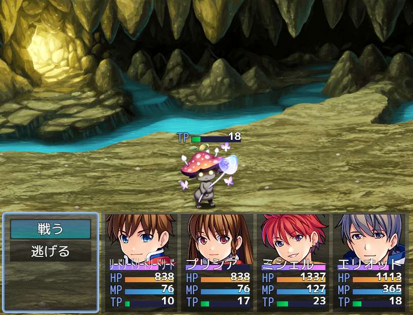

# [敵TPゲージ](https://raw.githubusercontent.com/nuun888/MZ/master/NUUN_EnemyTPGauge.js)
# Ver.1.0.0
[ダウンロード](https://raw.githubusercontent.com/nuun888/MZ/master/NUUN_EnemyTPGauge.js)
#### 必須、前提プラグイン
[共通処理](https://github.com/nuun888/MZ/blob/master/README/Base.md)Ver.1.4.2以降  

敵のバトラー上にTPゲージを表示します。  

  

### 設定方法

#### TPゲージの座標指定
敵キャラのメモ欄  
`<TPGaugeX:[position]>`TPゲージのX座標を調整します。（相対座標）  
`<TPGaugeY:[position]>` TPゲージのY座標を調整します。（相対座標）  
[position]:座標

バトルイベント1ページ目のの注釈  
`<TPGaugePosition:[Id],[x],[y]>` 敵グループの[Id]番目のモンスターのゲージの位置を調整します。（相対座標）  
[Id]：表示順番号  敵グループ設定で配置した順番のIDで指定します。モンスター画像の左上に番号が表示されますのでその番号を記入します。  
[x]：X座標  
[y]：Y座標  

#### TPゲージの表示
敵キャラのメモ欄  
`<NoTPGauge>` HPゲージを表示しません。  
`<TPGaugeMask:[eval]>` 条件に一致しなければTP値の表示を？？？にします。  
[eval]:評価式  
this 敵データ  
this.enemy() 敵のデータベースデータ  
例`<TPGaugeMask:this.tp >= this.maxTp() * 0.5>`敵のTPが５０％以上の時にTP値を表示します。  

特徴を有するメモ欄  
`<TPGaugeVisible>`この特徴を持つアクターが存在すれば、敵のTPゲージが表示されます。  
`<EnemyTPGaugeVisible>` この特徴を持つ敵はTPゲージが表示されます。  

### 表示のタイミング設定
#### TPゲージ表示タイミング
`常に表示`  
常に表示されます。  
`選択時`  
敵対象選択時に表示します。  
`ダメージ時`   
敵のダメージ時に表示されます。  
`選択時、ダメージ時`  
敵選択時、敵のダメージ時に表示されます。  

#### 初期TPゲージ表示
初期状態でのTPゲージの表示を設定します。TPゲージが特徴によって表示、図鑑登録で表示する場合は非表示にします。

### モンスター図鑑の情報登録を反映
この機能を使用するには[モンスター図鑑](https://raw.githubusercontent.com/nuun888/MZ/master/NUUN_EnemyBook.js)が必要です。
#### HPゲージ表示タイミング（モンスター図鑑）
初期TPゲージ表示をOFFにする必要があります。HPゲージ表示タイミングによって表示タイミングを指定できます。  
`図鑑登録後に表示`  
図鑑登録後にTPゲージを表示します。  
`図鑑情報登録後に表示`  
図鑑にモンスター情報が登録後にTPゲージを表示します。  

## 更新履歴
2022/1/12 Ver.1.0.0  
初版  
