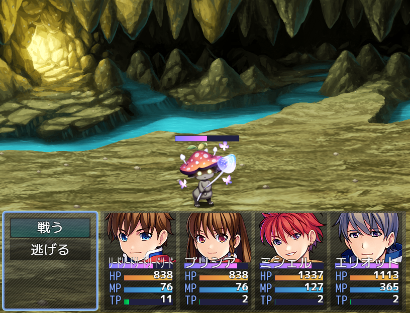

# [モンスターTPBゲージ](https://raw.githubusercontent.com/nuun888/MZ/master/NUUN_BattlerTpbGauge.js)
# Ver.1.5.0
[ダウンロード](https://raw.githubusercontent.com/nuun888/MZ/master/NUUN_BattlerTpbGauge.js)  
#### 必須、前提プラグイン
[バトラーオーバーレイベース](https://github.com/nuun888/MZ/blob/master/README/BattlerOverlayBase.md)  

戦闘中の敵及びSVアクターにTPBゲージを表示します。  
※Ver.1.5.0よりプラグイン名が変更になりましたので、再設定が必要になります。  

  

### 設定

#### MPゲージの座標指定
敵キャラまたはアクターのメモ欄  
`<TPBGaugeX:[position]>`TPBゲージのX座標を調整します。（相対座標）  
`<TPBGaugeY:[position]>`TPBゲージのY座標を調整します。（相対座標）  
[position]:座標

バトルイベント1ページ目のの注釈  
`<TPBGaugePosition:[Id],[x],[y]>` 敵グループの[Id]番目のモンスターのゲージの位置を調整します。（相対座標）  
[Id]：表示順番号  敵グループ設定で配置した順番のIDで指定します。モンスター画像の左上に番号が表示されますのでその番号を記入します。  
[x]：X座標  
[y]：Y座標

## 更新履歴
2023/5/28 Ver.1.5.0  
TPBゲージをアクターにも表示できるように対応。  
2022/5/14 Ver.1.4.0  
バトラーの表示処理の定義大幅変更に関する定義変更。  
2021/12/19 Ver.1.3.0  
ゲージ画像化に対応。  
2021/11/8 Ver.1.2.2  
敵グループの座標変更の設定方法を変更。  
2021/11/7 Ver.1.2.1  
一部処理を修正。  
2021/11/6 Ver.1.2.0  
敵グループのモンスター毎にゲージの座標を調整できる機能を追加。  
2021/9/2 Ver.1.1.9  
中心に表示する機能を追加。  
TPBゲージの位置が反映しなかった問題を修正。  
2021/8/29 Ver.1.1.8  
競合対策のための処理追加。  
2021/7/15 Ver.1.1.7  
処理の最適化により一部処理をNUUN_Baseに移行。  
2021/7/14 Ver.1.1.6  
エネミー画像を消去する及び新たにエネミー画像を追加表示するプラグインとの競合対策。  
2021/6/19 Ver.1.1.5  
疑似3DバトルVer.1.1対応のため一部の処理を変更。  
2021/5/24 Ver.1.1.4  
処理の一部を修正。  
2021/4/11 Ver.1.1.3  
モンスターにサイドビューアクター表示系のプラグインに対応。  
サイドビューアクターを指定したモンスターと戦闘を開始したときにエラーが出る問題を修正。  
2021/1/28 Ver.1.1.2  
エネミーごとにX座標を調整できるように変更。  
2021/1/20 Ver.1.1.1  
X座標を調整できるように変更。  
エネミーごとにY座標を調整できるように変更。  
2021/1/17 Ver.1.1.0  
Y座標を調整できる機能を追加。  
エネミーのステート表示が被る問題を修正。  
2021/1/17 Ver.1.0.1  
少し修正。  
2021/1/16 Ver.1.0.0  
初版  
