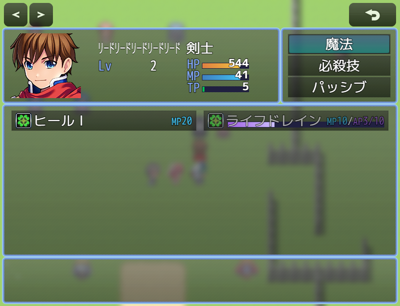

# [スキル習得装備](https://raw.githubusercontent.com/nuun888/MZ/master/NUUN_EquipSkillLearning.js)
# Ver.1.2.0
[ダウンロード](https://raw.githubusercontent.com/nuun888/MZ/master/NUUN_EquipSkillLearning.js)
#### 必須、前提プラグイン

## 概要
スキルを習得できる装備を設定できます。  
装備中に得たポイントが指定のポイントまで取得したときにスキルを習得できます。  

  

## 設定
このプラグインでは、武器・防具に習得させたいスキルを設定し、敵からAPを獲得して必要APに到達すると習得する仕組みになっています。  
武器または防具のメモ欄に以下のタグを記入します。  
武器、防具のメモ欄  
`<EquipSkillLearning:「id],[id]...>` 習得するスキルを設定します。複数指定可能です。  
`[id]`:スキルID  
`<EquipSkillLearning:10>`その装備を装備している間、スキルID10が習得対象になります。  
`<EquipSkillLearning:10,11,12>`その装備を装備している間、スキルID10,11,12が習得対象になります。  

#### スキルのメモ欄  
`<EquipSkillLearningPoint:「num]>` 習得に必要なポイントを設定します。  
`[num]`:必要ポイント  
`<EquipSkillLearningPoint:20>`そのスキルを習得するために 20AP 必要になります。  
このタグを設定しなかった場合は、現在の仕様では自動的に 10AP が必要ポイントとして使用されます。  
タグを設定していない敵については、プラグインパラメータの「デフォルト取得ポイント」が使用されます。初期値は 1AP です。  

#### 敵キャラのメモ欄  
`<EquipSkillLearningPoint:「num]>` 獲得するポイントを設定します。未記入の場合はデフォルトの取得ポイントが適用されます。  
`[num]`:取得ポイント  
`<EquipSkillLearningPoint:3>`この敵を倒すと 3AP を獲得します。  

#### 特徴を有するメモ欄  
習得するポイントの増幅率を設定します。  
`<EquipSkillLearningRate:「rate]>`  
`<EquipSkillLearningRate:150>` 取得ポイントが4の場合、150%の効果で6ポイント取得します。  

#### NUUN_SkillCostShowEXでコストを表示  
NUUN_SkillCostShowEXのプラグインパラメータのスキルコストの表示順でコスト表示対象でEquipSkillLearnSkillを選択することでスキルコストに表示させることができます。   

## 更新履歴
2026/10/3 Ver.1.2.0  
NUUN_Baseなしで実行できるように仕様を変更。  
スキルに習得に必要なポイントが設定されていない場合、デフォルト値が設定されるように修正。  
NUUN_ResultExに対応。  
ゲージ色で0が指定できない問題を修正。  
2022/12/25 Ver.1.1.1  
スキルを選択できなくなる問題を修正。  
2022/12/24 Ver.1.1.0  
取得ポイントの増幅率を設定できる機能を追加。  
2022/12/17 Ver.1.0.0  
初版
