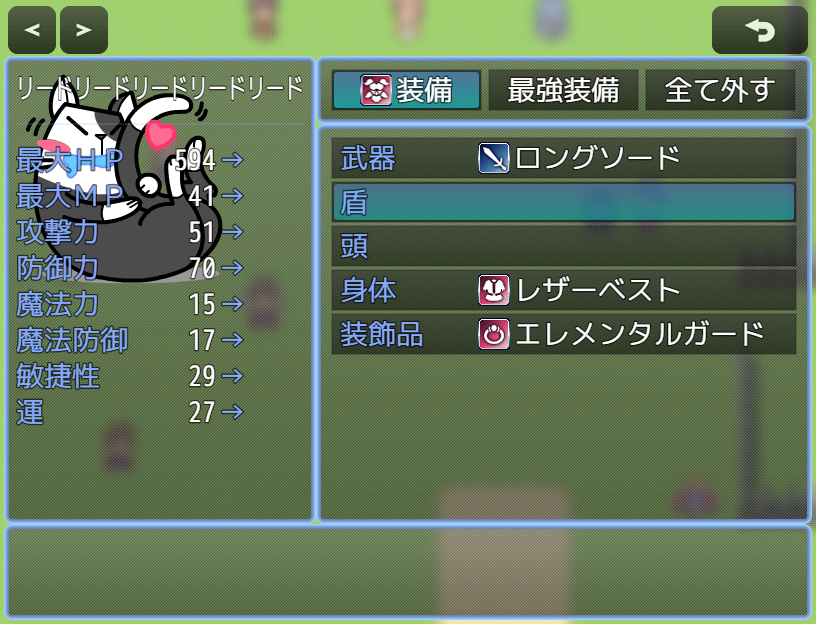
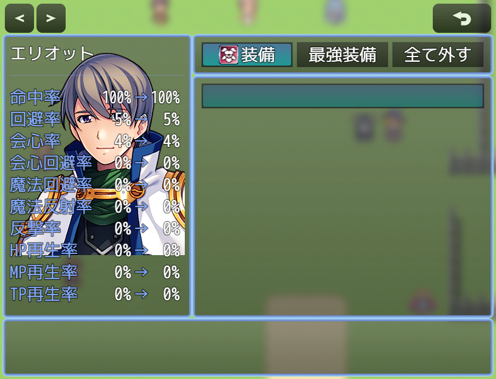
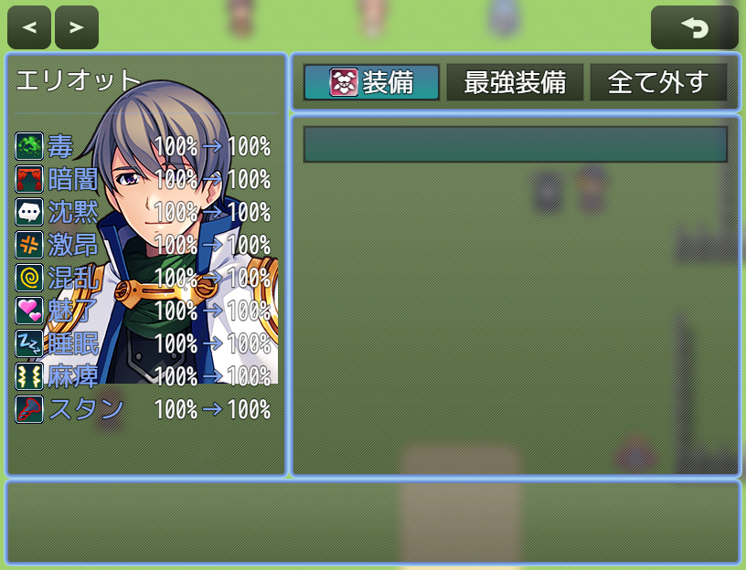

# [装備ステータス表示拡張](https://raw.githubusercontent.com/nuun888/MZ/master/NUUN_EquipStatusEX.js)
# Ver.1.4.7
[ダウンロード](https://raw.githubusercontent.com/nuun888/MZ/master/NUUN_EquipStatusEX.js)  
#### 必須、前提プラグイン
[共通処理](https://github.com/nuun888/MZ/blob/master/README/Base.md)  
#### オプション
[キーボタン割り当て](https://github.com/nuun888/MZ/blob/master/README/UserKey.md)  

装備ステータスの表示を拡張します。  

## 設定
各項目の設定はページ表示設定で設定します。  
装備ステータス設定でページ表示設定で設定したリスト番号を指定してください。  
装備ステータス設定リストの上から順にページが設定されます。  

通常能力値の他、HP、MP(数値またはゲージ)、追加能力値、特殊能力値、属性耐性、ステート耐性、独自のパラメータ、レベル、二つ名、職業、キャラチップ、サイドビューアクターが表示できます。  
アクター画像は顔グラまたは立ち絵画像のどちらかが選択できます。  
APNGを表示するにはNUUN_Base Ver.1.6.0とトリアコンタン様のAPNGピクチャプラグインが必要です。  

ゲージは仕様上差分表示されません。  

表示させる属性、ステートはプラグインパラメータの属性耐性、ステート耐性で設定します。  

当プラグインは、立ち絵、顔グラ表示EXに対応しています。  
立ち絵表示EX適用をOFFにすることで立ち絵、顔グラ表示EX導入時でも、このプラグインの立ち絵設定が適用されます。  
個別に設定する場合は各アクター画像設定の画像X座標、画像Y座標で設定します。  
画像のアクターが表示されている部分を中央に表示させたい場合は各アクター画像設定の画像表示開始座標X、画像表示開始座標Yで設定します。  

### 装備セットボーナス
項目の装備セットボーナスを表示するには[装備セットボーナス](https://github.com/nuun888/MZ/blob/master/README/SetBonusEquip.md)が必要です。  
セットボーナスの表示がウィンドウよりも長い場合は、自動的に改行されます。  
装備ステータスに表示させるには、プラグインパラメータの装備ステータス設定で、表示するステータスから装備セットボーナス(180)を選択してください。  

### 特殊ステータス
特殊ステータスの表示は装備のメモ欄に以下のタグを記入する必要があります。  
装備ステータスに表示させるには、プラグインパラメータの装備ステータス設定で、表示するステータスから特殊ステータス(160)を選択してください。  
特殊ステータスのテキスト設定  
武器、防具のメモ欄  
`<SpecialAbilityText:[text],[text],[text]...>` 特殊ステータスのテキストを記入します。  
`[text]`:テキスト  

### 評価式
a:アクターのゲームデータ

## 操作
QWキー:ページ切り替え  
装備コマンドが選択中の時は、アクターが切り替わります。  
装備スロット、アイテム選択中はステータスのページが切り替わります。  

  
  
  

## 更新履歴
2024/4/21 Ver.1.4.7  
装備ステータス設定が1ページしか設定されていない場合、アクターを切り替えるように変更。  
2024/4/6 Ver.1.4.6  
追加能力値の小数点の桁数が正常に機能していない問題を修正。  
2023/7/15 Ver.1.4.5  
独自パラメータを表示させるとエラーが出る問題を修正。  
2023/6/17 Ver.1.4.4  
属性名、ステート名が正常に表示されていなかった問題を修正。  
2023/6/2 Ver.1.4.3  
表示アクター画像を顔グラに設定したときにエラーが出る問題を修正。  
差分色反転の適用パラメータを拡大。  
2023/5/20 Ver.1.4.2  
装備シーン拡張との競合対策。  
項目を2列に跨いで表示できるように修正。  
X列指定を最大3に変更。  
設定できる項目に名称のみを追加。  
2023/5/14 Ver.1.4.1  
差分パラメータがプラスの場合、＋を表示するように修正。  
2023/5/8 Ver.1.4.0  
差分パラメータを表示する機能を追加。  
2023/4/22 Ver.1.3.5  
現在値及び補正後能力値のX座標指定が適用されていなかった問題を修正。  
2023/4/16 Ver.1.3.4  
ステータスウィンドウの横幅を指定できる機能を追加。  
2023/2/28 Ver.1.3.3  
ステータスのページ切り替えのキー設定を指定できる機能を追加。(別途キー割り当てが出来るプラグインが必要です)  
2023/2/25 Ver.1.3.2  
狙われ率、MP消費率、物理ダメージ率、魔法ダメージ率、床ダメージ率の差分の色を逆にするよう修正。(上昇で赤、減少で緑)  
オリジナルパラメータの差分表示に差分の色を逆にする機能を追加。  
2022/12/11 Ver.1.3.1  
装備セットボーナスの項目高さが適用されていなかった問題を修正。  
2022/12/11 Ver.1.3.0  
カラー指定のプラグインパラメータのTypeをcolorに変更。(Ver.1.6.0以降)  
アイコン指定のプラグインパラメータのTypeをiconに変更。(Ver.1.6.0以降)  
特殊ステータスを表示できる機能を追加。  
装備セットボーナスの差分表示を修正。  
2022/11/17 Ver.1.2.0  
適用している装備セットボーナスを表示できる機能を追加。(要NUUN_SetBonusEquip)  
2022/11/14 Ver.1.1.1  
装備画面を開くとエラーが出る問題を修正。  
2022/11/14 Ver.1.1.0  
設定項目の設定方法を変更。  
表示項目にキャラチップとSVアクターを追加  
2022/11/14 Ver.1.0.1  
アクター画像が手前に表示されてしまう問題を修正。  
2022/11/13 Ver.1.0.0  
初版  
