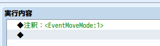

# [イベントの移動モード設定](https://raw.githubusercontent.com/nuun888/MZ/master/NUUN_EventMoveMode.js)
# Ver.1.0.0
[ダウンロード](https://raw.githubusercontent.com/nuun888/MZ/master/NUUN_EventMoveMode.js)  
#### 必須、前提プラグイン
[共通処理](https://github.com/nuun888/MZ/blob/master/README/Base.md)  

イベントの移動を乗り物と同じ移動方式に変更します。  

## 設定
イベントのメモ欄及び、イベントの実行内容の注釈で記述  
`<EventMoveMode:[id]>` 上記のIDモードでの通行になります。全てのページで有効になります。  
イベントの実行内容に記入の場合はそのページでのみ有効になります。  
  
`[id]`:下記のID  
1:小型船と同じ  
2:大型船と同じ  
3:飛行艇と同じ  

## 更新履歴
更新準備中  
