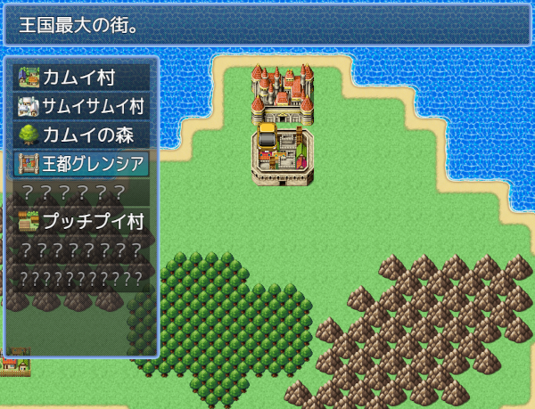

# [ファストトラベル](https://raw.githubusercontent.com/nuun888/MZ/master/NUUN_FastTravel.js)
# Ver.1.0.4
[ダウンロード](https://raw.githubusercontent.com/nuun888/MZ/master/NUUN_FastTravel.js)  
#### 必須、前提プラグイン
[共通処理](https://github.com/nuun888/MZ/blob/master/README/Base.md)  

ファストトラベルを実装します。  

  

## ファストトラベル用のマップの設定
マップの設定のメモ欄に`<FastTravelMap:[id]>`を記入します。  

マップのメモ欄  
`<FastTravelMap:[id]>` このタグが付けられたマップはファストトラベルマップとなります。  
`[id]`:ファストトラベル設定のリスト番号  

## ファストトラベルの設定
イベントIDにマップで設定したイベントIDを記入します。(IDまたはイベント名)  
選択後イベント起動をONにしている場合は、イベントIDで指定したイベントが実行されます。  
OFFにしている場合は移動先マップID、座標を指定します。  

## ファストトラベル用マップへの移動
イベントコマンドの場所移動、またはプラグインパラメータでファストトラベル用マップに移動します。  
キャンセルはプラグインパラメータから実行のみ有効になります。  

## スクリプト
スクリプト
$gameMap.openFastTravel([id], [x], [y]);  
`[id]`:移動先マップID  
`[x]`:移動先X座標  
`[y]`:移動先Y座標  

## 更新履歴
2025/3/1 Ver.1.0.4  
アノテーションlocationに対応。(1.8以前のバージョンは従来の方式)  
2024/9/22 Ver.1.0.3  
カーソルの初期位置のスクロールの挙動を修正。  
2024/9/21 Ver.1.0.2  
ヘルプウィンドウ、ファストトラベルウィンドウのウィンドウが透明化しない問題を修正。  
カーソルの初期インデックスを移動先の座標から一番近いイベントのインデックスになるように修正。  
カーソルの初期インデックスを指定のインデックスにする機能を追加。  
2024/8/18 Ver.1.0.1  
移動先の向きを指定できる機能を追加。  
選択できない場所にスクロールしないように修正。  
戻るボタンを追加。(プラグインコマンドから実行時のみ)  
2024/8/17 Ver.1.0.0  
初版  
