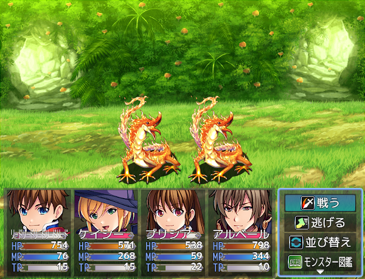
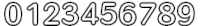

# [ゲージ画像化](https://raw.githubusercontent.com/nuun888/MZ/master/NUUN_GaugeImage.js)
# Ver.1.6.10
[ダウンロード](https://raw.githubusercontent.com/nuun888/MZ/master/NUUN_GaugeImage.js)
#### 必須、前提プラグイン
[共通処理](https://github.com/nuun888/MZ/blob/master/README/Base.md)  

English available  

ゲージを画像化します。  

  

## 設定
背後画像：一番後ろに表示される画像です。  
前面画像：一番手前に表示される装飾用の画像です。  
メイン画像：ゲージの画像です。  

配布、販売されているゲージ画像を使用できるようにするため、各ゲージ画像に合わせた表示設定を行う必要があります。  

#### 画像回転角度
ゲージを左基準に回転させます。正の数で時計回りに回転します。
ベース高さを調整する必要があります。  
コアスクリプトデフォルトだとゲージの表示高さ範囲は36になっていますので、ベース高さを変更しないと画像が途切れてしまいます。  

#### 傾斜率
ゲージを斜めに傾かせます。正の数で左に傾きます。  

#### 可変表示
前面ゲージ横幅から前面ゲージ画像左側非可変横幅と前面ゲージ画像右側非可変横幅で指定した範囲を除くゲージの表示を引き延ばします。  

#### 特定条件
HPゲージ:HPが瀕死の時に設定した画像に切り替わります。  
TPBゲージ:TPBがキャストタイム中なら設定した画像に切り替わります。(別途キャストタイムを可視化できるプラグインが必要です)  

#### 数値画像
数値の画像のフォーマットは左から0から9までの数値が並んだ画像を指定してください。縦分割数は1固定です。  
リスト1:通常時  
リスト2:瀕死時(未指定の場合はリスト1が適用)  
リスト3:戦闘不能時(未指定の場合はリスト1が適用)  
数値画像に拡大率の設定はありません。  

以下の画像のようにしてください。  

    
##### ※上の画像は素材ではありません。背景は白くしてあります。元の画像はツクールMVのRTPです。

### 仕様
このプラグインは共通処理プラグインVer.1.4.4以降が必要になります。  

## 更新履歴
2025/4/13 Ver.1.6.10  
経験値数値の処理を変更。  
2025/4/13 Ver.1.6.9  
一部プラグインを導入していない時にエラーが出る問題を暫定修正。  
2025/4/12 Ver.1.6.8  
NUUN_StatusScreen、NUUN_MenuScreenEX、NUUN_MenuParamListBaseの経験値ゲージの数値にも画像を適用できるように修正。  
画像の角度の処理を現座標を基準に回転させるように修正(数値以外)。  
2024/5/24 Ver.1.6.7  
ゲージ表示拡張プラグイン更新による処理の修正。  
2023/4/16 Ver.1.6.6  
フィルタリングクラスの処理を汎用ゲージ追加プラグイン、カスタムメニュー作成プラグインに対応できるよう修正。  
2023/1/10 Ver.1.6.5  
ゲージを表示した際にちらつく問題を修正。  
2023/1/9 Ver.1.6.4  
傾斜率をマイナスに指定したときに、ゲージ画像がずれる問題を修正。  
2022/12/15 Ver.1.6.3  
パーティリミットゲージで画像表示するとエラーがでる問題を修正。  
2022/11/9 Ver.1.6.2  
日本語以外での表示を英語表示に変更。  
2022/10/16 Ver.1.6.1  
数値画像が回転しない問題を修正。  
回転を指定したときにゴミが表示される問題を修正。  
2022/10/15 Ver.1.6.0  
数値の画像化に対応  
2022/7/19 Ver.1.5.2  
ダメージ量ゲージ可視化別プラグイン化による処理変更。  
2022/5/24 Ver.1.5.1  
ラベルの座標が適用されない問題を修正。  
2022/5/24 Ver.1.5.0  
処理内容、プラグインパラメータの大幅な見直し。  
ゲージの角度を指定できる機能を追加。  
2022/1/3 Ver.1.4.3  
ゲージ表示拡張プラグインのダメージ量可視化に対応。  
前面ゲージの表示がずれる問題を修正。  
2021/12/20 Ver.1.4.2  
パーティゲージの画像化に対応。  
前面ゲージ画像を可変表示させない範囲を設定できる機能を追加。  
2021/12/19 Ver.1.4.1  
フィルタリングクラスが正常に適用されていなかった問題を修正。  
2021/12/19 Ver.1.4.0  
ゲージプラグイン対応による処理追加。  
ゲージの画像設定を変更。  
2021/10/4 Ver.1.3.0  
最大時の画像を設定できる機能を追加。  
溺死、キャストタイム中のゲージの画像が、特定条件の画像設定をしていなかった場合反映しなかった問題を修正。  
2021/9/24 Ver.1.2.0  
ラベルを画像化する機能を追加。  
画像を１枚にまとめなくとも表示できるように修正。  
画像が重複して表示されてしまう問題を修正。  
2021/9/22 Ver.1.1.1  
メインゲージが正常に表示されない問題を修正。  
2021/9/20 Ver.1.1.0  
フィルタリング機能を追加。  
ゲージの前面に画像を表示出来る機能を追加。  
2021/9/20 Ver.1.0.1  
当プラグインに対応していないゲージで、ゲージが表示されない問題を修正。  
2021/9/20 Ver.1.0.0  
初版  
