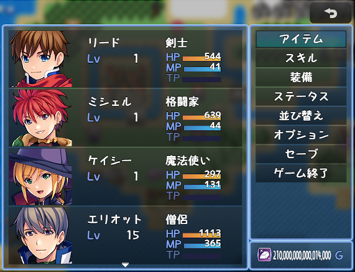

# [所持金拡張](https://raw.githubusercontent.com/nuun888/MZ/master/NUUN_GoldEX.js)
# Ver.1.1.1
[ダウンロード](https://raw.githubusercontent.com/nuun888/MZ/master/NUUN_GoldEX.js)
#### 必須プラグイン
[共通処理](https://raw.githubusercontent.com/nuun888/MZ/master/NUUN_Base.js)  

所持金を拡張します。  

  

## 設定方法
### 最大所持金額
所持金の最大金額を設定します。-1で無制限になります。0でデフォルト上限値　1以上で設定できる範囲の上限値  
### カンマ区切り
所持金をカンマ区切りにします。
### アイコンインデックス
所持金を表示するときに左側にアイコンを表示させます。表示させるウィンドウをアイコン表示クラスで指定できます。

## 更新履歴
2021/12/30 Ver.1.1.1  
所持金アイコンを表示させるクラス指定をコンボボックスに変更。  
2021/2/3 Ver.1.1.0  
特定のクラスのみ所持金のアイコンを表示させる機能を追加  
2021/1/24 Ver.1.0.1  
「セーブ画面拡張プラグインを使用時」、アイコン画像をセーブ画面に反映しないように修正。  
2021/1/13 Ver.1.0.0  
初版  
