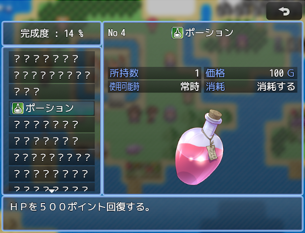
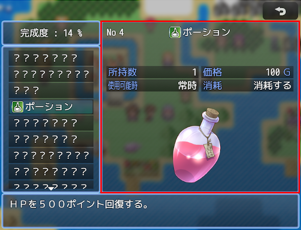

# [アイテム図鑑](https://raw.githubusercontent.com/nuun888/MZ/master/NUUN_ItemBook.js)
# Ver.1.6.5
[ダウンロード](https://raw.githubusercontent.com/nuun888/MZ/master/NUUN_ItemBook.js)  
#### 必須、前提プラグイン
[共通処理](https://raw.githubusercontent.com/nuun888/MZ/master/NUUN_Base.js)  

アイテム図鑑を実装します。
このプラグインではアイテム、武器、防具の表示内容を自由に設定することが出来ます。  

   

## 設定方法
アイテム、武器、防具のメモ欄  
`<NoBook>` アイテム図鑑に表示されません。  

### ページの各項目の設定
各項目は赤枠内の項目を設定できます。  
   
各ページの項目は「アイテム項目設定」「武器項目設定」「防具項目設定」から設定します。  
各項目の設定は、項目リスト横の()の数値の項目で設定できます。  
#### 【名称の設定】
アイテム名以外で任意の名称を設定できます。  
無記入の場合はデーターベース及びこのプラグイン内で設定した名称が表示されます。  
#### 【システム項目文字色の設定】
名称の文字色を指定します。  
#### 【パラメータ評価式の設定】  
評価式を記入します。オリジナルパラメータでは必ず記入してください。  
itemでアイテムデータを取得できます。  
オリジナルパラメータ以外で無記入の場合は自動的に参照されます。  
参照パラメータ  
item　アイテムデータ  
#### 【記述欄設定】
記述欄はプラグインパラメータ「記述欄タグ名」に任意の文字列を記入してください。一部文字列は使用できない場合もありますので注意してください。  
desc1と記入した場合はアイテム、武器、防具のメモ欄に<desc1:ああああ>と記入したとき、記述欄タグ名にdesc1と記入した項目に「ああああ」と表示されます。  
#### 【X表示位置】
表示する列を指定します。  
#### 【Y表示位置】
表示する行を指定します。  
#### 【X座標設定】
表示位置からの相対座標シフト。  
#### 【Y座標設定】
表示位置からの相対座標シフト。  
#### 【項目横幅設定】
横幅を指定します。指定しない場合は自動調整されます。  
#### 【項目表示モード】
項目を複数列に跨いで表示します。  
#### 【システム項目横幅】
システム文字の表示幅を指定します。  
#### 【名称、アイテム名表示位置】
名称、アイテム名の文字の位置を指定します。  
#### 【単位】
接尾につける単位を設定します。オリジナルパラメータ、成功率で設定できます。  
#### 【コンテンツ背景表示】
一部を除く黒い背景（デフォルトの場合）を表示、表表示かを設定します。  
能力値、所持数、最大所持数、価格、オリジナルパラメータ、使用可能時、消耗、速度補正率、得TP、武器タイプ、防具タイプ、装備タイプで設定可能です。  
#### 【記述欄、個別指定画像タグ名】
任意の文字列を記入してください。一部文字列は使用できない場合もありますのでその場合は''で囲むと表示される場合があります。  
[記述欄]  
アイテム、武器、防具のメモ欄  
`<[tag]:[text]>` 記述欄のテキスト  
`[tag]`:記述欄タグ名
`[text]`:表示するテキスト。 
改行すれば何行でも表示可能ですので、独自の項目を追加することも可能です。  
`<desc1:ああああ>` desc1とタグ付けされた項目に「ああああ」が表示されます。  
文章を表示させる場合は`<desc1:[text]>`と記入してください。  
[個別指定画像]  
アイテム、武器、防具のメモ欄  
`<[tag]:[img],[x],[y]>` アイテム個別画像の表示   
`[tag]`:アイテム個別画像タグ名
`[img]`:画像パス(拡張子なし)  
個別指定画像フォルダが'pictures'ならimg/pictures直下のファイルを拡張子なしで記入してください。  
サブフォルダーから取得する場合はサブフォルダー名も記入してください。例 'items/tankobu'  
`[x]`:x座標(相対)  
`[y]`:y座標(相対)  
複数画像を指定したい場合は項目リストで表示する分だけ設定し、記述欄、個別指定画像タグ名で別々の名前で設定してください。  
#### 【共通画像】
アイテム、武器、防具すべてで表示される共通の画像を指定します。  
#### 【画像の最大縦幅】
画像の表示サイズを指定した行分のサイズに調整します。デフォルトで８行で設定されていますので８行分の高さを超えたらサイズ調整します。  
共通画像、アイテム個別画像で設定可能です。  

## アイテムに独自のカテゴリーを設定
アイテム、武器、防具のメモ欄  
`<[categorytag]:[categorykey]>` 表示するアイテムのカテゴリーを記入します。  
`[categorytag]`:「カテゴリータグ名」で設定したタグ名  
`[categorykey]`:カテゴリーキー  
`allItem`:キーアイテムを含む全てのアイテム  
`allItems`:アイテム、武器、防具全て  
文字の最初と最後の'及び"は付けなくても問題ありませんが、一部の文字列で反映されない場合があるため念のため付いています。  
メモ欄のタグ記入時では付けないでください。  

## 更新履歴
2024/10/12 Ver.1.6.5  
一部プラグインでの競合対応。  
2023/12/29 Ver.1.6.4  
アイテムカテゴリー名称の未設定時の不具合修正。  
2023/9/10 Ver.1.6.3  
個別指定画像フォルダを設定しなかった時に、エラーが表示される問題を修正。  
2023/4/23 Ver.1.6.2  
図鑑完成率、登録数にアイテム、武器、防具を含まないトータル数を設定できる機能を追加。  
2023/3/25 Ver.1.6.1　　
ページ切り替えのキー設定を指定できる機能を追加。(別途キー割り当てが出来るプラグインが必要です)　　
2023/2/25 Ver.1.6.0  
追加能力値、特殊能力値を表示できる項目を追加。  
2023/1/25 Ver.1.5.1  
データベースでアイテムカテゴリーを一つに設定したときにアイテム図鑑を開くとエラーが出る問題を修正。  
アイテムカテゴリーとアイテム図鑑のカテゴリーを別々に仕様変更。  
武器の名称のみが適用されない問題を修正。  
2023/1/9 Ver.1.5.0  
アイテム、武器、防具の画像をプラグんパラメータから設定できる機能を追加。  
2023/1/7 Ver.1.4.5  
項目設定のオリジナルパラメータの仕様を変更。(要オリジナルパラメータのみ再設定)  
処理の修正。  
2022/7/24 Ver.1.4.4  
武器、防具が表示されない問題を修正。  
2022/2/3 Ver.1.4.3  
アイテムのリストの表示がおかしくなる問題を修正。  
2021/12/12 Ver.1.4.2  
メインウィンドウ（アイテムの情報を表示）の横幅を設定できる機能を追加。  
2021/11/11 Ver.1.4.1  
背景の設定方法を少し変更。  
各項目のシステム文字色をカラーコードに対応。  
2021/11/3 Ver.1.4.0  
完成率ウィンドウに完成率（アイテム、武器、防具）、情報登録数/全アイテム、武器、防具を表示する機能を追加。  
2021/9/28 Ver.1.3.0  
プラグインコマンドに図鑑完成度、情報登録済みアイテム数を変数に代入する機能を追加。  
ナンバー表示をカテゴリー順に表示させる機能を追加。  
背景画像を指定できる機能を追加。  
2021/9/2 Ver.1.2.4  
個別アイテム画像の座標設定がされていなかった問題を修正。  
2021/8/30 Ver.1.2.3  
プラグインパラメータのアイテム項目設定が初期設定のままだとエラーが出る問題を修正。  
2021/8/28 Ver.1.2.2  
カテゴリーキーが反映しなかった問題を修正。  
2021/8/28 Ver.1.2.1  
共通画像を空白のままでアイテム図鑑を開くとエラーが出る問題を修正。  
2021/8/27 Ver.1.2.0  
画像を表示できる機能を追加。  
2021/8/22 Ver.1.1.0  
任意のアイテムカテゴリーを設定できる機能を追加。  
2021/8/13 Ver.1.0.1  
ブックナンバーの表示がおかしくなる問題を修正。  
特定の武器、防具タイプを表示しない機能を追加。  
2021/8/11 Ver.1.0.0  
初版  
