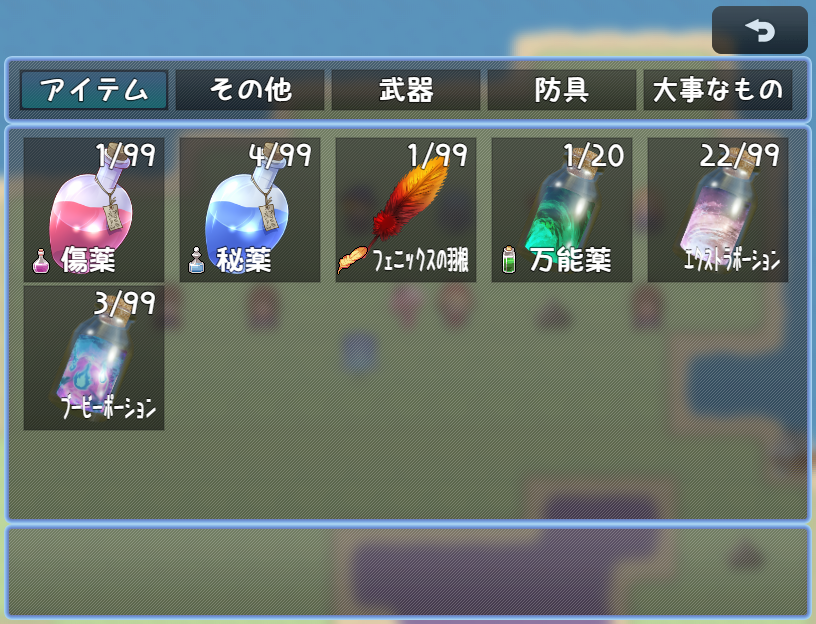
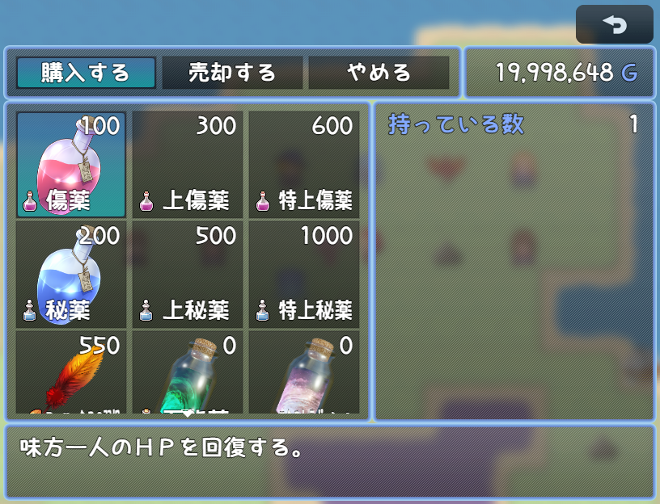

# [アイテムリスト画像化](https://raw.githubusercontent.com/nuun888/MZ/master/NUUN_ItemListImage.js)
# Ver.1.0.1
[ダウンロード](https://raw.githubusercontent.com/nuun888/MZ/master/NUUN_ItemListImage.js)
#### 必須、前提プラグイン
[共通処理](https://github.com/nuun888/MZ/blob/master/README/Base.md)  

アイテム一覧に画像を表示させます。  

  
  

## 設定
### 画像の設定
アイテムのメモ欄
`<ItemListImg:[url]>` 画像を表示します。  
`[url]`:pictures直下の画像  

## 更新履歴
2024/10/13 Ver.1.0.1  
設定画像の未使用ファイルを除外するを除外するように修正。  
2024/10/12 Ver.1.0.0  
初版  
