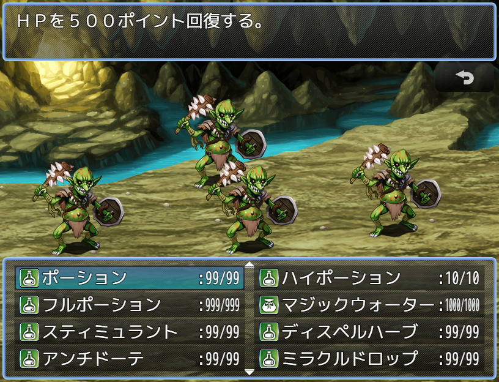

# [アイテム個数表示変更](https://raw.githubusercontent.com/nuun888/MZ/master/NUUN_ItemNum.js)
# Ver.1.0.1  
 [ダウンロード](https://raw.githubusercontent.com/nuun888/MZ/master/NUUN_ItemNum.js)  
 
 アイテムの個数表示をカスタマイズします。
 
   

## 設定
アイテムのメモ欄  
`<NoItemNum>` アイテムの個数を表示しません。  
  
#### 評価式のパラメータ
`party`:パーティ  
`num`:所持個数  
`maxNum`:最大個数  

## 更新履歴
2022/8/22 Ver.1.0.1  
''で囲うと評価式が評価しない問題を修正。  
2022/6/11 Ver.1.0.0  
初版  
