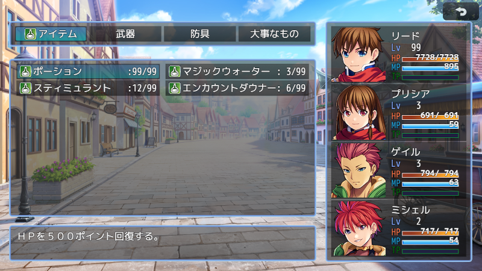

# [アイテムウィンドウカスタマイズ](https://raw.githubusercontent.com/nuun888/MZ/master/NUUN_ItemWindowEx.js)
# Ver.1.1.1
[ダウンロード](https://raw.githubusercontent.com/nuun888/MZ/master/NUUN_ItemWindowEx.js)  
#### 必須プラグイン
[共通処理](https://github.com/nuun888/MZ/blob/master/README/Base.md)  
[ステータス項目ベースプラグイン](https://github.com/nuun888/MZ/blob/master/README/NUUN_MenuParamListBase.md)Ver.1.1.0以降  
#### 対応プラグイン
[立ち絵、顔グラ表示](https://github.com/nuun888/MZ/blob/master/README/ActorPicture.md)Ver.1.7.2以降  

アイテム画面をカスタマイズできます。  
戦闘中のアイテム画面には対応しておりません。 

## 主な機能
アイテム画面のウィンドウの配置を自由に設定できます。  
アイテム画面表示中にアクターウィンドウを常時表示させることができます。  
アクターウィンドウのステータス項目設定が設定されていない場合は、メニュー画面と同じ表示になります。  

  
画像は設定例です。初期設定ではデフォルトと同じ表示になります。  

## アイテムインフォ
アイテムインフォウィンドウは初期設定では表示されません。  
#### 表示項目リストの指定
アイテム、武器、防具のメモ欄  
`<ItemParamListId:[id]>` アイテムインフォ項目設定のリストIDを指定します。指定がない場合はリスト番号1番の項目が表示されます。  

#### 記述欄、個別画像指定
アイテム、武器、防具のメモ欄  
記述欄  
`<[Method]:[text]>`  
`[Method]`:記述欄、個別指定画像タグ名で記入したタグ名。  
`[text]`:表示テキスト  

個別画像指定  
`<[Method]:[filePass], [x], [y]>`  
`[Method]`:記述欄、個別指定画像タグ名で記入したタグ名。  
`[filePass]`:img/pictures直下のファイル名  
`[x]`:X座標  
`[y]`:Y座標  
[]は外して記入して下さい。  

## クラスウィンドウ
`Window_ItemMenuActor` アクターステータス(アクターウィンドウのステータス項目設定が設定されている場合)  
`Window_ItemInfo` アイテムインフォ(未実装)  

## 更新履歴
2024/7/27 Ver.1.1.1  
オリジナルパラメータに小数点数を適用できるように修正。  
2024/7/21 Ver.1.1.0  
アイテムインフォを表示できる機能を追加。  
ウィンドウの不透明化の説明が間違っていたため修正。  
2024/7/13 Ver.1.0.1  
立ち絵、顔グラ共通プラグインでの設定が適用されなかった問題を修正。  
2024/6/16 Ver.1.0.0    
初版  
