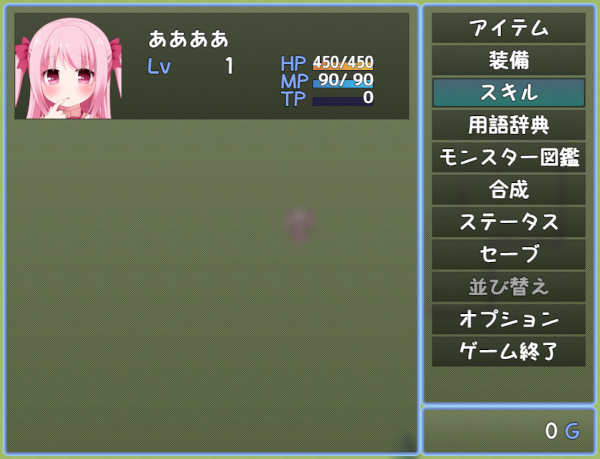

# [メニューコマンド任意表示順](https://raw.githubusercontent.com/nuun888/MZ/master/NUUN_MenuCommandDisplayOrder.js)
# Ver.1.0.0
[ダウンロード](https://raw.githubusercontent.com/nuun888/MZ/master/NUUN_MenuCommandDisplayOrder.js)
#### 必須、前提プラグイン
[共通処理](https://github.com/nuun888/MZ/blob/master/README/Base.md)   

メニューコマンドの表示順を任意の表示順に表示できます。  
表示順はプラグインパラメータのメニューコマンド設定での設定したID順に表示されます。  
未設定のコマンドは設定したコマンドの後に表示されます。  

   

## 更新履歴
2023/1/3 Ver.1.0.0  
初版。  
