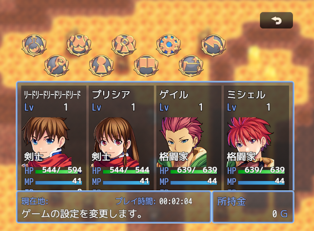

# [メニューコマンド表示EX](https://raw.githubusercontent.com/nuun888/MZ/master/NUUN_MenuCommandEX.js)
# Ver.1.2.3
[ダウンロード](https://raw.githubusercontent.com/nuun888/MZ/master/NUUN_MenuCommandEX.js)
#### 必須、前提プラグイン
※[メニュー画面](https://github.com/nuun888/MZ/blob/master/README/MenuScreen_default.md)   
または  
[メニュー画面ベース](https://github.com/nuun888/MZ/blob/master/README/MenuScreen_default.md)   
[共通処理](https://github.com/nuun888/MZ/blob/master/README/Base.md)  

メニューコマンドに任意の背景画像、コマンド画像、任意の座標に表示することができます。  
  
   

## 更新履歴
2026/2/24 Ver.1.2.3  
特定の処理後、スクロールを行うとコマンド画像の表示がずれて更新される問題を修正。  
2025/5/11 Ver.1.2.2  
移動フレーム数を61以上に設定するとコマンドが移動しない問題を修正。  
2024/8/19 Ver.1.2.1  
対象選択時カーソル非表示が機能していなかった問題を修正。  
2024/8/18 Ver.1.2.0  
選択不可時の画像を指定できる機能を追加。  
選択不可時の画像の不透明度を設定できる機能を追加。  
2024/1/7 Ver.1.1.4  
メニュー画面Ver.3.0.0更新による修正。  
2023/2/24 Ver.1.1.3  
アクター選択後キャンセルを押しメニューコマンドに戻る際に、コマンドが動く問題を修正。  
2023/1/22 Ver.1.1.2  
画像を全てメニューコマンド表示時に読み込むように修正。  
2023/1/8 Ver.1.1.1  
コマンドソート有効をONにしたときに、コマンドの座標がずれて表示される問題を修正。  
2023/1/4 Ver.1.1.0  
コマンド毎に横幅、高さ及び各コンテンツ背景画像の座標を調整できる機能を追加。  
2023/1/3 Ver.1.0.1  
コマンドのソート機能を追加。  
2023/1/3 Ver.1.0.0  
初版。  
