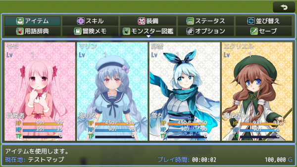

# [メニュー画面タイプ２](https://raw.githubusercontent.com/nuun888/MZ/master/NUUN_MenuScreen_2.js)
# Ver.1.6.0
[ダウンロード](https://raw.githubusercontent.com/nuun888/MZ/master/NUUN_MenuScreen_2.js)  
#### 必須、前提プラグイン
[共通処理](https://github.com/nuun888/MZ/blob/master/README/Base.md)Ver.1.4.1以降  
#### オプション
※アクター表示列が２列以上でかつ表示行が２行以上の場合は、以下のプラグインが必要です。  
全体選択時カーソル修正
[メニュー画面の全体対象時のカーソル表示修正](https://github.com/nuun888/MZ/blob/master/README/MenuStatusAllSelectFix.md)  
行動目標表示
[メニュー画面行動目標表示](https://github.com/nuun888/MZ/blob/master/README/Destination.md)  

メニュー画面の表示を変更、拡張します。  
メニュー画面に表示できる項目はカスタマイズすることができます。  

  

## 設定方法
### ステータス項目設定
アクターの表示するステータスを設定します。  

表示ステータス、ゲージの取得パラメータ  
`actor`:アクターのゲームデータ  

### インフォ設定
インフォウィンドウに表示する項目を設定します。  

#### ヘルプ項目設定
メニューコマンドの説明を表示するテキストを設定します。表示するにはインフォ設定でメニューコマンド説明を選択し設定してください。  

### 立ち絵、顔グラ設定
立ち絵及び顔グラの座標設定、画像設定はアクターの画像設定から設定します。  
立ち絵、顔グラ表示EX導入時で立ち絵表示EX適用をONにしている場合は、立ち絵表示EX用画像設定で設定します。  

立ち絵表示EX用画像設定で設定しなくても立ち絵は表示されます。  
立ち絵表示EX適用をOFFにすることで立ち絵、顔グラ表示EX導入時でも、このプラグインの立ち絵設定が適用されます。  

顔グラの座標設定はアクターの画像設定または立ち絵表示EX用画像設定（立ち絵、顔グラ表示EX導入時）で設定してください。  

アクターの顔グラ、立ち絵はアクター画像基本X座標、アクター画像基本Y座標で設定できます。  
また個別に設定する場合は各アクター画像設定の画像X座標、画像Y座標で設定します。  
画像のアクターが表示されている部分を中央に表示させたい場合は各アクター画像設定の画像表示開始座標X、画像表示開始座標Yで設定します。  

720p設定例  
 

### 背景画像
#### 背景画像1
IDはマップのタグまたはプラグインコマンドで設定します。  
マップの設定のメモ欄  
`<MenuBackgroundId:[id]>` メニュー背景を背景画像リスト[id]番の画像を表示します。  
`<MenuBackground:[url]>` メニュー背景を[url]の画像を表示します。パスはimg/[url].pngです。  
例：`<MenuBackground:titles1/Bigtree>`  
なお上記のタグよりもプラグインパラメータで設定した背景が優先されます。0番指定の時はデフォルトの背景が表示されます。  
タグの[id]、[url]は[]ごと数値または文字列に置き換えてください。  

#### 背景画像2
背景画像1の手前に重ねて表示されます。  
メニューUIの背景として使用します。  
ゲーム中、背景画像1を変更しない場合は、メニュー背景を背景画像2で設定しても問題ありません。  

## 更新履歴
2022/6/4 Ver.1.6.0  
行動目標を表示できる機能を追加。（要メニュー画面行動目標表示プラグイン）  
2022/5/29 Ver.1.5.1  
マップごとに背景を変更できる機能を追加。  
背景画像を変更するプラグインコマンドを追加。  
背景画像を２層構造に変更。 
2022/5/28 Ver.1.5.0  
表示できるステータスに独自のゲージを追加できる機能を追加。  
2022/5/22 Ver.1.4.1  
ステータスの独自パラメータが適用されない問題を修正。  
ステータスに経験値（ゲージなし）を追加。  
2022/5/17 Ver.1.4.0  
キャラチップを表示できる機能を追加。  
アクターの画像を顔グラ、キャラチップ、画像から選択する方式に変更。  
2022/5/11 Ver.1.3.0  
ステータス欄の各項目にフォントサイズを設定できる機能を追加。  
インフォウィンドウにフリーテキストを追加。  
2022/4/10 Ver.1.2.1  
誤字修正。  
2022/4/10 Ver.1.2.0  
アクター表示の項目に通常能力値、追加能力値、特殊能力値を設定できる機能を追加。  
顔グラモードでアクター前面画像が表示されない問題を修正。  
アクター表示画像表示関係の処理を修正。  
画面上、コマンド下にインフォウィンドウを表示できる機能を追加。  
各アクターの表示領域内に項目表示が収まるように修正。  
アイテム、スキルで味方選択時の画面をメニュー画面の表示と同じになるように修正。  
バージョンアップによりプリセットを変更。  
2022/1/23 Ver.1.1.1  
立ち絵、顔グラEXを導入せず、顔グラを表示させるとエラーが出る問題を修正。  
顔グラの座標設定の仕様を変更。  
2022/1/9 Ver.1.1.0  
ステータス項目の表示の文字揃えを指定できる機能を追加。  
ステータス項目に経験値を追加。  
インフォウィンドウの文字サイズを指定できる機能を追加。  
2021/12/29 Ver.1.0.0  
初版  
