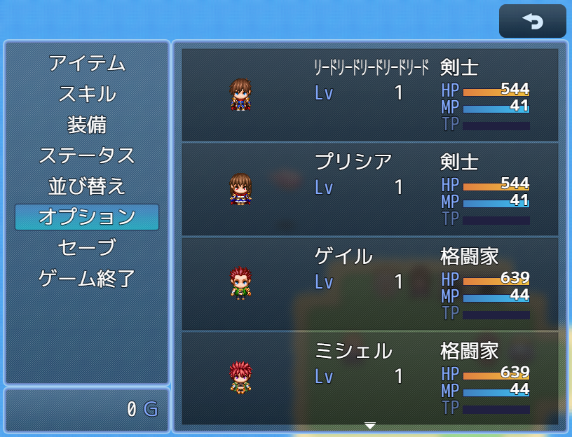
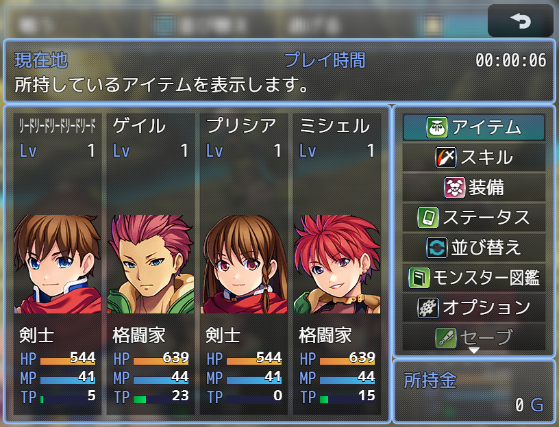
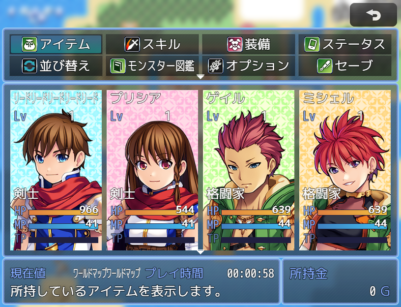

# メニュー画面

# 新版

# 旧版
## メニュー画面ベース
### Ver.2.1.5  
[ダウンロード](https://raw.githubusercontent.com/nuun888/MZ/master/NUUN_MenuScreenEXBase.js)  
## 設定用プラグイン
メニュー画面デフォルトタイプVer.2.1.1    
[ダウンロード](https://raw.githubusercontent.com/nuun888/MZ/master/NUUN_MenuScreen_default.js)  
メニュー画面タイプ１Ver.2.1.1    
[ダウンロード](https://raw.githubusercontent.com/nuun888/MZ/master/NUUN_MenuScreen.js)  
メニュー画面タイプ２Ver.2.1.1    
[ダウンロード](https://raw.githubusercontent.com/nuun888/MZ/master/NUUN_MenuScreen_2.js)  

#### 必須、前提プラグイン
[共通処理](https://github.com/nuun888/MZ/blob/master/README/Base.md)Ver.1.6.7以降  

#### 拡張プラグイン
[メニューコマンド表示EX](https://github.com/nuun888/MZ/blob/master/README/MenuCommandEX.md)  

[スキルステータス画面表示カスタマイズ](https://github.com/nuun888/MZ/blob/master/README/SkillStatusEX.md)  

#### オプション
全体選択時カーソル修正  
※アクター表示列が２列以上でかつ表示行が２行以上の場合は、以下のプラグインが必要です。  
[メニュー画面の全体対象時のカーソル表示修正](https://github.com/nuun888/MZ/blob/master/README/MenuStatusAllSelectFix.md)  

[メニュー画面行動目標表示](https://github.com/nuun888/MZ/blob/master/README/Destination.md)  

[メニュー画面チャプターテキスト](https://github.com/nuun888/MZ/blob/master/README/Chapter.md)  

## 概要
メニュー画面の表示を拡張します。  

※各スタイルVer.2.0.4でステータス設定のHP、MP、TPゲージのカラー設定を適用できるように変更いたしました。  
その関係でアップデート後、ステータス設定のHP、MP、TPゲージのカラー設定をテキストタブから-1に設定あるいはカラーインデックスを指定の色に変更してください。  
すでに色を変更している場合は変更の必要はございません。(変更してない場合だと白く(カラーインデックス0番の色)表示されます)  

## 特徴
メニュー画面の表示をカスタマイズできます。  
アクターステータスに経験値や能力値、追加能力値、特殊能力値などを表示できます。  
インフォウィンドウは最大10のウィンドウを生成できます。  

デフォルトタイプ  
  
タイプ１  
  
タイプ2  
  

## 設定方法
### UIウィンドウ基準無効
ウィンドウの表示基準位置を画面基準に表示します。OFFの場合はデフォルトの表示になります。  
 
### メニューコマンド表示モード
メニューコマンドの表示位置を指定します。  

### 配置モード
メニューステータスウィンドウの配置をメニューコマンド表示モードで設定したモードにより表示します。  
メニューコマンド表示モードが'left'の場合はメニューコマンドの右側に表示。  
'right'の場合はメニューコマンドの左側に表示。  
'top'の場合はメニューコマンドの下側に表示。  
'under'の場合はメニューコマンドの上側に表示。  
'free'の場合は左上基準(UIウィンドウ基準無効基準)に表示。  

### ステータス項目設定
アクターの表示するステータスを設定します。  

表示ステータス、独自ゲージの取得パラメータ  
`actor`:アクターのゲームデータ  

ステートの評価式には表示したいステートを指定できます。(直接記入)  
表示したいステートIDを,区切りで指定します。  
例 "1,5,11" 必ず''または""で囲む  
"1-10" ステートID1～10番まで表示  
"3-11,15"ステートID3～11,15番を表示  

ゲージ設定  
ゲージカラー(左)ゲージカラー(右)はHP、MP、TPに関しては、テキストタブで-1を指定することでデフォルトのカラーインデックスが設定されます。  

### フォント変更
別途フォントを変更できるプラグインが必要です。(トリアコンタン様のFontLoad(フォントロードプラグイン)推奨)  

### インフォ設定
インフォウィンドウに表示する項目を設定します。  

#### ヘルプ項目設定
メニューコマンドの説明を表示するテキストを設定します。表示するにはインフォ設定でメニューコマンド説明を選択し設定してください。  

### 立ち絵、顔グラ設定
立ち絵及び顔グラの座標設定、画像設定はアクターの画像設定から設定します。  
立ち絵、顔グラ表示EX導入時で立ち絵表示EX適用をONにしている場合は、立ち絵表示EX用画像設定で設定します。  

立ち絵表示EX用画像設定で設定しなくても立ち絵は表示されます。  
立ち絵表示EX適用をOFFにすることで立ち絵、顔グラ表示EX導入時でも、このプラグインの立ち絵設定が適用されます。  

顔グラの座標設定はアクターの画像設定または立ち絵表示EX用画像設定（立ち絵、顔グラ表示EX導入時）で設定してください。  

アクターの顔グラ、立ち絵はアクター画像基本X座標、アクター画像基本Y座標で設定できます。  
また個別に設定する場合は各アクター画像設定の画像X座標、画像Y座標で設定します。  
画像のアクターが表示されている部分を中央に表示させたい場合は各アクター画像設定の画像表示開始座標X、画像表示開始座標Yで設定します。  

### 画像(アクターステータス)
評価式or文字列(javaScript)には表示条件をjavascriptで記入します。条件が一致しているときに表示されます。  
無記入の場合は常に表示されます。  
`actor`:アクターゲームデータ  
`actor.actor()`:アクターシステムデータ  

### 背景画像
#### 背景画像1
IDはマップのタグまたはプラグインコマンドで設定します。  
マップの設定のメモ欄  
`<MenuBackgroundId:[id]>` メニュー背景を背景画像リスト[id]番の画像を表示します。  
`<MenuBackground:[url]>` メニュー背景を[url]の画像を表示します。パスはimg/[url].pngです。  
例：`<MenuBackground:titles1/Bigtree>`  
なお上記のタグよりもプラグインパラメータで設定した背景が優先されます。0番指定の時はデフォルトの背景が表示されます。  
タグの[id]、[url]は[]ごと数値または文字列に置き換えてください。  

#### 背景画像2
背景画像1の手前に重ねて表示されます。  
メニューUIの背景として使用します。  
ゲーム中、背景画像1を変更しない場合は、メニュー背景を背景画像2で設定しても問題ありません。  

## 更新履歴
2024/1/7 Ver.2.1.5  
背景画像をUIに合わせるをOFFにしても背景画像がUI内に表示されてしまう問題を修正。  
他作者様背景プラグインの競合対応。  
2024/1/6 Ver.2.1.4  
追加能力値、特殊能力値を設定するとエラーが出る問題を修正。  
2024/1/3 Ver.2.1.3  
インフォウィンドウのメソッド名が適用されていなかった箇所があったため修正。  
2023/8/8 Ver.2.1.2  
二つ名と職業の文字色変更が機能していなかった問題を修正。  
2023/8/8 Ver.2.1.1  
控えメンバーのアクター画像(顔グラ)を不透明にしない機能を追加。  
2023/7/20 Ver.2.1.0  
アクター画像設定にアクターIDではなく職業IDで指定できる機能を追加。  
アクターステータスのラインが機能していなかった問題を修正。  
2023/6/14 Ver.2.0.20  
顔グラの処理を修正。  
2023/6/2 Ver.2.0.19  
二つ名を表示したときにエラーが出る問題を修正。  
2023/5/22 Ver.2.0.18  
前衛後衛プラグインのフェイスシフトとの競合対応。  
2023/5/14 Ver.2.0.17  
スキルステータス画面表示カスタマイズに関する処理の修正。  
項目名称をゲージのラベルにも適用するように修正。  
2023/5/8 Ver.2.0.16  
アクターステータスの画像に条件を指定できる機能を追加。  
2023/5/7 Ver.2.0.15  
アクターステータスに画像を設定するとエラーが出る問題を修正。  
2023/5/3 Ver.2.0.14  
ゲージの色変更をHP、MP、TPにも適用できるように修正。  
2023/5/2 Ver.2.0.13  
経験値以外のゲージの数値が表示されていなかった問題を修正。  
2023/4/29 Ver.2.0.12  
経験値数値が正常に表示されていなかった問題を修正。  
経験値の表示なし指定時でも、数値が表示されていた問題を修正。  
2023/4/28 Ver.2.0.11  
フォントを変更できる機能を追加。別途フォントを変更できるプラグインが必要です。  
2023/4/22 Ver.2.0.10(ベースプラグイン)  
インフォウィンドウのオリジナルパラメータが表示されない問題を修正。  
2023/4/13 Ver.2.0.9(ベースプラグイン)  
最大レベルでの経験値の表示を修正。  
2023/4/9 Ver.2.0.8(ベースプラグイン)  
他制作者プラグインでのインフォウィンドウのクラス指定を適用できるように修正。  
2023/4/1 Ver.2.0.2  
リミットゲージを表示する項目を追加。  
2022/12/10 Ver.2.0.1  
カラー指定のプラグインパラメータのTypeをcolorに変更。(Ver.1.6.0以降)  
アイコン指定のプラグインパラメータのTypeをiconに変更。(Ver.1.6.0以降)  
2022/11/25 Ver.2.0.0  
設定用と処理用のファイルを分離。  
メニューコマンドウィンドウ、メニューステータスウィンドウ、メニューインフォウィンドウの座標、サイズを指定できる機能を追加。  
メニューインフォウィンドウの設定方法の仕様を変更。  
2022/9/10 Ver.1.4.1  
インフォウィンドウの行を1行に指定したときに、スクロールしてしまう問題を修正。  
2022/8/27 Ver.1.4.0  
アクターステータスに任意の画像を表示できる機能を追加。  
ゲージがアクターの表示範囲内に収まるように修正。  
2022/8/22 Ver.1.3.2  
制御文字でフォントサイズ変更をした後に、項目のフォントのサイズが変化してしまう問題を修正。  
2022/7/23 Ver.1.3.1  
ステートの表示ステートを範囲指定する機能を追加。  
2022/7/23 Ver.1.3.0
ステートのアイコンを表示したいステートのみ表示する機能を追加。  
バトルステータスに表示されるステートの表示をメニュー画面上に表示できる機能を追加。  
経験値の%表示時に小数点が指定した小数点数を無視して表示されてしまう問題を修正。  
2022/7/4 Ver.1.2.4  
インフォのフォントサイズを各項目毎に設定できるように修正。  
チャプターテキストプラグイン対応による処理追加。  
2022/6/10 Ver.1.2.3  
ステータス独自パラメータで名称を無記入した場合、パラメータが右にずれる問題を修正。  
2022/6/7 Ver.1.2.2  
一部プラグインでの競合対策。  
2022/6/5 Ver.1.2.1  
ステータスの独自パラメータの名称の座標が正常に適用されていなかった問題を修正。  
2022/6/4 Ver.1.2.0  
行動目標を表示できる機能を追加。（要メニュー画面行動目標表示プラグイン）  
2022/5/29 Ver.1.1.1  
マップごとに背景を変更できる機能を追加。  
背景画像を変更するプラグインコマンドを追加。  
背景画像を２層構造に変更。  
2022/5/28 Ver.1.1.0  
表示できるステータスに独自のゲージを追加できる機能を追加。  
メニューコマンドウィンドウの高さをコマンド数の高さで表示する(MVの表示)機能を追加。  
2022/5/22 Ver.1.0.1  
ステータスの独自パラメータが適用されない問題を修正。  
ステータスに経験値（ゲージなし）を追加。  
2022/5/17 Ver.1.0.0  
初版  
