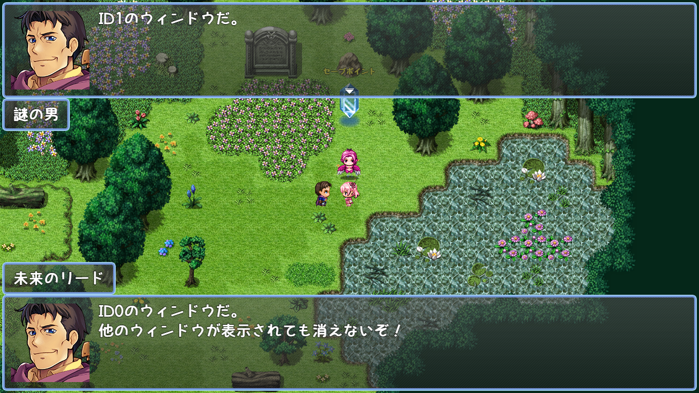

# [複数メッセージウィンドウ](https://raw.githubusercontent.com/nuun888/MZ/master/NUUN_MultiMessageWindows.js)
# Ver.1.1.3
[ダウンロード](https://raw.githubusercontent.com/nuun888/MZ/master/NUUN_MultiMessageWindows.js)
#### 必須、前提プラグイン

メッセージウィンドウを複数表示させることが出来るようになります。  

  

## 特徴
複数のウィンドウを表示できます。  
複数のウィンドウを同時に表示できます。  
ウィンドウが開いていてもプレイヤーを移動させることができます。  
フキダシウィンドウプラグイン(トリアコンタン様)に対応しています。  

## 設定
イベントコマンドのメッセージの前にプラグインコマンドのメッセージウィンドウ設定でメッセージのIDを指定してください。  
その際に他メッセージウィンドウ持続表示をONにしてください。  

他メッセージウィンドウ持続表示をONにしたメッセージウィンドウは自動ではウィンドウが閉じませんので、プラグインコマンドのメッセージウィンドウクローズでウィンドウを閉じます。  

#### 他メッセージウィンドウ持続表示
複数のメッセージウィンドウを表示させるには必ずONにしてください。  
他メッセージウィンドウ持続表示をOFFに設定し、次メッセージ同時表示をONにした場合は次のキーが押されるまで表示されます。  

#### 次メッセージ同時表示
次に表示されるメッセージウィンドウと同時に表示します。  
間にウエイトを行うイベントコマンドを実行すると表示タイミングがずれます。  

## 更新履歴
2023/4/2 Ver.1.1.3  
特定の条件でメッセージウィンドウを閉じるとメニュー等が開かなくなる問題を修正。  
飛び番のIDを指定した後にウィンドウを一括削除するとエラーが出る問題を修正。  
2023/4/2 Ver.1.1.2  
ネームウィンドウの表示位置を指定できる機能を追加。  
2023/4/1 Ver.1.1.1  
メッセージウィンドウ表示中に移動を許可する機能を追加。  
2023/4/1 Ver.1.1.0  
メッセージ表示中は全てのメッセージウィンドウでポーズサインが出るように修正。  
メッセージウィンドウを他のウィンドウと同時に表示する機能を追加。  
2023/3/26 Ver.1.0.2  
IDを指定せずにメッセージウィンドウを表示させようとすると、行動不能になる問題を修正。  
2023/3/26 Ver.1.0.1  
処理の修正。  
2023/3/25 Ver.1.0.0  
初版。  
