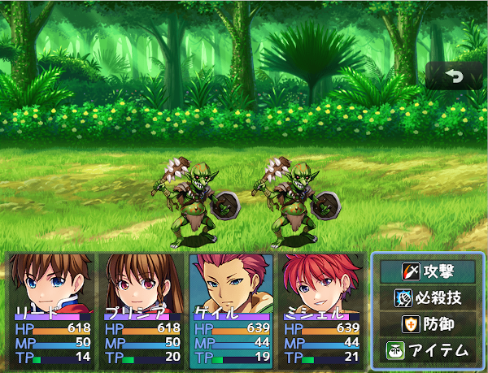

# [コマンド、カテゴリー表示拡張](https://raw.githubusercontent.com/nuun888/MZ/master/NUUN_CommandIcon.js)
# Ver.1.6.1
[ダウンロード](https://raw.githubusercontent.com/nuun888/MZ/master/NUUN_CommandIcon.js)  

#### 必須プラグイン
[共通処理](https://raw.githubusercontent.com/nuun888/MZ/master/NUUN_Base.js)  

コマンドにアイコン、文字色を設定できます。  
ウィンドウごとに左揃え、中央揃え、右揃えに表示させることができます。  

コマンド名：コマンドメニューに表示される文字列をそのまま記入します。  
コマンドの色：コマンド名の色を変更します。  
アイコンインデックス：アイコンを指定します。  
フィルタリングクラス設定モード：下のフィルタリングを適用するか除外するか指定します。  
フィルタリングクラス設定：設定を適用または除外するクラスを設定します。上から一番最初に条件一致した条件が適用されます。  

## 設定方法
### フィルタリングクラス設定
リストにないクラスを記入する場合は必ず'または"で囲ってください。  
フィルタリングクラス設定にないウィンドウで設定する場合は、テキストタブで直接該当クラスを''または""で囲って記入してください。  
Window_Command.prototype.drawItem内にconsole.log(this)を記入することでクラス名が分かります。(F12)  
反映させられるクラスはWindow_Commandを継承しているクラスのみとなります。  

Window_ItemBook_Category：アイテム図鑑カテゴリー  
Window_SaveVerificationWindow：セーブ確認上書き画面選択肢  
Window_EnemyBook_Category：モンスター図鑑敵カテゴリー  
Window_EnemyBookPageCategory：モンスター図鑑情報ページ  

※コンボボックスにない場合、直接記入してください。

コマンドスキルプラグイン(トリアコンタン様)シンボル名:"special"  

### フォントの変更
別途フォントを変更できるプラグインが必要です。(トリアコンタン様のFontLoad(フォントロードプラグイン)推奨)  

## 更新履歴
2024/6/16 Ver.1.6.1  
処理の修正。  
2024/2/17 Ver.1.6.0  
スイッチによってコマンドテキストの表示を変更する機能を追加。  
コマンド選択可能な条件を設定できる機能を追加。  
コンテンツ背景の表示が正常に行われていなかった問題を修正。  
2023/4/29 Ver.1.5.1  
他のコマンドのフォントが変更されてしまう問題を修正。  
2023/4/29 Ver.1.5.0  
フォントを変更できる機能を追加。別途フォントを変更できるプラグインが必要です。  
2023/4/10 Ver.1.4.5  
フィルタリングクラスの処理修正。  
2023/4/9 Ver.1.4.4  
オプションに適用されていなかった問題を修正。  
2022/12/6 Ver.1.4.3  
カラー指定のプラグインパラメータのTypeをcolorに変更。(コアスクリプトVer.1.6.0以降)  
アイコン指定のプラグインパラメータのTypeをiconに変更。(コアスクリプトVer.1.6.0以降)  
2022/11/25 Ver 1.4.2  
適用するコマンドをシンボルで指定できる機能を追加。  
2022/11/10 Ver 1.4.1  
画像全体を表示内に収めるように修正。  
日本語以外での表示を英語表示に変更。  
2022/11/10 Ver 1.4.0  
コマンドのコンテンツ背景に任意の画像を表示できる機能を追加。  
2022/4/10 Ver 1.3.2  
クラス毎のコマンド名表示位置の設定が適用されていなかった問題を修正。  
2021/12/25 Ver 1.3.1  
モンスター図鑑敵カテゴリーコマンド化によりフィルタリングクラスに項目追加。  
2021/11/14 Ver 1.3.0  
クラス毎にテキストの位置を指定できる機能を追加。  
2021/11/7 Ver 1.2.5  
カラーコードで指定できるように修正。  
2021/10/23 Ver 1.2.4  
プラグインパラメータの説明を修正及びメニューコマンド内の項目のみ初期設定に追加。  
2021/9/11 Ver 1.2.3  
フィルタリングクラスにセーブ上書き確認を追加（要NUUN_SaveVerification）  
2021/8/23 Ver 1.2.2  
適用除外クラス設定にアイテム図鑑カテゴリーを追加。(要NUUN_ItemBook)  
2021/5/22 Ver 1.2.1  
設定を反映するウィンドウを適用モードか除外モードかを選択できる機能を追加。  
2021/5/21 Ver 1.2.0  
設定を反映するウィンドウを指定できる機能を追加。  
2020/11/22 Ver 1.1.1  
コマンド名を左揃え、中央揃え、右揃えから選べる機能を追加。  
2020/11/21 Ver 1.1.0  
コマンド名に色を付ける機能を追加。  
2020/11/20 Ver 1.0.2  
日本語版しかヘルプやプラグインパラメータが表示されなかった問題を修正。  
2020/11/20 Ver 1.0.1  
プラグインパラメータのCommadIconが空白だった場合、エラーが出る問題を修正。  
2020/11/19 Ver 1.0.0  
初版  
