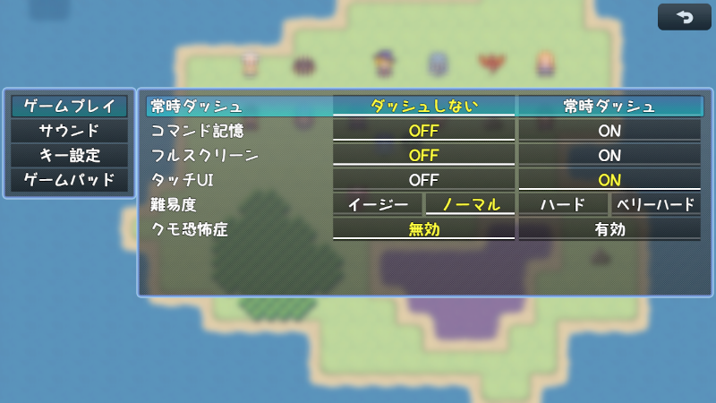

# [オプション拡張](https://raw.githubusercontent.com/nuun888/MZ/master/NUUN_OptionEx.js)
# Ver.1.2.1
[ダウンロード](https://raw.githubusercontent.com/nuun888/MZ/master/NUUN_OptionEx.js)  
#### 必須プラグイン
[共通処理](https://github.com/nuun888/MZ/blob/master/README/Base.md)  
#### 拡張プラグイン
[オプション拡張音量ゲージ表示](https://github.com/nuun888/MZ/blob/master/NUUN_OptionEx_2.js)  
[オプション拡張項目スタイル変更](https://github.com/nuun888/MZ/blob/master/NUUN_OptionEx_3.js)  

オプション画面を拡張します。  
  
  

## 共通設定

### 初期値
値の初期値を設定します。  
booleanタイプの場合は0がOFF 1がON  
デフォルトオプション、外部プラグイン、音量の初期値を適用させる場合は変数、スイッチ以外初期値適用をtrueに設定してください。  

### オプションパラメータ名
boolea対応(ONまたはOFFの項目及びスイッチ指定時): 0:OFF 1:ON  
変数タイプ:対応する値  
音量、キー設定、ゲームパッド設定には適用できません。  

## 変数、スイッチを使用したオプション項目
### オプション詳細設定
変数、スイッチにIDを１以上に指定したときに適用されます。  

#### 全セーブデータ適用
ONにすることで全てのセーブデータに適用されます。変数、スイッチ指定時のみでデフォルトオプション、外部プラグイン、音量は適用されません  

#### DifficultyOptionを使用した設定例
オプション詳細設定の変数に難易度変数IDと同じ変数IDを設定。  
オプションパラメータ名のリストに変数の値に対応する文字列を設定。  
難易度リスト　1:イージー 2:ノーマル 3:ハードなら  
オプションパラメータ名のリスト　1:イージー 2:ノーマル 3:ハード  

## コマンドシンボル名
`alwaysDash` :常時ダッシュ  
`commandRemember` :コマンド記憶  
`touchUI` :タッチUI  
`bgmVolume` :BGM音量  
`bgsVolume` :BGS音量  
`meVolume` :ME音量  
`seVolume` SE音量  
`gamePadVibration` :ゲームパッドの振動 要NUUN_GamePadVibration  
`startUpFullScreen` :フルスクリーン 要StartUpFullScreen（トリアコンタン氏）  
`masterVolume`　:マスター音量 要MasterVolumeOption（トリアコンタン氏）  
`reset`:現在のページの設定をリセットにします。  

## キー、ゲームパッドのキー(ボタン)変更の操作
キー、ゲームパッドのキー、ボタンの変更は変更したい項目でEnter(決定ボタン)を押し、任意のキー(ボタン)を押します。  
キー設定でDeleteキーで選択中のキー設定を解除できます。  
既に設定済みのキー(ボタン)、予約キー(ボタン)は設定できません。  

## 拡張プラグイン
### オプション拡張音量ゲージ表示
音量設定にゲージを表示させます。  
  
※マスター音量はMasterVolumeOption.jsを使用しています。  
[ダウンロード](https://github.com/nuun888/MZ/blob/master/NUUN_OptionEx_2.js)Ver.1.0.2  

2024/9/10 Ver.1.0.4  
スライダーのみタッチ操作可能を実装。  
2024/9/7 Ver.1.0.3  
つまみがゲージ範囲外にクリックしたままカーソル移動した場合、最小または最大になるように修正。  
つまみの表示を実装。  
Ver.1.0.2   
音量のつまみ機能を実装。  
ボリュームゲージのクリックした場所により、クリック場所の音量に設定する機能を追加。  

### オプション拡張項目スタイル変更
オプションの項目を選択式に変更します。  
  
[ダウンロード](https://github.com/nuun888/MZ/blob/master/NUUN_OptionEx_3.js)Ver.1.0.1  
難易度はトリアコンタン氏の難易度設定プラグインを使用した例となります。  
クモ恐怖症は使用プラグインはありません。  

2025/1/28 Ver.1.0.1  
スイッチのタッチ操作が機能していなかった問題を修正。  

## 外部プラグインとの併用
マスターボリューム設定プラグイン、オプションデフォルト値設定プラグインはこのプラグインよりも上に設定してください。  

## 更新履歴
2025/1/3 Ver.1.2.1  
ローカルオプションの設定値がゲーム再起動後にリセットされてしまう問題を修正。    
変数オプションの設定値が決定で2項目目までしか切り替わらない問題を修正。  
キー設定、ゲームパッド以外の設定にリセットを追加。  
2024/12/28 Ver.1.2.0  
初期値を設定できる機能を追加。  
キー設定時の特定のキーを無効にする設定を追加。  
オプションパラメータ名をbooleanタイプにも適用。   
ローカルオプションをタイトル画面からのオプション画面で表示させないように修正。  
キーの設定が解除出来ない問題を修正。  
2024/12/25 Ver.1.1.2  
ローカルオプションが保存されていなかった問題を修正。  
変数指定のクリック時の設定値変更が1までしか適用されていなかった問題を修正。  
2024/9/7 Ver.1.1.1  
ゲージのつまみの機能を追加。  
2024/8/25 Ver.1.1.0  
音量ゲージの設定を追加。  
2024/8/16 Ver.1.0.1  
ウィンドウを透明にする機能を追加。  
2024/8/15 Ver.1.0.0  
初版  
