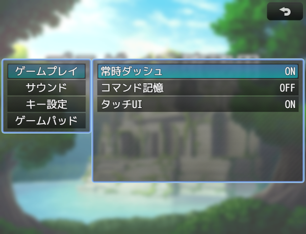
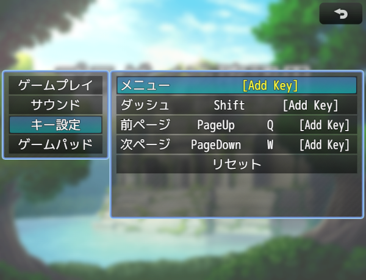
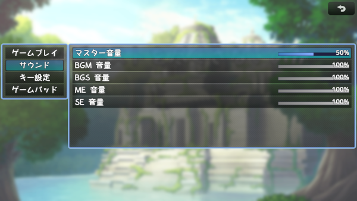

# [オプション拡張](https://raw.githubusercontent.com/nuun888/MZ/master/NUUN_OptionEx.js)
# Ver.1.1.0
[ダウンロード](https://raw.githubusercontent.com/nuun888/MZ/master/NUUN_OptionEx.js)  
#### 必須プラグイン
[共通処理](https://github.com/nuun888/MZ/blob/master/README/Base.md)  
#### 拡張プラグイン
[オプション拡張音量ゲージ表示](https://github.com/nuun888/MZ/blob/masterNUUN_OptionEx_2.js)  

オプション画面を拡張します。  
  
  

## 変数、スイッチを使用したオプション項目
### オプション詳細設定
変数、スイッチにIDを１以上に指定したときに適用されます。  

#### オプションパラメータ名
リストの番号に設定した文字列が変数、スイッチに対応するIDとなります。  
変数1:リスト0番  
スイッチON:リスト0番(OFFの場合は1番)  

#### 全セーブデータ適用
ONにすることで全てのセーブデータに適用されます。  

#### DifficultyOptionを使用した設定例
オプション詳細設定の変数に難易度変数IDと同じ変数IDを設定。  
オプションパラメータ名のリストに変数の値に対応する文字列を設定。  
難易度リスト　1:イージー 2:ノーマル 3:ハードなら  
オプションパラメータ名のリスト　1:イージー 2:ノーマル 3:ハード  

## コマンドシンボル名
`alwaysDash` :常時ダッシュ  
`commandRemember` :コマンド記憶  
`touchUI` :タッチUI  
`bgmVolume` :BGM音量  
`bgsVolume` :BGS音量  
`meVolume` :ME音量  
`seVolume` SE音量  
`gamePadVibration` :振動 要NUUN_GamePadVibration  
`startUpFullScreen` :フルスクリーン 要StartUpFullScreen（トリアコンタン氏）  

## キー、ゲームパッドのキー(ボタン)変更の操作
キー、ゲームパッドのキー、ボタンの変更は変更したい項目でEnter(決定ボタン)を押し、任意のキー(ボタン)を押します。  
既に設定済みのキー(ボタン)、予約キー(ボタン)は設定できません。  

## 拡張プラグイン
### オプション拡張音量ゲージ表示
音量設定にゲージを表示させます。  
  
[ダウンロード](https://github.com/nuun888/MZ/blob/masterNUUN_OptionEx_2.js)  

## 更新履歴
2024/8/25 Ver.1.1.0  
音量ゲージの設定を追加。  
2024/8/16 Ver.1.0.1  
ウィンドウを透明にする機能を追加。  
2024/8/15 Ver.1.0.0  
初版  
