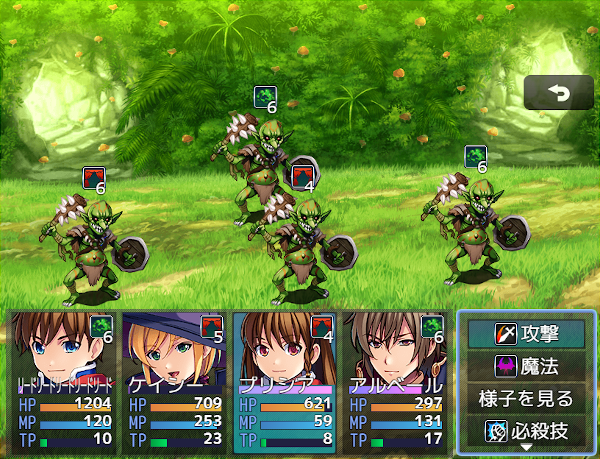

# [ステート、バフ残りターン表示](https://raw.githubusercontent.com/nuun888/MZ/master/NUUN_StateTurn.js)
# Ver.1.1.7
[ダウンロード](https://raw.githubusercontent.com/nuun888/MZ/master/NUUN_StateTurn.js)

#### 必須、前提プラグイン
[共通処理](https://github.com/nuun888/MZ/blob/master/README/Base.md)  

ステートアイコンに残りターンを表示します。  

   

## 設定方法
#### 表示ターンモード  
`remaining`指定時のデフォルトの補正値は1です。  
`elapsed`指定時はターン数補正を-1に設定してください。  
経過ターンを表示させるには[ステート経過ターンカウント](https://github.com/nuun888/MZ/blob/master/README/StateTurnCount.md)プラグインが必要です。  

#### ターンの文字色
ステートのメモ欄  
`<BatState>`  このタグがあるステートは不利なステートになります。よって不利ステート、デバフターンの色が適用されます。  
上記タグがないステートは有利ステート、バフターンの色が適用されます。  

## 競合情報
MOG_BattleHudには対応しておりません。  

## 更新履歴
2024/11/9 Ver.1.1.7  
バトルスタイル拡張プラグイン併用時にステートターンが正常に表示されない問題を修正。  
2024/5/15 Ver.1.1.6  
ステートターンが表示されない問題を修正。  
2024/3/2 Ver.1.1.5  
バトルスタイル拡張プラグインでステートの表示を指定している場合に、ターンの表示がずれて表示されてしまう問題を修正。  
2023/8/23 Ver.1.1.4  
途中から出現するモンスターがいる敵グループと戦闘を行うとエラーが出る問題を修正。  
2022/3/30 Ver.1.1.3  
自動解除のタイミングがターン終了時の時にターン数が正常に表示されていなかった問題を修正。  
2023/1/3 Ver.1.1.2  
カラー指定のプラグインパラメータのTypeをcolorに変更。(Ver.1.6.0以降)  
日本語以外での表示を英語表示に変更。  
2022/10/29 Ver.1.1.1  
不利、ステート、バフのターン数の文字色を変更できる機能を追加。  
2022/1/21 Ver.1.1.0  
ステートのターンの表示方法に経過ターンを追加。（要ステート経過ターンカウント）  
2021/9/16 Ver.1.0.2  
競合が起きないよう一部の関数名を変更。  
不要な処理を削除。  
2021/9/15 Ver.1.0.1  
ターン表示が正常に取得できていなかった問題を修正。  
自動解除のないステートのターンが表示されていた問題を修正。  
2021/9/9 Ver.1.0.0  
初版  
