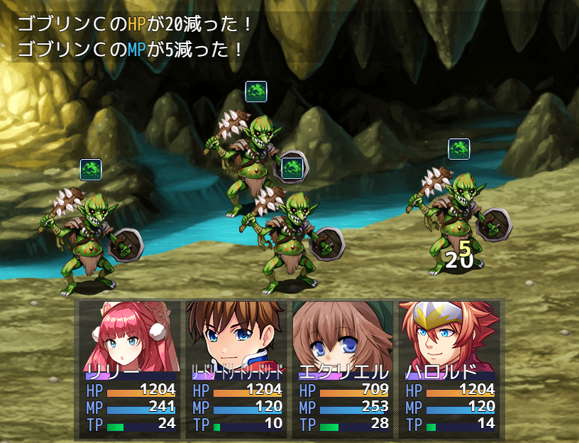

# [再生率バトルログ表示](https://raw.githubusercontent.com/nuun888/MZ/master/NUUN_PlaybackRateBattleLog.js)
# Ver.1.0.4
[ダウンロード](https://raw.githubusercontent.com/nuun888/MZ/master/NUUN_PlaybackRateBattleLog.js)

HP、MP、TP再生率でダメージ、回復した再生量をバトルログに表示させます。  

  

## 更新履歴
2024/1/7 Ver.1.0.4  
スリップダメージで戦闘不能になった時に、戦闘不能時のログよりも前に再生ログを表示するように修正。  
2023/8/25 Ver.1.0.3  
バトルログのメッセージ表示プラグインとの併用で再生ログが表示されない問題を修正。  
2023/6/22 Ver.1.0.2  
バトルログが消去されなかった問題を修正。  
2023/6/22 Ver.1.0.1  
回復時のテキストで-が表示されてしまう問題を修正。  
2022/1/21 Ver.1.0.0  
初版  
