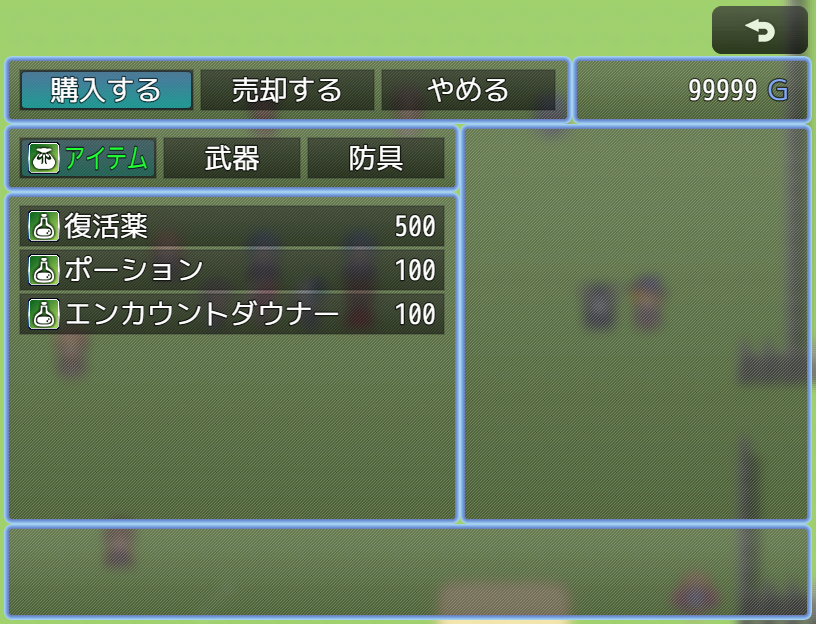

# [ショップ購入カテゴリー表示](https://raw.githubusercontent.com/nuun888/MZ/master/NUUN_PurchaseCategory.js)
# Ver.1.1.1
[ダウンロード](https://raw.githubusercontent.com/nuun888/MZ/master/NUUN_PurchaseCategory.js)  
#### 必須、前提プラグイン
[共通処理](https://github.com/nuun888/MZ/blob/master/README/Base.md)
#### 競合対策プラグイン
うなぎおおとろ様ショップ画面拡張競合対策プラグイン  
[ダウンロード](https://raw.githubusercontent.com/nuun888/MZ/master/NUUN_ShopPurchaseCategory_ShopScene_Extension_cm.js)  

ショップの購入画面にアイテムカテゴリーを表示します。

  

## プラグインコマンド
### 購入時表示カテゴリー変更
表示するカテゴリーを設定します。  
任意のキーで表示するには別途[NUUN_ItemCategory](https://github.com/nuun888/MZ/blob/master/README/ItemCategory.md)が必要です。  

### 購入表示カテゴリーリセット
購入時表示カテゴリー変更で設定したカテゴリー設定をリセットします。  
デフォルトの状態に戻ります。  

## 更新履歴
2023/8/23 Ver.1.1.1  
ショップを開くとエラーが出る問題を修正。  
2022/12/10 Ver.1.1.0  
カテゴリー表示の表示、非表示を設定出来るスイッチを追加。  
2022/12/3 Ver.1.0.1  
微修正。  
2022/12/3 Ver.1.0.0  
初版  
