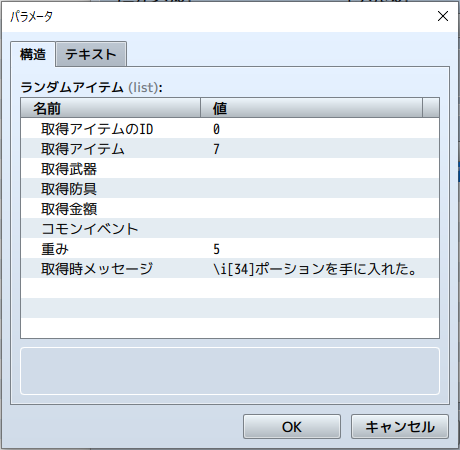

# [アイテムのランダム入手](https://raw.githubusercontent.com/nuun888/MZ/master/NUUN_RandomItems.js)
# Ver.1.3.0
[ダウンロード](https://raw.githubusercontent.com/nuun888/MZ/master/NUUN_RandomItems.js)
#### 必須、前提プラグイン
[共通処理](https://github.com/nuun888/MZ/blob/master/README/Base.md)  

アイテム、武器、防具、金額などをランダムで取得します。
当プラグインはプラグインコマンドからランダムアイテムリストを設定します。コモンイベントから呼び出すことも可能です。

#### ランダムに取得できる対象
- アイテム
- 武器
- 防具
- 金額
- コモンイベント

### 設定方法
ランダムアイテムの設定はプラグインコマンドから設定します。  
  

#### ランダムアイテム
ランダムに取得するアイテム等のリストを設定します。

#### 取得アイテム対象
ランダムに取得する対象を設定します。
コモンイベントは取得時にコモンイベントを呼び出します。

#### 取得アイテム、武器、防具、コモンイベント
取得するアイテム、武器、防具、コモンイベントのIDを指定します。

#### 取得金額
取得時の金額を指定します。

#### 重み
取得するアイテム等の重みを指定します。

#### 取得時メッセージ
取得時のメッセージを表示します。  
アイテム取得時のメッセージ  
%1:アイテム名  
%2:アイテムアイコン  
お金取得時のメッセージ  
%1:金額  
%2:お金取得時アイコンID  
%3:通貨単位  

#### お金取得時アイコンID
指定した金額取得時のアイコンIDをプラグインパラメータ「取得アイテムアイコンID」に代入します。

### 更新履歴  
2022/11/12 Ver.1.3.0
メッセージのフォーマットを変更。  
日本語以外での表示を英語表示に変更。  
2021/4/4 Ver.1.2.2  
プラグインコマンドにお金を入手したときにアイコンIDを取得し変数に格納できる機能を追加しました。  
2021/2/25 Ver.1.2.1  
ゲーム変数代入時のマップ更新を１度しか行わないようにに修正。  
2021/2/25 Ver.1.2.0  
変数にアイテム名、アイコンインデックス、重みを代入する機能を追加。  
アイテムを取得するときに変数にリストIDが代入されない問題を修正。  
2020/12/15 Ver.1.1.0  
MOG_TreasurePopup対応。  
2020/11/22 Ver.1.0.0  
初版  

