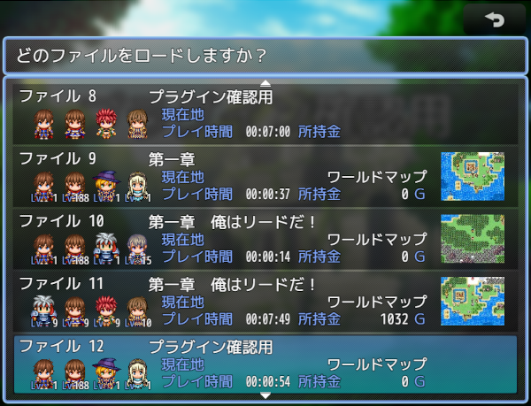
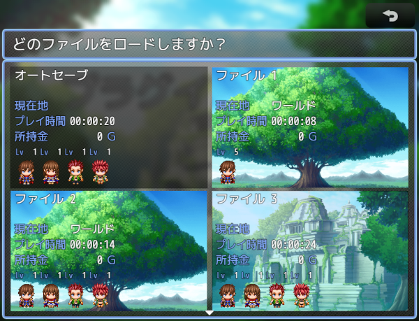

# [セーブ画面拡張](https://raw.githubusercontent.com/nuun888/MZ/master/NUUN_SaveScreen.js)
# 新版Ver.3.0.7
[ダウンロード](https://raw.githubusercontent.com/nuun888/MZ/master/NUUN_SaveScreen_3.js)  
# 旧版Ver.2.3.1
[ダウンロード](https://raw.githubusercontent.com/nuun888/MZ/master/NUUN_SaveScreen.js)  
#### 必須プラグイン
[共通処理](https://raw.githubusercontent.com/nuun888/MZ/master/NUUN_Base.js)Ver.1.7.3以降  

セーブ画面をカスタマイズできます。　　

  
※  
  
Type2  
  

※は設定例です。  
## 設定
セーブ画面に表示する項目を設定するにはプラグインパラメータの表示項目から設定します。  

### ウィンドウの構成
セーブメインウィンドウはセーブファイルのリストを表示するウィンドウです。  
セーブステータスウィンドウは選択中のセーブ情報を表示するウィンドウです。このウィンドウは複数生成できます。  

### アクター表示
アクター画像はキャラチップ、顔グラフィック、サイドビューアクターを表示できます。PartyActorModeで指定のメンバーを設定している場合は指定アクターのみ表示されます。  
また、アクター名、職業、ニックネーム、レベルはアクター画像と同様にキャラ毎に表示可能です。PartyActorModeで指定のメンバーを設定している場合は指定アクターのみ表示されます。 

同じ項目で別の内容を表示させる場合はメソッド名に任意の文字列を記入します。(キャラチップ、顔グラフィック、サイドビューアクター、アクター名、レベル)  

### オリジナル項目
オリジナル項目を設定するにはメソッド名に任意の文字列を記入してください。  
`actor`:$gameActors (指定のアクター変更で指定したアクター(指定してない場合はリーダー))  
オリジナル項目を複数設定する場合はメソッド名(13)に任意の文字列を記入して下さい。  

### アクターオリジナルパラメータ
オリジナルパラメータを設定するにはメソッド名に任意の文字列を記入してください。  
アクター画像と同様にキャラ毎に表示可能です。PartyActorModeで指定のメンバーを設定している場合は指定アクターのみ表示されます。  
`actor`:$gameActors  

### 表示条件
actor:$gameActors (指定のアクター変更で指定したアクター(指定してない場合はリーダー))  
フリーテキストの表示条件で参照できる変数はインフォ情報とファイル名番号及び表示ウィンドウのオブジェクトのみになります。 

### 背景画像の変更
ゲームの進行によって背景画像を変更出来ます。  
初期設定ではプラグインコマンド「背景画像変更」で変更したたびに背景IDが変更されます。  
背景IDはロード画面でIDの一番高いセーブデータの背景が表示されます。  

#### コンテンツ背景の設定(NUUN_Base ver.1.6.2以降)
各セーブのコンテンツ背景に画像を設定できます。  
通常はリスト番号1番の背景が表示されます。  
2番以降はマップ毎でコンテンツ背景を変更したい場合に使用します。  
プラグインコマンドでの変更は直接ファイルを指定します。  

コンテンツ背景の画像の原点位置及び、拡大率はプラグインパラメータのコンテンツ背景画像設定で行います。  
コンテンツ背景に設定された画像を同じ名前の画像が表示されるとき、設定された原点、拡大率が適用されます。  
設定されていない場合は原点0,0、拡大率100%で適用されます。  

マップの設定のメモ欄  
`<SaveContentsBackImg:[filename]>` コンテンツ背景の画像を指定します。このタグが設定されているマップは、プラグインパラメータ及びプラグインコマンドで設定された画像は適用されずマップに設定された画像が適用されます。  
`[filename]`:コンテンツ背景画像のリスト番号  

### オートセーブ
移動後、戦闘終了後のオートセーブを制御できます。また任意のタイミングでオートセーブを実行できます。

#### オートセーブ時のスナップショット
オートセーブ時のスナップショットは戦闘開始直前のマップ、移動直前のマップが撮影されます。  

## 更新履歴 
2024/10/23 Ver.3.0.7  
セーブ後にセーブ画面を閉じない機能を追加。  
2024/8/17 Ver.3.0.6  
セーブ画面のオートセーブ表示を無効にしたときに、セーブファイルのカーソルが不自然になる問題を修正。  
スペルミスを修正。  
2024/7/27 Ver.3.0.5  
セーブインフォウィンドウでコンテンツ列数の設定を追加。  
一部項目に小数点数を指定できる機能を追加。  
2024/6/22 Ver.3.0.4  
項目の横幅が1項目の横幅より広く適用されない問題を修正。  
2024/6/1 Ver.3.0.3  
初回時に画像が表示されない問題を修正。  
2024/5/5 Ver.3.0.2  
アクターオリジナルパラメータが表示されない問題を修正。  
プラグインコマンドが実行できない問題を修正。  
単位を追加。  
2024/5/4 Ver.3.0.1   
パラメータが取得されない問題を修正。 
2024/5/3 Ver.3.0.0  
初版
2024/5/2 Ver.2.3.1  
単体表示でエラーが出る表示がされない問題を修正。  
2024/5/1 Ver.2.3.0  
マップ移動時、戦闘終了時にオートセーブの実行を非許可にする機能を追加。  
セーブ禁止時にオートセーブを実行できるように修正。  
一部コンテンツの表示位置の修正。  
多数の不具合を修正。  
2024/4/21 Ver.2.2.5  
可変最大セーブ数プラグイン更新による一部処理の変更。  
2024/4/20 Ver.2.2.4  
セーブ列数を2以上にしてセーブした際に、スクロールがずれる問題を修正。  
2024/2/23 Ver.2.2.3  
イベントテストでセーブが実行できない問題を修正。  
2023/8/21 Ver.2.2.2  
オリジナルパラメータで0が表示されない問題を修正。  
2023/7/15 Ver.2.2.1  
特定の条件のみ一致したアクターの顔グラ、SVアクター、アクター名を表示できる機能を追加。  
2023/7/8 Ver.2.2.0  
特定の条件のみ一致したアクターのキャラチップ、レベルを表示できる機能を追加。  
2023/6/18 Ver.2.1.4  
ラインが機能していなかった問題を修正。  
2023/1/17 Ver.2.1.3  
プラグインコマンドのオードセーブ実行の内容が異なっていたので修正。  
オートセーブ有効化をOFFにしたときに最大セーブ数が１つ少なく表示される問題を修正。  
戦闘後、移動時のオートセーブを実行しないスイッチを指定できる機能を追加。  
2023/1/7 Ver.2.1.2  
ウィンドウ画像を表示非表示か選択できる機能を追加。  
日本語以外での表示を英語表示に変更。  
2023/1/7 Ver.2.1.1  
セーブ時に背景画像が表示されない問題を修正。  
2022/12/30 Ver.2.1.0  
セーブファイルの表示に列数を設定できる機能を追加。  
コンテンツ背景画像をマップ毎に指定できる機能を追加。  
2022/11/5 Ver.2.0.1  
顔グラの拡大率を変更したときに各顔グラの間に余白ができてしまう問題を修正。  
2022/9/24 Ver.2.0.0  
全ての項目の配置の自由化。  
一部不具合修正。  
2022/7/4 Ver.1.9.0  
チャプターテキスト、メニュー画面行動目標表示プラグインでのテキスト表示の処理追加。  
コンテンツ背景をゲーム途中で変更できる機能を追加。  
オリジナルパラメータの一部のテキストのフォントが適用されない問題を修正。  
2022/5/28 Ver.1.8.5  
ファイル名に座標時を指定できる機能を追加。  
ファイル名横文字列に座標、表示横幅、文字揃えを指定できる機能を追加。  
2022/5/14 Ver.1.8.4  
コンテンツ背景画像非表示をOFFに設定しても背景画像が適用しない問題を修正。   
2022/5/11 Ver.1.8.3  
戦闘終了時にオートセーブがされない問題を修正。  
マップ移動時、戦闘終了時に、オートセーブでのマップショットが黒い画像になる問題を修正。  
2022/1/5 Ver.1.8.2  
名称が取得できない問題を修正。  
オリジナルパラメータの設定方法を変更。  
2021/12/30 Ver.1.8.1  
コンテンツ背景を独自の画像を設定できる機能を追加。  
2021/12/12 Ver.1.8.0  
コンテンツの表示設定を変更。  
プラグインコマンドが適用されていなかった問題を修正。  
ファイル名横の表示する文字の設定方法を変更。  
2021/7/16 Ver.1.7.0  
セーブ日時を表示する機能を追加。  
2021/5/29 Ver.1.6.0  
サイドビューアクターを表示する機能を追加。  
2021/5/27 Ver.1.5.2  
スクリーンショットの処理を修正。  
一部プラグインコマンドを削除。  
2021/5/15 Ver.1.5.1  
スクリーンショットの処理方法を変更。  
2021/5/14 Ver.1.5.0  
セーブスクリーンショットを表示する機能を追加。  
2021/5/11 Ver.1.4.1  
前バージョンから引き継いだセーブデータがあるセーブ画面を開くとエラーが出る問題を修正。  
2021/5/11 Ver.1.4.0  
ゲームの進行度に応じて背景画像を変更できる機能を追加。  
2021/5/8 Ver.1.3.0  
任意の背景画像を表示できる機能を追加。  
アクター画像の表示の設定方法を変更。  
レベルのYを調整できるように変更。  
キャラチップ表示時のアクターY座標を相対座標に変更。  
表示できるセーブ数、セーブできる最大数を指定できる機能を追加。  
選択画面のコンテンツ背後に表示される黒い背景画像（デフォルトの場合）を非表示にする機能を追加。  
2021/1/30 Ver.1.2.1  
コンテンツエリアX座標の設定方法を変更  
2021/1/29 Ver.1.2.0  
顔グラの横幅、縦幅、拡大率を指定できるように変更。  
セーブインフォがないファイルでファイル名が表示されない問題を修正。  
2021/1/26 Ver.1.1.1  
顔グラを表示時、ファイルタイトルが隠れて表示されてしまう問題を修正。  
2021/1/26 Ver.1.1.0  
顔グラを表示できる機能を追加。  
2021/1/24 Ver.1.0.0  
初版  
