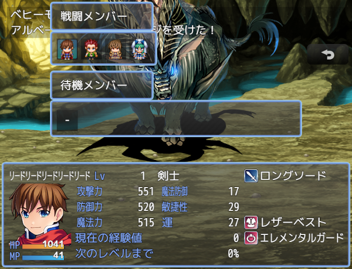

# [メンバー変更画面(戦闘)](https://raw.githubusercontent.com/nuun888/MZ/master/NUUN_SceneBattleFormation.js)
# Ver.1.3.9
[ダウンロード](https://raw.githubusercontent.com/nuun888/MZ/master/NUUN_SceneBattleFormation.js)
#### 必須、前提プラグイン
[共通処理](https://github.com/nuun888/MZ/blob/master/README/Base.md)  
[メンバー変更画面](https://github.com/nuun888/MZ/blob/master/README/SceneFormation.md)  

戦闘中にメンバーを変更できるようにします。  
このプラグインはメンバー変更画面（NUUN_SceneFormation）の拡張機能です。  

  

※アクターコマンドの並び替え条件は選択不可時のときは現在、暫定的に不透明に表示する仕様にしてあります。  

## 更新履歴
2024/6/9 Ver.1.3.9  
ターン制で並び替えをアクターコマンドに指定した際に、メンバー交代後に前のアクターのコマンドが表示されたままになる問題を修正。  
メンバー交代をした際に、コマンド選択が初期化されない問題を修正。  
2024/5/25 Ver.1.3.8  
ターン制でメンバー変更画面を閉じた時に、行動回数が再設定される問題を修正。  
2023/8/8 Ver.1.3.7  
メンバー入れ替え時にカーソルの位置がずれて表示される問題を修正。  
2023/8/6 Ver.1.3.6  
アクターコマンドから選択できる条件を指定できる機能を追加。  
2023/7/24 Ver.1.3.5  
戦闘中の並び替えのコマンド名を指定できる機能を追加。  
処理の修正。  
2022/9/14 Ver.1.3.4  
サポートアクターを呼び出した際にゲームが進行しなくなる問題を修正。  
2022/3/30 Ver.1.3.3  
戦闘メンバーの表示列、行数を設定できる機能を追加。  
2022/2/26 Ver.1.3.2  
戦闘中に画面を閉じるとアクター選択コマンドがキャンセル扱いにされる問題を修正。  
メンバー入れ替え時のカーソルの処理を変更。  
2022/2/25 Ver.1.3.1  
TPBが溜まっているアクターを交換するとアクターウィンドウがアクティブになる問題を修正。  
2022/2/23 Ver.1.3.0  
戦闘メンバー人数の可変対応による処理の変更。  
2021/11/27 Ver.1.2.0  
立ち絵を表示できる機能を追加。  
2021/11/15 Ver.1.1.0  
ウィンドウの配置を戦闘用と別々に設定できるように変更。  
控えメンバーのウィンドウのX座標がある程度の座標で止まる問題を修正。  
2021/9/17 Ver.1.0.4  
戦闘メンバーから控えメンバーにカーソルが移るときに空白にカーソルが選択してしまう問題を修正。  
2021/8/24 Ver.1.0.3  
パーティコマンドに表示させる位置を指定できる機能を追加。（1で逃げるより先に表示されます）  
2021/8/23 Ver.1.0.2  
ターン制でメンバーを交代した後にコマンドで攻撃を選択するとエラーが出る問題を修正。  
2021/8/17 Ver.1.0.1  
サポートアクターに対応。  
アクター並び替え固定に対応。  
2021/8/15 Ver.1.0.0  
初版  
