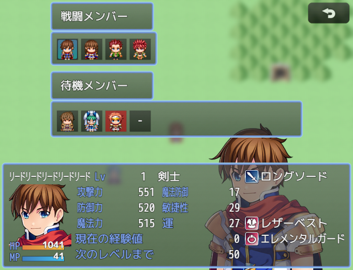
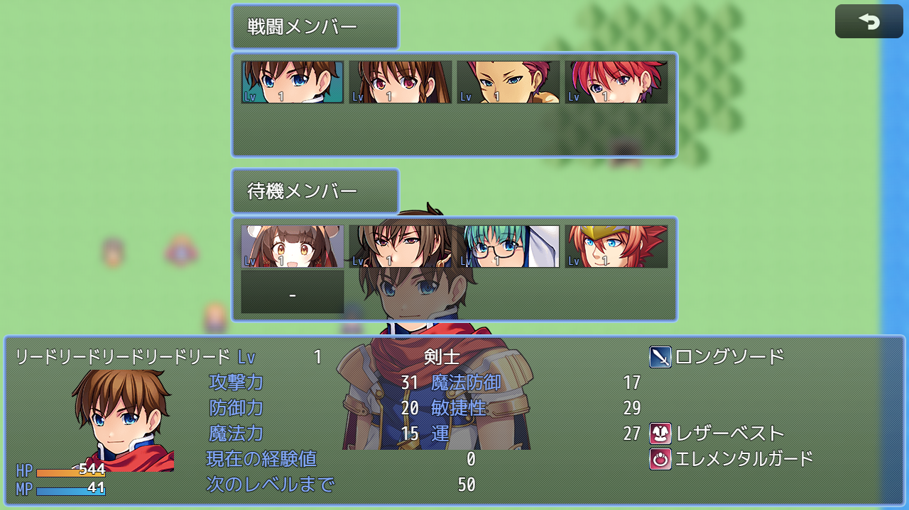

# [メンバー変更画面](https://raw.githubusercontent.com/nuun888/MZ/master/NUUN_SceneFormation.js)
# Ver.2.1.8
[ダウンロード](https://raw.githubusercontent.com/nuun888/MZ/master/NUUN_SceneFormation.js)
#### 必須、前提プラグイン
[共通処理](https://github.com/nuun888/MZ/blob/master/README/Base.md)  
[ステータス項目ベースプラグイン](https://github.com/nuun888/MZ/blob/master/README/NUUN_MenuParamListBase.md)  

#### オプション
[メンバー変更画面(戦闘)](https://github.com/nuun888/MZ/blob/master/README/SceneBattleFormation.md)  
[リーダのみ自由編成可能](https://github.com/nuun888/MZ/blob/master/README/LeaderActorFormationOnly.md)  

メンバーを並び変える画面を追加します。  
メニューコマンドの並び替えを選択するとメンバー変更画面が表示されるようになります。  
戦闘メンバー、待機メンバーの画像はキャラチップ、顔グラから選択できます。（デフォルトではキャラチップ）  

  
  

戦闘不能のキャラはデフォルト設定では背景が赤く表示されます。  

選択中のアクターのステータスはカスタマイズ可能です。  

ウィンドウ基準0をONにした場合、ウィンドウの基準座標を0,0にします。  
なおウィンドウ中央自動調整をONにしている場合、X座標だけ中央になるよう自動調整されてしまいますのでX座標を調整する場合はOFFにしてください。  

## クラスウィンドウ
`Window_FormationBattleMemberName` 戦闘メンバー名称ウィンドウ  
`Window_FormationMemberName` 待機メンバー名称ウィンドウ  
`Window_FormationBattleMember` 戦闘メンバーウィンドウ  
`Window_FormationMember` 待機メンバーウィンドウ  
`Window_FormationStatus` アクターステータスウィンドウ  

## 更新履歴
2025/8/3 Ver.2.1.8  
hiddenアクターが戦闘メンバーにいる場合に、交代時の挙動が不自然になる問題を修正。  
hiddenアクターが戦闘メンバーにいる場合に戦闘メンバー数可変を適用時、最大メンバー数をhiddenアクター人数分差し引くように仕様変更。  
hiddenアクターが戦闘メンバーにいる場合に、元の最大パーティメンバー数まで入れ替えできる機能を追加。  
2025/6/13 Ver.2.1.7  
登録メンバーを登録した後、メンバー変更ウィンドウを閉じた場合にアクションが正しく設定されない問題を修正。  
2025/6/3 Ver.2.1.6  
装備表示を当プラグインから行えるように修正。  
2025/5/5 Ver.2.1.5  
メニュー画面でパーティ登録画面が開けなくなる問題を修正。  
登録メンバーを削除した際に、メンバー画面と戦闘画面のカーソルアクティブの移行が行われなくなる問題を修正。  
2025/5/4 Ver.2.1.4  
NUUN_SaveMembersを戦闘中に実行できるように修正。  
2025/4/24 Ver.2.1.3  
NUUN_SaveMembers更新による修正。  
2025/4/23 Ver.2.1.2  
変更前のメンバーに戻す機能を追加。  
2025/4/19 Ver.2.1.1  
メンバーの顔グラの処理を修正。  
NUUN_ActorPictureの設定が適用できない問題を修正。  
2025/4/19 Ver.2.1.0  
メンバーの表示に画像を表示できる機能を追加。  
NUUN_SaveMembers適用による処理の追加。  
2025/4/6 Ver.2.0.6  
1.9の仕様変更による修正。  
2025/4/4 Ver.2.0.5  
メンバー変更画面(戦闘)更新による処理の追加。  
2024/12/15 Ver.2.0.4  
戦闘メンバー数可変で最大バトルメンバー数が増加しない問題を修正。  
サポートアクター2.0.0適用に関する処理の修正。  
2024/7/13 Ver.2.0.3  
立ち絵、顔グラ表示EXでの設定が適用されない問題を修正。  
ターン制でメンバー交代を行い、コマンド選択するとエラーが出る問題を修正。  
2024/6/30 Ver.2.0.2  
固定アクターの背景色設定でエラーが出る問題を修正。  
2024/6/23 Ver.2.0.1  
強制戦闘メンバーのプラグインコマンドを追加。  
強制戦闘メンバーのアクターが控えメンバーにいる場合、メンバー変更画面を閉じないように修正。  
背景色の座標を修正。  
2024/6/22 Ver.2.0.0  
プラグインパラメータの仕様を変更。  
戦闘メンバーから控えメンバーへのカーソル移動を横方向にも対応。(戦闘メンバー(左)、控えメンバー(右))  
2024/6/11 Ver.1.7.11  
バトルメンバーから控えメンバーの切り替えが行われない問題を修正。  
2024/6/9 Ver.1.7.10  
処理の修正。  
2024/5/25 Ver.1.7.9  
ターン制でメンバー変更画面を閉じた時に、行動回数が再設定される問題を修正。  
2023/8/6 Ver.1.7.8  
処理の修正。  
2023/7/24 Ver.1.7.7  
処理の修正。  
2022/11/20 Ver.1.7.6  
初回表示時にアクターのステータスが表示されない問題を修正。  
デフォルトの立ち絵切り替えが機能していなかった問題を修正。  
2022/10/28 Ver.1.7.5  
アクター固定化プラグインの固定アクター戦闘メンバーへの移動可をOFFにしたときに固定アクターが移動できてしまう問題を修正。  
2022/9/22 Ver.1.7.4  
アクターステータスウィンドウのコンテンツ背景をONにするとエラーが出る問題を修正。  
2022/7/30 Ver.1.7.3  
戦闘中に無限ループを起こしゲームが停止してしまう問題を修正。  
2022/7/26 Ver.1.7.2  
最大メンバー増減が正常に機能しない場合がある問題を修正。  
最大メンバー増減後にフォロワーの表示が正常に表示されない問題を修正。  
2022/6/15 Ver.1.7.1  
微修正。  
2022/3/30 Ver.1.7.0  
戦闘メンバー、待機メンバーの画像に顔グラを選択できる機能を追加。  
戦闘メンバーの表示列、行数を設定できる機能を追加。  
Ver.1.6.0以降でのサポートアクター対応。  
2022/2/26 Ver.1.6.3  
戦闘中に画面を閉じるとアクター選択コマンドがキャンセル扱いにされる問題を修正。  
メンバー入れ替え時のカーソルの処理を変更。  
2022/2/25 Ver.1.6.2  
TPBが溜まっているアクターを交換するとアクターウィンドウがアクティブになる問題を修正。  
戦闘中にアクターを入れ替えて再度画面を開いてアクターを選択するとカーソルの表示がおかしくなる問題を修正。  
2022/2/23 Ver.1.6.1  
固定アクター対応により処理修正。  
2022/2/23 Ver.1.6.0  
戦闘メンバー人数の可変対応。  
2021/12/26 Ver.1.5.2  
立ち絵、顔グラ表示EX用の立ち絵設定が設定できなかった問題を修正。  
2021/12/14 Ver.1.5.1  
立ち絵、顔グラ表示EXを入れてない状態で開くとエラーが出る問題を修正。  
2021/12/11 Ver.1.5.0  
立ち絵、顔グラ表示EXに対応。  
2021/11/27 Ver.1.4.1  
Ver.1.4.0（当プラグイン）アップデート後、ゲーム開始時にエラーが出る問題を修正。  
2021/11/27 Ver.1.4.0  
立ち絵を表示できる機能を追加。  
立ち絵を切り替えられるプラグインコマンドを追加。  
顔グラが表示されない問題を修正。  
一部の項目で名称が適用されない問題を修正。  
オリジナルパラメータにも小数点を指定できるように変更。  
2021/11/15 Ver.1.3.0  
ウィンドウの配置を戦闘用と別々に設定できるように変更。  
控えメンバーのウィンドウのX座標がある程度の座標で止まる問題を修正。  
2021/9/23 Ver.1.2.5  
固定アクターが待機メンバーの最後のキャラと入れ替えた時に入れ替えが出来てしまう問題を修正。  
2021/9/22 Ver.1.2.4  
アクター並び替え固定プラグインの固定アクターの移動が正常に行えていなかった問題を修正。  
2021/9/21 Ver.1.2.3  
アクター並び替え固定プラグインの固定アクター戦闘メンバーへの移動可対応。  
2021/9/18 Ver.1.2.2  
アクター並び替え固定プラグインとの併用時にエラーが出る問題を修正。  
2021/9/17 Ver.1.2.1  
戦闘メンバーから控えメンバーにカーソルが移るときに空白にカーソルが選択してしまう問題を修正。  
2021/9/4 Ver.1.2.0  
表示できるステータスに経験値を追加。  
戦闘メンバー、待機メンバーにレベルを表示する機能を追加。  
2021/8/25 Ver.1.1.1  
アクター並び替え固定プラグインの待機固定アクター移動可に対応。  
固定アクターの背景色を変更できる機能を追加。  
2021/8/24 Ver.1.1.0  
ステータスウィンドウ以外を中央（待機メンバーウィンドウ基準）揃えにする機能を追加。（戦闘時共通）  
Y座標を指定できる機能を追加。（戦闘時共通）  
2021/8/18 Ver.1.0.2  
戦闘メンバーが最大戦闘メンバー未満の時にエラーが起きる問題を修正。  
2021/8/17 Ver.1.0.1  
サポートアクターに対応。  
2021/8/15 Ver.1.0.0  
初版  
